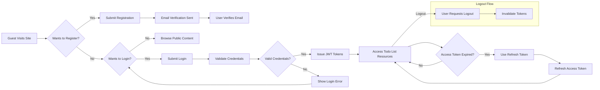

# Multi-User Todo List Application - Functional Requirements Specification

## 1. Introduction

The multi-user Todo list application provides a platform for registered users to manage their personal todo lists securely. Each user's todo items are private and inaccessible to other users.

This service ensures robust user authentication and authorization to maintain data privacy and integrity.

## 2. User Actors and Authentication

### 2.1 User Actors

- **Guest**: Unauthenticated users who can register and log in.
- **User**: Authenticated users who can create, read, update, and delete their own todo items.

### 2.2 Authentication Requirements

- WHEN a guest submits a registration request with a valid email and password, THE system SHALL create a new user account and store credentials securely using strong encryption.
- WHEN a guest submits valid login credentials, THE system SHALL authenticate the user and issue JWT access and refresh tokens.
- WHILE a user session is active, THE system SHALL maintain the session using access and refresh tokens.
- WHEN a user registers, THE system SHALL send a verification email containing a secure token.
- WHEN a user clicks the verification link, THE system SHALL mark the user's email as verified.
- WHEN a user requests a password reset, THE system SHALL send a secure password reset email.
- WHEN a user submits a new password, THE system SHALL update the stored credentials.
- WHEN a user requests to log out, THE system SHALL invalidate the access token and refresh token.

### 2.3 Token Management

- THE system SHALL use JSON Web Tokens (JWT) for access and refresh tokens.
- Access tokens SHALL have a lifespan of 15 minutes.
- Refresh tokens SHALL have a lifespan of 7 days.
- THE system SHALL require secure storage of tokens on the client side, preferably using httpOnly cookies.
- THE JWT payload SHALL include userId and role.
- THE system SHALL allow a secure token refresh flow to obtain new access tokens.

### 2.4 Permission Matrix

| Action                     | Guest | User |
|----------------------------|-------|------|
| Register                   | ✅    | ❌   |
| Login                      | ✅    | ❌   |
| Logout                     | ❌    | ✅   |
| Create Todo Item           | ❌    | ✅   |
| Read Own Todo Items        | ❌    | ✅   |
| Update Own Todo Items      | ❌    | ✅   |
| Delete Own Todo Items      | ❌    | ✅   |
| Access Others' Todo Items  | ❌    | ❌   |

### 2.5 Authentication Flow Diagram

## 3. Todo List Management

### 3.1 Todo Item CRUD Operations

- WHEN a user creates a todo item with valid title and optional description, THE system SHALL save the item associated with the user's account.
- WHEN a user requests to read their todo list, THE system SHALL return only the items belonging to that user.
- WHEN a user updates a todo item, THE system SHALL validate ownership and update the item accordingly.
- WHEN a user deletes a todo item, THE system SHALL validate ownership and remove the item from storage.

### 3.2 Privacy and Access Control

- THE system SHALL ensure that each user's todo list is private and inaccessible to other users.
- WHEN a user attempts to access or modify todo items that do not belong to them, THE system SHALL deny access and respond with a suitable error message.

## 4. Business Rules

- WHEN a todo item is created or updated, THE system SHALL validate that the title is non-empty and does not exceed 255 characters.
- THE system SHALL enforce that todo descriptions do not exceed 1000 characters.
- WHEN a user deletes a todo item, THE system SHALL perform a soft delete to allow recovery within 30 days.

## 5. User Scenarios

### 5.1 User Registration

WHEN a guest submits a registration with valid email and password, THE system SHALL create an account, send a verification email, and mark the email as unverified until confirmed.

### 5.2 User Login

WHEN a user submits valid credentials, THE system SHALL authenticate and issue JWT tokens for session management.

### 5.3 Todo Management

WHEN a user creates, reads, updates, or deletes todo items, THE system SHALL allow only access to their own items.

### 5.4 Unauthorized Access Handling

WHEN unauthorized access is attempted, THE system SHALL respond with HTTP 403 Forbidden and a descriptive error.

## 6. Security and Privacy

- THE system SHALL encrypt all sensitive data such as passwords using secure hashing algorithms.
- THE system SHALL ensure all communication between client and server is secured via HTTPS.
- THE system SHALL implement rate limiting on authentication endpoints to prevent brute force attacks.
- THE system SHALL log authentication failures for audit and troubleshooting.

## 7. Performance

- THE system SHALL respond to authentication and todo requests within 500 milliseconds under normal load.
- THE system SHALL handle concurrent user access with proper session isolation.
- THE system SHALL support horizontal scalability by stateless server design.

## 8. Error Handling

- WHEN a request includes invalid data, THE system SHALL respond with HTTP 400 Bad Request and a message explaining the validation failure.
- WHEN an authenticated user attempts forbidden operations, THE system SHALL respond with HTTP 403 Forbidden.
- WHEN an internal error occurs, THE system SHALL respond with HTTP 500 Internal Server Error and log the error details for investigation.

## 9. Future Enhancements

- Support for multiple todo lists per user.
- Collaborative shared todo lists with fine-grained permissions.
- Integration with external calendar services.
- Biometric authentication options.

---

This detailed specification supports the development of a minimal yet secure multi-user Todo list backend application, ensuring user authentication, authorization, data privacy, and proper error handling.