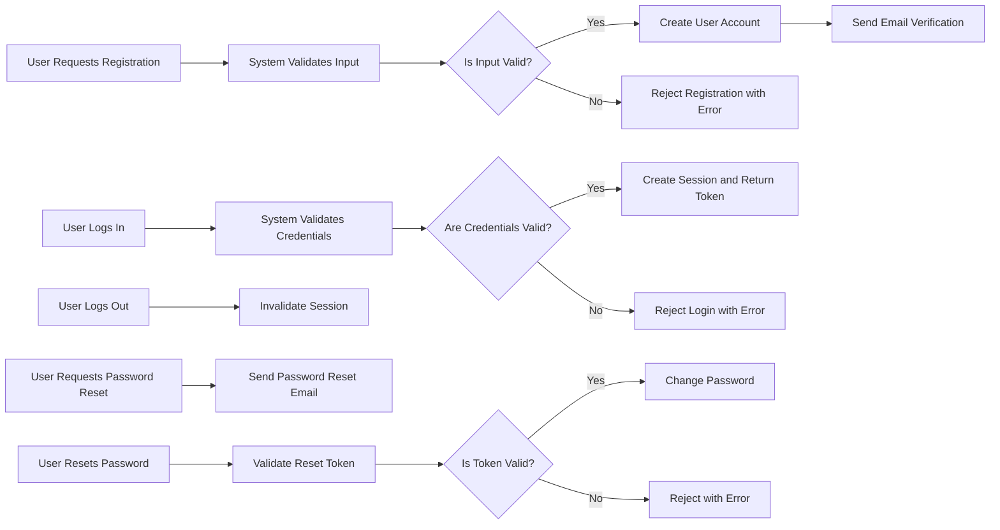

# User Actors and Authentication Requirements for the Todo List Application

## 1. Introduction
The purpose is to define clear user actors, their roles, and authentication and authorization business rules for the Todo List backend. This outlines the precise interactions, permissions, and security workflows expected by system users to guide backend developers.

## 2. User Actor Definitions

### 2.1 Overview
This system includes two primary actors with distinct roles:

| Actor | Description |
|-------|-------------|
| Guest | Unauthenticated users who can browse public information but cannot create or modify todo items. |
| User  | Authenticated users who can create, read, update, and delete their own todo items. |

### 2.2 Actor Descriptions

- **Guest**:
  - Can only access public, read-only API endpoints.
  - Cannot create, modify, or delete any todo items.
  - Restricted from accessing any user-specific data.

- **User**:
  - Must be authenticated for all todo item related actions.
  - Can create new todo items.
  - Can view, update, and delete only their own todo items.
  - Cannot view or modify other users' todo items.

## 3. Authentication Flow Requirements

### 3.1 Core Authentication Functions

- WHEN a user registers, THE system SHALL validate and store the user's email and password.
- WHEN a user attempts login, THE system SHALL validate credentials and authenticate the user.
- WHEN a user logs out, THE system SHALL invalidate the user's session.
- WHEN a user requests password reset, THE system SHALL send a secure reset link via email.
- WHEN a user changes the password, THE system SHALL verify the current password before updating.
- THE system SHALL securely manage user sessions with appropriate expiration.

### 3.2 Authentication Process Flow

## 4. Actor Hierarchy and Permissions

- Guest (not authenticated): limited to read-only access on any public endpoints.
- User (authenticated): full CRUD permissions on their own todo items only, no access to others' data.

## 5. Token Management

### 5.1 Token Types
- THE system SHALL use JWT tokens for authentication.
- Access tokens SHALL have a lifespan of 15 to 30 minutes.
- Refresh tokens SHALL have a lifespan of 7 to 30 days.

### 5.2 Token Security
- Refresh tokens SHALL be securely stored and transmitted.
- Access tokens MAY be stored in httpOnly cookies or localStorage.
- THE system SHALL revoke tokens upon logout.

### 5.3 JWT Payload
- Payload SHALL include userId, role, and permissions claims.

## 6. Permission Matrix

| Action                        | Guest | User |
|-------------------------------|-------|------|
| Browse public todo items       | ✅    | ✅   |
| Create todo item               | ❌    | ✅   |
| Read own todo items            | ❌    | ✅   |
| Update own todo items          | ❌    | ✅   |
| Delete own todo items          | ❌    | ✅   |
| Access others' todo items      | ❌    | ❌   |

---

All requirements are specified as business needs only. There are no technical implementation or architectural details included.
All content is English-language and suitable for direct use by backend developers.