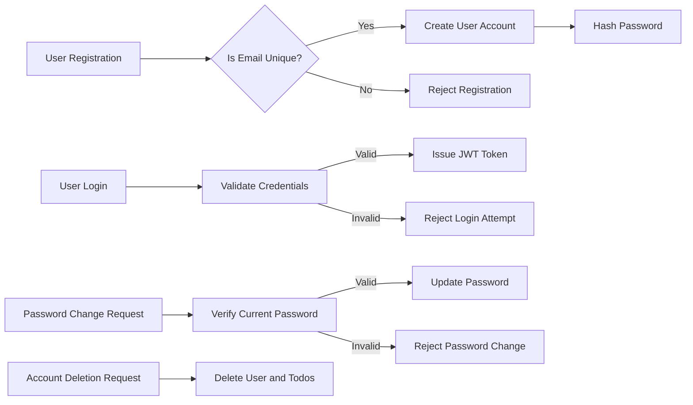
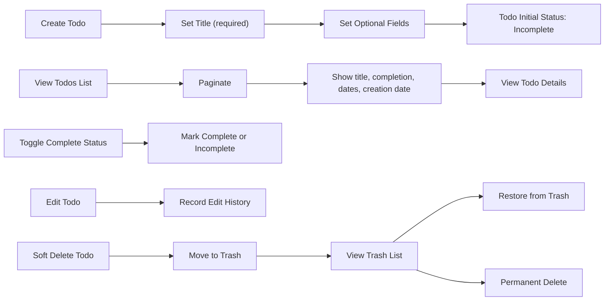

# Multi-User Todo Application Requirements Specification

## 1. User Account

### 1.1 Registration
WHEN a user submits an email and password to register, THE system SHALL create a new user account.

WHEN a user submits registration information with an email already in use, THEN THE system SHALL reject the registration with an appropriate error.

WHEN the user successfully registers, THE system SHALL store the user password securely using hashing with salt.

### 1.2 Login
WHEN a user submits an email and password to log in, THE system SHALL validate the credentials.

IF the credentials are correct, THEN THE system SHALL authenticate the user and issue a JWT token.

IF the credentials are incorrect, THEN THE system SHALL reject the login attempt with an appropriate error message.

## 1.3 Password Change
WHEN an authenticated user submits a password change request with the current password and a new password, THE system SHALL verify the current password.

IF verification succeeds, THEN THE system SHALL update the password with a securely hashed new password.

IF verification fails, THEN THE system SHALL reject the password change request with an appropriate error.

## 1.4 Account Deletion
WHEN an authenticated user requests account deletion, THE system SHALL delete the user account and all associated todos and edit histories permanently.

## 2. User Profile

### 2.1 Display Name
WHEN a user creates their profile, THE system SHALL allow the user to set a display name.

WHEN a user updates their display name, THE system SHALL save and update it.

### 2.2 Privacy
Users SHALL NOT be able to view other users' profiles under any circumstance.

## 3. Creating Todos

### 3.1 Fields
WHEN a user creates a new todo, THE system SHALL require a title.

Description, start date, and due date are optional and can be left empty.

### 3.2 Default Status
Newly created todos SHALL be marked as incomplete by default.

## 4. Viewing Todos

### 4.1 Listing
WHEN a user views their todo list, THE system SHALL display only their own todos.

The todo list SHALL be paginated.

### 4.2 List Item Fields
Each todo item in the list SHALL show the title, completion status, start date (if set), due date (if set), and creation date.

### 4.3 Detail View
WHEN a user views a single todo, THE system SHALL display all details, including the full description.

## 5. Completing Todos

WHEN a user marks a todo as complete or incomplete, THE system SHALL toggle the completion status accordingly.

## 6. Editing Todos

### 6.1 Editable Fields
A user SHALL be able to edit the title, description, start date, and due date of their todos.

### 6.2 Edit History
WHEN a todo is edited, THE system SHALL create an entry in the todo's edit history recording the changes.

## 7. Edit History

### 7.1 History Entries
Each edit history entry SHALL record the following:
- When the edit was made
- What the title was changed to (if changed)
- What the description was changed to (if changed)
- What the start date was changed to (if changed)
- What the due date was changed to (if changed)

### 7.2 Viewing and Sorting
Users SHALL be able to view their todos' full edit history.

History entries SHALL be sorted from most recent to oldest.

## 8. Deleting Todos

WHEN a user deletes a todo, THE system SHALL softly delete it so that it no longer appears in the normal todo list but is not permanently removed.

## 9. Trash

### 9.1 Trash Listing
Users SHALL be able to view a paginated list of their deleted todos (trash).

### 9.2 Restore
Users SHALL be able to restore a deleted todo from the trash, returning it to the normal todo list.

### 9.3 Permanent Deletion
WHEN a user permanently deletes a todo from the trash, THE system SHALL remove the todo and all associated edit history permanently.

## 10. Filtering Todos

Users SHALL be able to filter their todo list by completion status:
- All todos
- Only complete todos
- Only incomplete todos

## 11. Sorting Todos

Users SHALL be able to sort their todo list by:
- Creation date (newest first or oldest first)
- Start date (earliest first or latest first)
- Due date (earliest first or latest first)

Todos without start date SHALL appear at the end when sorting by start date.

Todos without due date SHALL appear at the end when sorting by due date.

## 12. Privacy

### 12.1 Todo Ownership
Users SHALL only be able to see their own todos.

### 12.2 Access Control
The system SHALL prevent users from accessing or viewing other users' todos or profiles.

## 13. Authentication and Authorization

### 13.1 JWT Tokens
The system SHALL use JWT tokens for session management.

Access tokens SHALL expire after 30 minutes.

Refresh tokens SHALL expire after 14 days.

### 13.2 Permissions
A user SHALL only be able to perform actions on their own resources.

### 13.3 Roles
There is only one user role: "User", representing all authenticated users with the same permissions.

## Mermaid Diagrams

# End of Requirements Specification