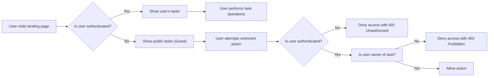

# Requirements Analysis Report for Todo List Application

## 1. Introduction
This report provides the detailed requirements analysis for the Todo list application backend. The goal is to capture all necessary business requirements, user roles, authentication flows, permissions, and workflows to guide a minimal and secure implementation.

## 2. User Roles and Actors
### 2.1 User Actor Definitions
The Todo list application supports two primary user actors:
- **Guest**: Unauthenticated users who can only view public-facing pages but cannot manipulate any Todo items.
- **User**: Authenticated users who have full control over their own Todos, including creating, reading, updating, and deleting their tasks.

### 2.2 Permissions Matrix
| Action                   | Guest  | User   |
|--------------------------|--------|--------|
| View public tasks        | ✅     | ✅     |
| View own tasks           | ❌     | ✅     |
| Create tasks             | ❌     | ✅     |
| Update own tasks         | ❌     | ✅     |
| Delete own tasks         | ❌     | ✅     |
| Access administration    | ❌     | ❌     |

## 3. Authentication and Authorization
### 3.1 Authentication Flow
- Users must log in with valid credentials (email and password). User registration is considered out of current minimal scope but anticipated in future versions.
- Secure session management through JSON Web Tokens (JWT).
- JWT tokens must contain user identity and role claims.
- Tokens will have expiration policies and a potential refresh mechanism.
- Logout functionality must securely invalidate sessions.

### 3.2 Authorization Rules
- Guests cannot create, update, or delete any Todos.
- Users can manage (create, read, update, delete) only their own Todos.
- Unauthorized access attempts must be rejected with appropriate HTTP status codes (401 for unauthorized, 403 for forbidden).

## 4. Todo Management
### 4.1 Todo Item Structure
- Each Todo item includes an identifier, title, description (optional), creation timestamp, completion status, and owner identifier.

### 4.2 CRUD Operations
- Users SHALL be able to create new Todos.
- Users SHALL be able to retrieve a list of their Todos.
- Users SHALL be able to update details of their Todos.
- Users SHALL be able to delete their Todos.

### 4.3 Business Rules
- Users SHALL NOT access or modify other users' Todos.
- When a Todo is marked as completed, the system SHALL record the completion timestamp.

## 5. Error Handling and Security
- IF an unauthenticated user (Guest) attempts to perform restricted actions, THEN the system SHALL respond with 401 Unauthorized.
- IF a user attempts to access or modify another user's Todo, THEN the system SHALL respond with 403 Forbidden.
- JWT tokens SHALL be securely validated for authenticity and expiration.
- Passwords (if handled) SHALL be stored securely with hashing and salting (implementation detail).

## 6. User Interface Considerations
- Guests SHALL see a read-only view of public tasks or a landing page.
- Authenticated users SHALL see a personalized view displaying their own Todos.
- The system SHALL provide informative error messages in case of failures.

## 7. Appendices
### 7.1 Mermaid Diagram: User Authentication and Authorization Flow

### 7.2 Permissions Matrix
| Action                   | Guest  | User   |
|--------------------------|--------|--------|
| View public tasks        | ✅     | ✅     |
| View own tasks           | ❌     | ✅     |
| Create tasks             | ❌     | ✅     |
| Update own tasks         | ❌     | ✅     |
| Delete own tasks         | ❌     | ✅     |

---

This comprehensive requirements specification defines the minimal, production-ready Todo list backend application, ensuring secure authentication and authorization, clear business rules, and user roles necessary for implementation.