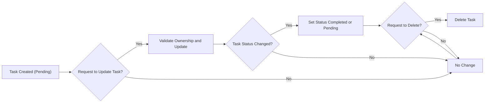

# Functional Requirements Analysis for Todo List Application

## 1. Introduction
This document specifies the business and functional requirements for a minimum viable Todo list application backend. The primary audience is backend developers who will implement the system. The scope includes essential features that allow authenticated users to create, view, update, complete, and delete their tasks. It excludes complex features like collaboration, reminders, or deadlines.

## 2. Business Model
The Todo list application meets a market need for simple, personal task management without complexity. It fills the gap for users needing lightweight solutions. Initial revenue focus is on user acquisition with potential future premium features.

## 3. User Roles and Permissions
The system defines three user roles each with specific permissions:

- **Guest**: Unauthenticated users with read-only access to public information. They cannot create or modify tasks.
- **User**: Authenticated users who manage personal todo tasks fully.
- **Admin**: System administrators with permissions to manage all users and system settings.

### 3.1 Authentication Workflows
- WHEN a user registers with valid email and password, THEN the system SHALL create an account and send a verification email within 1 minute.
- WHEN a user attempts login with credentials, THEN the system SHALL validate and grant access within 2 seconds or return error on failure.
- WHEN a user logs out, THEN the system SHALL invalidate the current session token immediately.
- Session tokens SHALL expire after 30 minutes of inactivity.
- Refresh tokens SHALL allow session renewal for up to 14 days.
- Users SHALL be able to request password reset emails which expire after 1 hour.
- Users SHALL be able to change passwords after authentication.
- Users SHALL have the ability to revoke all active sessions.

### 3.2 Permission Matrix
| Action                               | Guest | User | Admin |
|------------------------------------|-------|------|-------|
| View public information             | ✅    | ✅   | ✅    |
| Register an account                 | ❌    | N/A  | ❌    |
| Create todo task                   | ❌    | ✅   | ✅    |
| Update own todo task               | ❌    | ✅   | ✅    |
| Mark own task as completed/pending| ❌    | ✅   | ✅    |
| Delete own todo task               | ❌    | ✅   | ✅    |
| Manage all users                   | ❌    | ❌   | ✅    |
| Manage system settings            | ❌    | ❌   | ✅    |

## 4. Task Management
### 4.1 Task Creation
- WHEN a user submits a new task description that is non-empty, THEN the system SHALL create the task with a unique ID and pending status.
- IF the description is empty or whitespace only, THEN the system SHALL reject the creation with a validation error.

### 4.2 Task Update
- WHEN a user updates a task description or status, THEN the system SHALL validate ownership and apply changes.
- THE task status SHALL be either "pending" or "completed".

### 4.3 Task Deletion
- WHEN a user requests task deletion, THEN the system SHALL verify ownership and delete the task.

### 4.4 Task Listing
- WHEN a user requests their task list, THEN the system SHALL return all tasks with descriptions and statuses.

## 5. Task Life Cycle

## 6. Validation Rules
- Task descriptions SHALL be non-empty strings trimmed of whitespace.
- Task status SHALL be one of the enum values: "pending", "completed".
- Only authenticated users SHALL be able to create, update, complete, or delete tasks.

## 7. Error Handling
- WHEN a user attempts to modify a task they do not own, THEN the system SHALL respond with a 403 authorization error.
- WHEN validation fails (e.g., empty description), THEN the system SHALL respond with a 400 validation error.
- WHEN unauthenticated users attempt restricted actions, THEN the system SHALL respond with a 401 authentication error.

## 8. Performance Requirements
- Task operations (create, update, delete) SHALL complete within 2 seconds under nominal load.
- Task listing SHALL respond within 2 seconds.
- The system SHALL maintain data consistency under concurrent access.

## 9. Security and Authentication
- Session tokens SHALL be stored securely using httpOnly cookies.
- Refresh tokens SHALL be rotated on use to prevent replay attacks.
- All endpoints requiring authentication SHALL verify the session token.
- Users SHALL receive clear error messages on authentication failures.

## 10. Summary
The Todo list backend SHALL provide minimal but complete functionality for personal task management with strong authentication, proper authorization, and responsive performance. The system SHALL reject invalid data and deny unauthorized access with clear error reporting.

This document defines fully specified business requirements with precise behaviors to enable backend developers to implement the system as intended.