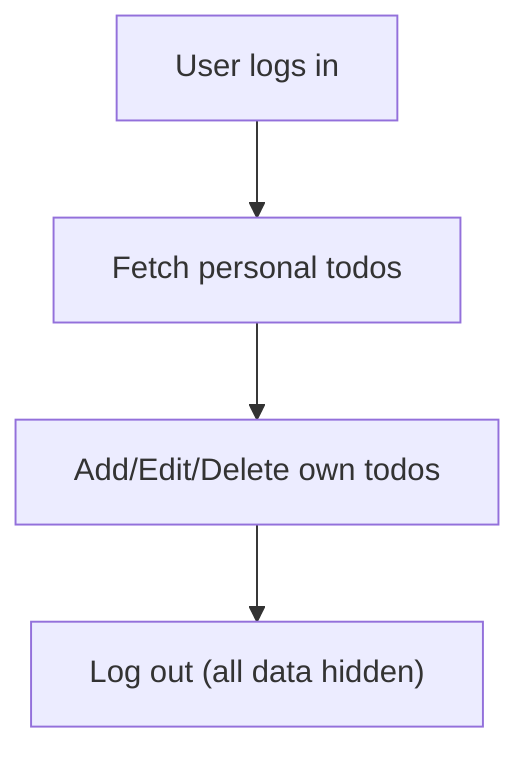

# Todo List Application: Requirements Specification

## Functional Requirements

- WHEN a user signs up, logs in, or logs out, THE application SHALL process user authentication and associate all todos with the current authenticated user.
- THE application SHALL allow each user to maintain their own independent list of todo items, ensuring no access nor data visibility for other users’ todos under any circumstances.
- The minimal viable todo functionality SHALL include creating (add), reading (view), updating (edit), and deleting (remove) todo items in the user’s list.
- WHEN a user adds a new todo, THE system SHALL require at minimum a textual description for the task. Optionally, a todo MAY include a completion status (done/not done) and a creation timestamp.
- WHEN displaying todos, THE application SHALL present only the current authenticated user's todos, sorted by creation time in descending order by default.
- WHEN a todo is marked as completed, THE system SHALL visibly update the status for the user, but SHALL retain the completed task for reference.
- WHEN a user edits a todo, THE application SHALL update only the specified fields and SHALL not create a duplicate.
- WHEN a user deletes a todo, THE system SHALL remove it only from that user’s list and SHALL not affect any other user’s data.
- All operations SHALL return a clear success or error message within 2 seconds of user action.

## Authentication and Authorization

- THE system SHALL require each user to authenticate via email/password (or OAuth where available) before allowing access to any todo-related features.
- WHEN a user’s session expires or if an authentication error occurs, THE application SHALL require the user to re-authenticate before presenting any todo list UI or data.
- All permission checks SHALL use strong session isolation: users SHALL NOT access, modify, or discover the existence of any todos belonging to others.

## User Scenarios

### Scenario 1: Adding a Todo
WHEN a user enters a new todo description and submits,
THE system SHALL create a new todo item associated exclusively with that user
AND return confirmation of successful addition.

### Scenario 2: Viewing Todos
WHEN a user authenticates successfully or refreshes the todo list page,
THE system SHALL present an up-to-date list of all their own todos
AND SHALL NOT display any other users' information.

### Scenario 3: Completing a Todo
WHEN the user marks a todo as done,
THE system SHALL update the completion status of that todo AND visibly show the change.

### Scenario 4: Editing a Todo
WHEN the user edits a todo’s description (and status, if supported),
THE system SHALL persist the changes and display them immediately.

### Scenario 5: Deleting a Todo
WHEN the user deletes any todo,
THE system SHALL irreversibly remove the specific todo from only their own list
AND confirm removal with a visible message.

## Business Rules and Constraints

- Each todo SHALL belong to one and only one user; there is NO shared todo or group function in this MVP.
- Todo description SHALL be a non-empty string of up to 255 characters and must not consist only of whitespace.
- Each user’s todo list SHALL be limited to a maximum of 200 active pending items. WHEN that limit is reached, THE system SHALL block new additions with an explanatory error message.
- Completed todos MAY remain for reference but are counted towards the total limit until deleted.
- WHEN invalid input is submitted, THE system SHALL provide an actionable error message describing the problem.
- Upon account removal, ALL user data including todos SHALL be permanently deleted and unrecoverable.
- No business logic enforces content or deadlines—todos have only minimal structure for MVP.

## Error Handling and Edge Cases

- WHEN backend service is unavailable or an unexpected error occurs,
THE application SHALL retry once and then report a persistent error if the issue continues.
- WHEN a user attempts any unauthorized action (such as accessing another user’s data),
THE system SHALL return an authorization error and log the attempt.
- WHEN a user submits an empty todo or tries to create more than 200 todos, THE system SHALL block the action with a clear error message.
- WHEN a request fails validation, THE error message SHALL specify the violated rule clearly (e.g., 'Todo description cannot be blank').

## Usability and Accessibility

- THE application SHALL be operable on both desktop and mobile browsers without requiring device-specific installation.
- THE todo input area and action buttons SHALL be accessible via keyboard navigation and screen reader technologies.
- All user-facing text SHALL use plain, clear language suitable for adult casual users.

## Privacy and Security

- All user data SHALL be stored securely. Unauthenticated users SHALL NOT access any content in the database.
- All authentication and todo interactions SHALL occur over encrypted HTTPS connections only.
- WHEN a user deletes their account, ALL associated todos SHALL be deleted immediately and irreversibly, with a confirmation to the user.

## Reliability and Availability

- THE system SHALL provide at least 99.9% uptime in typical operation conditions, excluding planned maintenance windows.
- WHEN a user takes any action (add, edit, remove, mark complete), THE outcome SHALL be confirmed to the user within 2 seconds or an error SHALL be shown.
- User todos SHALL persist through logout, application refresh, browser close, and device change—data loss is not permitted under normal operation.

---

# Value Proposition Traceability Reference

- This requirements document implements the core value proposition as stated:
    - Personal privacy by per-user data isolation
    - Simplicity through CRUD-only todo management
    - Reliability and peace of mind via strong persistence, authentication, and error handling
    - No extra features or distractions: only essential, core functions
    - User empowerment and satisfaction via ownership and clarity

## End of Document