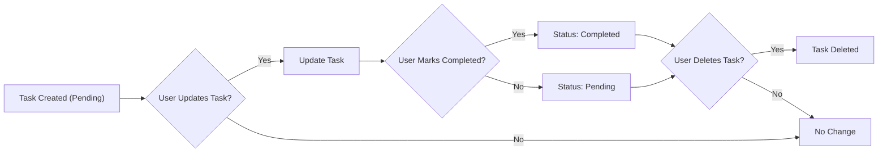

# Functional Requirements Analysis for Todo List Application

## 1. Introduction
This document specifies the business and functional requirements for a minimum viable Todo list application backend. The focus is on essential features allowing authenticated users to create, manage, complete, and delete personal tasks. The system does not support advanced features such as deadlines, reminders, or collaborative task management. It is intended for individual user use.

This document provides business requirements only. All technical implementation decisions (system architecture, API design, database schema, etc.) are the full responsibility of the development team.

## 2. Business Model

### Why This Service Exists
- The Todo list application addresses a universal need for simple, personal task management.
- It fills the gap for users seeking a lightweight tool without complex features.
- The market includes many competitors; this service differentiates by providing minimalism and ease of use.

### Revenue Strategy
- As a minimal application, initial revenue may not be the focus.
- Potential future monetization may include ads, premium features, or integrations.

### Growth Plan
- Growth driven by simplicity and ease of onboarding new users.
- Focus on retaining users by ensuring reliability and performance.

### Success Metrics
- Active user count (daily and monthly).
- Task creation and completion rates.
- User retention over time.

## 3. User Roles and Permissions

| Role  | Description                                                                                                     | Permissions                                             |
|-------|-----------------------------------------------------------------------------------------------------------------|---------------------------------------------------------|
| Guest | Unauthenticated users with read-only access (viewing public information only).                                  | Cannot create, update, or delete tasks.                  |
| User  | Authenticated users who can create, update, complete, and delete their own tasks.                               | Full CRUD on their own tasks.                            |
| Admin | System administrators with permissions to manage all users and system-wide settings.                           | Manage all user accounts and oversee system operations. |

## 4. Task Management

### 4.1 Task Creation
- WHEN a user submits a new task description, THE system SHALL create a new todo task associated with that user.
- WHEN a task is created, THE system SHALL assign it a unique identifier.
- THE task SHALL have a description text and a completion status set to "pending" by default.

### 4.2 Task Update
- WHEN a user updates the description of an existing task, THE system SHALL save the new description.
- THE system SHALL NOT allow users to update tasks that do not belong to them.

### 4.3 Task Completion
- WHEN a user marks a task as completed, THE system SHALL update the task's status to "completed".
- WHEN a user marks a task as pending again, THE system SHALL update the status to "pending".

### 4.4 Task Deletion
- WHEN a user requests deletion of a task, THE system SHALL delete that task.
- THE system SHALL NOT allow users to delete tasks that do not belong to them.

### 4.5 Task Listing
- WHEN a user requests their task list, THE system SHALL return all tasks associated with that user.
- THE system SHALL include task descriptions and completion statuses in the listing.

## 5. Task Life Cycle

The task life cycle includes the following states and transitions:
- Created (pending status)
- Updated (description or status change)
- Completed
- Deleted

## 6. Validation Rules

- WHEN a user submits a new task description, THEN THE system SHALL validate that the description is a non-empty string.
- IF the description is empty or only whitespace, THEN THE system SHALL reject the creation request with an error.
- WHEN a user updates a task description, THEN THE system SHALL apply the same validation.
- THE system SHALL enforce that only authenticated users can create, update, complete, or delete tasks.

## 7. Error Handling

- IF a user attempts to modify or delete a task that does not belong to them, THEN THE system SHALL respond with an authorization error.
- IF a user submits invalid task data (e.g., empty description), THEN THE system SHALL provide a validation error with a descriptive message.
- IF an unauthenticated user attempts to perform restricted actions, THEN THE system SHALL deny access and return an authentication error.

## 8. Performance Requirements

- WHEN a user requests their list of tasks, THEN THE system SHALL respond within 2 seconds under normal operating conditions.
- WHEN a user creates, updates, completes, or deletes a task, THEN THE system SHALL reflect changes in the backend within 2 seconds.
- THE system SHALL handle concurrent requests from multiple users without data loss or corruption.

---

This document contains business requirements only. All technical implementation decisions about how to build the system, including APIs, database schema, and architecture, are fully delegated to the development team.
The document specifies WHAT the system must do, not HOW to implement it.