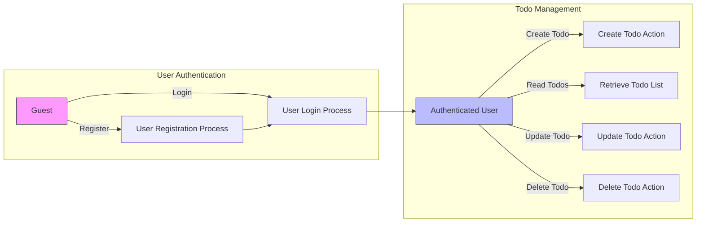

# Functional Requirements Specification Document

## Introduction

This document specifies the comprehensive functional requirements for the TodoApp, a multi-user Todo list application enabling users to register, authenticate, and manage their personal todo items. Each user's todo list is strictly private and inaccessible to others. The document is intended for backend developers to implement the system according to precise business needs, focusing on security, privacy, and core functionality.

---

## Business Model

### Why This Service Exists
TodoApp addresses the common need for individuals to organize personal tasks efficiently and securely in an online environment. Unlike generic or shared task managers, TodoApp provides isolated, secure todo lists tailored to individual users. This guarantees privacy and data separation in a multi-tenant architecture.

### Core Features
- Secure user registration and authentication
- Personal todo list creation, reading, updating, and deletion (CRUD)
- Strict access control ensuring that each user's data is private

### Success Metrics
- Active users managing their todo lists daily
- Zero data leakage incidents
- Fast system response times for task operations

---

## User Actors and Authentication

### User Actors

| Actor | Description |
|-------|-------------|
| guest | Unauthenticated users who can register and log in. |
| user  | Authenticated users who can manage their own private todo lists. |

### Authentication Flow

- Users register with email and password.
- Upon registration, users can log in to establish authenticated sessions.
- JWT tokens are used for session management with proper expiration and refresh handling.
- Only authenticated users can access any todo-related functionality.

### Permissions

| Action                | guest | user |
|-----------------------|-------|------|
| Register              | ✅    | ❌   |
| Login                 | ✅    | ❌   |
| Create todo items     | ❌    | ✅   |
| Read own todo items   | ❌    | ✅   |
| Update own todo items | ❌    | ✅   |
| Delete own todo items | ❌    | ✅   |
| Access other's todos  | ❌    | ❌   |

---

## Functional Requirements

### 1. Todo Item Management

#### Creation

WHEN a user submits a new todo item with valid title and optional description, THE system SHALL create a new todo item associated with that user and return a confirmation within 2 seconds.

#### Reading

WHEN a user requests their todo list, THE system SHALL retrieve and return only the todo items associated with that authenticated user.

#### Update

WHEN a user submits updates to a todo item they own, THE system SHALL update the todo item if it exists and belongs to that user, reflecting changes within 2 seconds.

#### Deletion

WHEN a user requests deletion of a todo item they own, THE system SHALL remove the todo item permanently from their list immediately.

### 2. User Registration and Login

#### Registration

WHEN a guest submits valid registration data (email and password), THE system SHALL create a new user account if the email is not already in use, sending a confirmation response.

#### Login

WHEN a user submits valid login credentials, THE system SHALL authenticate and issue a JWT access token valid for 30 minutes.

#### Session Management

WHILE the access token is valid, THE system SHALL authorize user actions.

WHEN the access token expires, THE system SHALL require re-authentication.

### 3. Data Privacy and Access Control

#### User Data Isolation

THE system SHALL ensure all todo data is scoped strictly per authenticated user, prohibiting access across different user accounts.

#### Unauthorized Access Handling

IF unauthorized access attempts occur (e.g., a user tries to access another user's todos), THEN THE system SHALL respond with HTTP 403 Forbidden and log the incident.

---

## Business Rules and Validation

- Todo item titles MUST be non-empty strings up to 255 characters.
- Descriptions are optional, with a maximum length of 1000 characters.
- Each todo item MUST have an owner user ID linking it to the authenticated user.
- User passwords MUST be stored securely following best hashing practices.
- Email addresses MUST be unique across all users.

---

## Error Handling and Recovery

- IF user registration fails due to duplicate email, THEN THE system SHALL return an error identifying the conflict.
- IF login fails due to invalid credentials, THEN THE system SHALL return an appropriate authentication error.
- IF a user attempts todo operations without authentication, THEN THE system SHALL reject with HTTP 401 Unauthorized.

---

## Performance Expectations

- Typical user todo CRUD operations SHALL respond within 2 seconds under normal load.
- Authentication requests SHALL validate and respond within 2 seconds.

---

## Security and Authorization Overview

- JWT tokens SHALL be used for stateless authentication.
- Access control SHALL strictly enforce user ownership on all todo operations.
- All sensitive data SHALL be transmitted over encrypted channels.

---

## Use Case Diagrams

```mermaid
graph LR
  subgraph "User Authentication"
    A["Guest"] -->|"Register"| B["User Registration Process"]
    A -->|"Login"| C["User Login Process"]
  end

  subgraph "Todo Management"
    U["Authenticated User"] -->|"Create Todo"| D["Create Todo Action"]
    U -->|"Read Todos"| E["Retrieve Todo List"]
    U -->|"Update Todo"| F["Update Todo Action"]
    U -->|"Delete Todo"| G["Delete Todo Action"]
  end

  B --> C
  C --> U

  style A fill:#f9f,stroke:#333,stroke-width:1px
  style U fill:#bbf,stroke:#333,stroke-width:1px
```

## Summary

This document provides comprehensive business and functional requirements for the TodoApp backend system, focusing on user authentication, todo management, data privacy, and security. It is intended exclusively as a business requirements document— all technical implementations including architecture, APIs, and data modeling shall be determined solely by the development team.

> This document provides business requirements only. All technical implementation decisions belong to developers. Developers have full autonomy over architecture, APIs, and database design. The document describes WHAT the system should do, not HOW to build it.
