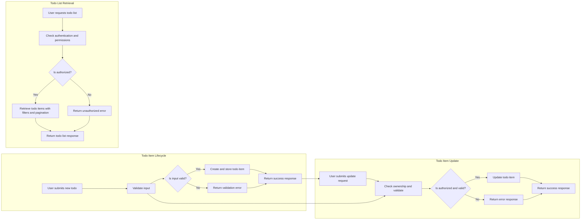

# Todo List Application Functional Requirements

## 1. Introduction
The todo list application provides users with a minimal yet fully functional system to create, manage, and track their todo items. The system supports registered users and administrators, with features including todo item creation, editing, deletion, status updates, list retrieval with filtering, and user profile management.

## 2. Functional Requirements

### 2.1 Todo Creation and Management
- WHEN a registered user submits a request to create a new todo item, THE todoList system SHALL create the todo item exclusively associated with the user.
- THE todoList system SHALL validate the todo item title and description with the title being a non-empty string up to 255 characters and description optional up to 1000 characters.
- IF the user submits invalid data such as an empty title or title exceeding length limits, THEN THE todoList system SHALL reject the creation request with a clear validation error message.
- THE todoList system SHALL assign a unique identifier and creation timestamp to each new todo item.
- WHEN a registered user submits modifications to their own todo items, THE todoList system SHALL update the items accordingly.
- THE todoList system SHALL reject modifications to todo items not owned by the requesting user.
- THE todoList system SHALL validate all modified fields using the same criteria as for creation.
- WHEN a registered user requests deletion of their own todo item, THE todoList system SHALL remove the item from the user's list.
- THE todoList system SHALL reject deletion requests for todo items not owned by the user.
- WHEN an administrator requests deletion of any todo item, THE todoList system SHALL remove the specified item.

### 2.2 Completion and Status Updates
- WHEN a registered user toggles the completion status of their todo item, THE todoList system SHALL update the status.
- THE todoList system SHALL track completion status using a boolean `isComplete` field.
- WHEN status update succeeds, THE todoList system SHALL update the modified timestamp.

### 2.3 List Retrieval and Filtering
- WHEN a registered user requests their todo list, THE todoList system SHALL return all todo items for that user, ordered by creation time descending.
- THE todoList system SHALL support optional filtering by completion status.
- THE todoList system SHALL paginate results beyond 50 items with default page size 20.
- WHEN a guest attempts to retrieve todo items, THEN THE todoList system SHALL deny access with an unauthorized error.
- WHEN an administrator requests todo items, THE todoList system SHALL allow retrieval of all users' items with filtering and pagination.

### 2.4 User Profile Management
- WHEN a user registers, THE todoList system SHALL create a user account with provided credentials.
- THE system SHALL require email verification before allowing any todo item operations.
- THE todoList system SHALL support login and token-based authentication.
- WHEN a user updates profile details like display name or password, THE system SHALL validate and persist changes.

## 3. Business Rules and Validation Summary
- Todo items belong exclusively to the user who created them.
- Only owners or administrators may modify or delete todo items.
- Titles must be non-empty strings no longer than 255 characters.
- Descriptions are optional with max length 1000 characters.
- Completion status is a boolean and only changeable by owners.
- All timestamps use ISO 8601 format.

## 4. Error Handling Scenarios

### 4.1 Authorization Failures
- IF a user attempts to access or modify a todo item they do not own, THEN THE system SHALL return a 403 Forbidden response with explanation.

### 4.2 Validation Errors
- IF input fails validation, THEN THE system SHALL respond with 400 Bad Request including detailed error report.

### 4.3 Authentication Required
- IF a request requires authentication and the user is unauthenticated, THEN THE system SHALL return 401 Unauthorized error.

## 5. Performance Requirements
- WHEN a user requests their todo list, THE system SHALL respond within 2 seconds under normal load.
- THE system SHALL handle concurrent requests efficiently.

## 6. User Interaction Flow Diagrams

```mermaid
graph LR
  subgraph "Todo Item Lifecycle"
    A["User submits new todo"] --> B["Validate input"]
    B --> C{"Is input valid?"}
    C -->|"Yes"| D["Create and store todo item"]
    C -->|"No"| E["Return validation error"]
    D --> F["Return success response"]
    E --> F
  end

  subgraph "Todo Item Update"
    G["User submits update request"] --> H["Check ownership and validate"]
    H --> I{"Is authorized and valid?"}
    I -->|"Yes"| J["Update todo item"]
    I -->|"No"| K["Return error response"]
    J --> L["Return success response"]
    K --> L
  end

  subgraph "Todo List Retrieval"
    M["User requests todo list"] --> N["Check authentication and permissions"]
    N --> O{"Is authorized?"}
    O -->|"Yes"| P["Retrieve todo items with filters and pagination"]
    O -->|"No"| Q["Return unauthorized error"]
    P --> R["Return todo list response"]
    Q --> R
  end

  B --> H
  F --> G
```
