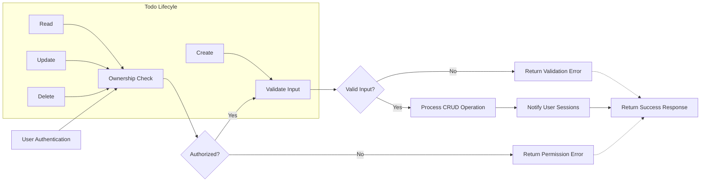

# Functional Requirements Document for Todo List Backend

## 1. Introduction
This document defines the detailed functional requirements for the Todo List backend service named **todoList**. The goal is to provide a complete specification for managing todo items and user interactions with the system. These requirements are expressed in natural language with explicit conditions, actions, and performance expectations. The document focuses on WHAT the system must do, without specifying HOW to implement.

The todoList backend supports two primary user actors:
- **guest**: Unauthenticated users who can browse public information but cannot create or modify todos.
- **user**: Authenticated users who can create, read, update, and delete their own todo items.

---

## 2. User Actors and Permissions

- WHEN an actor is unauthenticated (guest), THE system SHALL deny access to any todo item creation, update, or deletion operations and return authentication required errors.

- WHEN an actor is authenticated (user), THE system SHALL allow creating, reading, updating, and deleting of only those todo items that belong to the user.

- WHEN an actor attempts to access todo items owned by another user, THE system SHALL deny the operation and return a permission denied error.

---

## 3. Todo Item Lifecycle

### 3.1 Creating Todo Items

WHEN an authenticated user submits a request to create a new todo item with a valid title and optional description and due date, THE system SHALL validate the input according to validation rules defined in Section 4.

WHEN validation succeeds, THE system SHALL create the todo item associated uniquely with the requesting user and assign a unique identifier.

WHEN validation fails, THE system SHALL reject the creation request with detailed error messages describing invalid fields.

WHEN a guest attempts to create a todo item, THEN THE system SHALL deny the request with authentication required error.

### 3.2 Reading Todo Items

WHEN an authenticated user requests to list all todo items, THE system SHALL return all todo items that belong to the user, including their status and metadata.

WHEN a user requests a specific todo item by its unique identifier, THE system SHALL return the item only if it belongs to the user.

WHEN a guest requests to read todo items, THEN THE system SHALL deny access and return authentication required error.

### 3.3 Updating Todo Items

WHEN an authenticated user submits updates to a specific todo item, THE system SHALL verify ownership and validate inputs.

WHEN validation passes, THE system SHALL apply changes and respond with updated todo item details.

WHEN validation fails, THE system SHALL reject the update request with proper error messages.

WHEN a user attempts to update a todo item they do not own, THEN THE system SHALL deny the operation and return permission denied error.

WHEN a guest attempts to update any todo item, THEN THE system SHALL deny the request with authentication required error.

### 3.4 Deleting Todo Items

WHEN an authenticated user requests deletion of a todo item, THE system SHALL verify ownership and delete the item permanently upon verification.

WHEN a user attempts to delete a todo item they do not own, THEN THE system SHALL deny the request with permission denied error.

WHEN a guest attempts to delete any todo item, THEN THE system SHALL deny the request with authentication required error.

---

## 4. Input Validation Rules

- THE system SHALL validate that the todo item title is a non-empty string with maximum length of 255 characters.

- THE system SHALL validate that, when provided, the description is a string no longer than 1000 characters.

- THE system SHALL validate that, when provided, the due date complies with ISO 8601 date format and is not in the past.

- THE system SHALL validate that the completed flag is a boolean value.

- WHEN input fails any validation rules, THEN THE system SHALL reject the request with a clear error message identifying faulty inputs.

---

## 5. Access Controls

- THE system SHALL enforce that only authenticated users may create, read, update, or delete their own todo items.

- THE system SHALL reject any write requests originating from guests with authentication required errors.

- THE system SHALL reject any requests attempting to access or manipulate todo items that belong to other users with permission denied errors.

---

## 6. Notification and Synchronization

- WHEN a todo item is created, updated, or deleted, THE system SHALL notify all active sessions of the owning user about the change to keep the clients synchronized.

- Notification delivery SHALL occur within 2 seconds beginning upon successful operation completion.

- THE system SHALL guarantee that multiple concurrent client sessions of the same user see consistent and up-to-date todo data.

- WHEN concurrent modifications conflict on the same todo item, THEN THE system SHALL serialize changes to maintain data integrity and reject conflicting updates with a clear error that instructs the user to retry.

---

## 7. Error Handling

- WHEN users submit invalid inputs, THE system SHALL respond with detailed validation error messages explaining the problems.

- WHEN unauthorized operations are attempted, THE system SHALL respond with authentication or permission errors as appropriate.

- WHEN system failures occur during operations, THE system SHALL return service unavailable errors and allow clients to retry.

- All error responses SHALL be returned within 2 seconds to maintain acceptable user experience.

---

## 8. Performance Expectations

- THE system SHALL process create, update, and delete operations within 500 milliseconds.

- THE system SHALL return todo list retrieval responses within 1 second for up to 100 items.

- THE system SHALL handle notification dispatch to all user sessions within 2 seconds.

- THE system SHALL support at least 1,000 concurrent authenticated users with sustainable response times.

---

## 9. Mermaid Diagrams

```mermaid
graph LR
  A["User Authentication"] --> B["Ownership Check"]
  B --> C{""Authorized?""}
  C -->|"No"| D["Return Permission Error"]
  C -->|"Yes"| E["Validate Input"]
  E --> F{""Valid Input?""}
  F -->|"No"| G["Return Validation Error"]
  F -->|"Yes"| H["Process CRUD Operation"]
  H --> I["Notify User Sessions"]
  I --> J["Return Success Response"]

  subgraph Todo Lifecyle
    K["Create"] --> E
    L["Read"] --> B
    M["Update"] --> B
    N["Delete"] --> B
  end

  D -.-> J
  G -.-> J
```

---

These functional requirements focus on business-validatable behaviors only. Implementation details such as database schemas, API endpoint structures, and technical protocols are left to the developers' discretion.
Developers must ensure full compliance with these requirements in the actual backend system implementation.