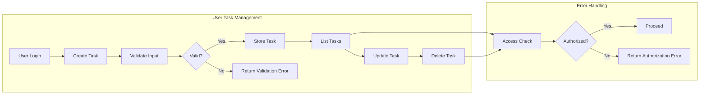

# Todo List Application Functional Requirements and Business Rules

## 1. Introduction
This document provides comprehensive and actionable business requirements for the minimum viable Todo list application. It describes the functionalities, user interactions, validations, business rules, error handling and performance requirements necessary to build the backend of the system. All technical decisions regarding architecture, APIs, and database design are left to developers' discretion.

## 2. Business Model

### Why This Service Exists
The Todo list application exists to help authenticated users efficiently manage and organize their daily tasks. It addresses the need for a simple, lightweight, and reliable tool for keeping track of personal tasks and work items.

### Business Strategy
The application aims to attract users by offering an easy-to-use and minimalistic service that prioritizes task management without unnecessary complexity. The core value lies in providing a personalized task management experience.

### Success Metrics
Success will be measured by user adoption rates, task completion rates, and system reliability.

## 3. User Actors

- **User**: Authenticated individuals who register and log in to manage their own personal todo list items.
  - Permissions: Create, read, update, and delete (CRUD) their own tasks only.
  - No access to other users' data.

## 4. Functional Requirements

### 4.1 Task Management

- WHEN a user creates a new task, THE system SHALL store the task with the following attributes: title, optional description, creation timestamp, and status.
- THE system SHALL allow users to retrieve all their tasks.
- WHEN a user updates a task, THE system SHALL modify the task attributes while preserving ownership.
- WHEN a user deletes a task, THE system SHALL remove the task permanently from the user's list.
- THE system SHALL prevent users from accessing or modifying tasks that they do not own.

### 4.2 User Interface Interactions

- WHEN a user requests to list tasks, THE system SHALL return the list sorted by creation date in descending order.
- THE system SHALL support pagination with a configurable page size of up to 50 tasks per request.

### 4.3 Data Validation

- THE system SHALL validate that task titles are non-empty strings with a maximum length of 255 characters.
- THE system SHALL validate that optional descriptions do not exceed 1000 characters.
- THE system SHALL store timestamps in ISO 8601 format.
- THE system SHALL enforce status values limited to e.g. "pending", "completed".

## 5. Business Rules

- Users can only create tasks belonging to themselves.
- Users cannot access or manipulate other users' tasks.
- Task status shall only be one of the defined allowed statuses.
- Deleted tasks are permanently removed and irrecoverable.

## 6. Error Handling

- IF a user attempts to access a task that does not exist or is not owned by them, THEN THE system SHALL return an authorization error.
- IF input validation fails, THEN THE system SHALL return descriptive validation error messages.
- IF a system error occurs, THEN THE system SHALL return a generic error message with appropriate logs for troubleshooting.

## 7. Performance Requirements

- THE system SHALL respond to all user requests within 2 seconds under normal load.
- THE system SHALL support at least 100 concurrent authenticated users managing their own todo lists.

## 8. Diagrams

```mermaid
graph LR
  subgraph "User Task Management"
    A["User Login"] --> B["Create Task"]
    B --> C["Validate Input"]
    C --> D{"Valid?"}
    D -->|"Yes"| E["Store Task"]
    D -->|"No"| F["Return Validation Error"]
    E --> G["List Tasks"]
    G --> H["Update Task"]
    H --> I["Delete Task"]
  end

  subgraph "Error Handling"
    J["Access Check"] --> K{"Authorized?"}
    K -->|"Yes"| L["Proceed"]
    K -->|"No"| M["Return Authorization Error"]
  end

  G --> J
  I --> J
```

---

This document defines business requirements only. All technical implementation decisions including architecture, API design, and database schemas are at the discretion of the development team. Developers have full autonomy in how to deliver the specified functionality.
