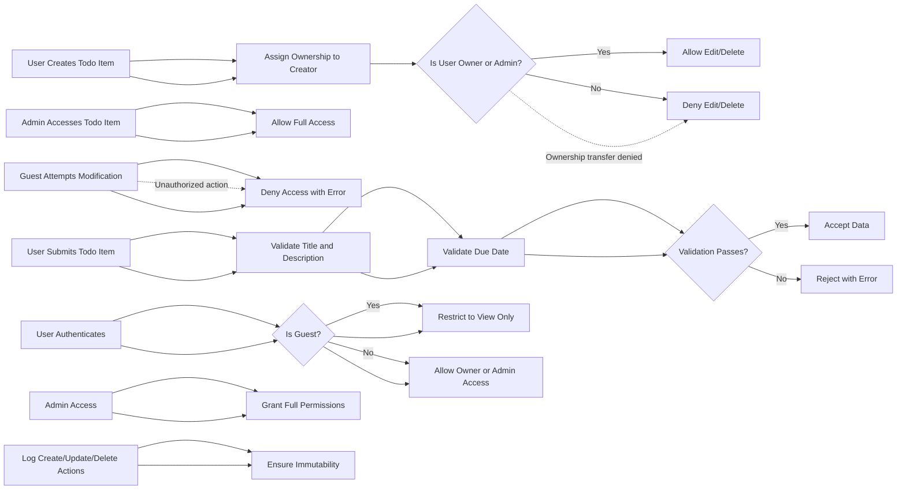

# Todo List Application Requirements Analysis

## Introduction
The Todo List Application provides minimal essential functionality to create, manage, and complete todo items for authenticated users. This document specifies business rules, user interactions, authentication, and access control requirements required to implement the backend.

## Functional Requirements

### Todo Item Management
- WHEN a registered user creates a todo item, THE system SHALL assign ownership of the todo item to that user.
- THE user SHALL be able to create, read, update, and delete their own todo items.
- THE system SHALL validate todo item data for correctness before accepting creation or update. Fields such as title and description SHALL meet length and format constraints.
- THE status field of a todo item SHALL accept only "pending", "in-progress", or "completed" values.
- IF a todo item is marked as "completed", THEN the system SHALL prevent edits to title and description.

### User Authentication and Authorization
- WHEN any operation is requested, other than viewing public information, THE system SHALL authenticate the user.
- GUEST users SHALL only have read access to public information and be restricted from creating, updating, or deleting todo items.
- ADMIN users SHALL have full access including the ability to manage all users and todo items.
- OWNERSHIP of todo items MAY NOT be transferred between users.

## User Scenarios
1. **User Registration and Login:** Users register and log in to access personal todo items.
2. **Todo Item Creation:** Users create todo items with title, optional description, status, and optional due date.
3. **Todo Item Update:** Users update their todo items, subject to validation and ownership.
4. **Todo Item Completion:** Users mark todo items as completed, locking title and description fields.
5. **Todo Item Deletion:** Users delete their owned todo items.
6. **Admin Management:** Admins view and manage all todo items and user roles.

## Business Rules

### Ownership Rules
- WHEN a user creates a todo item, THE system SHALL assign ownership to them.
- ONLY owners and admins may edit or delete a todo item.
- OWNERSHIP transfer is disallowed.

### Data Validation
- Titles SHALL be non-empty strings of 1-255 characters.
- Optional descriptions SHALL be strings up to 1000 characters.
- Due dates, if provided, SHALL comply with ISO 8601 format.
- Status values SHALL be restricted to "pending", "in-progress", or "completed".
- WHEN status is "completed", title and description edits are forbidden.

### Access Control
- AUTHENTICATION is mandatory for modification operations.
- GUESTS have read-only, public access.
- ADMINS have unrestricted access.
- Unauthorized access attempts SHALL return an error.

### Auditing and Logging
- All create, update, and delete actions SHALL be logged with user info, timestamp, and todo item ID.
- Logs SHALL be immutable to preserve audit integrity.

## Authentication
- THE system SHALL require user authentication via secure means.
- SESSION management SHALL prevent unauthorized access.
- ROLE-based permissions SHALL enforce access control rules.

## Error Handling
- VALIDATION errors SHALL provide clear messages describing the issue.
- UNAUTHORIZED attempts SHALL respond with appropriate status codes.
- SYSTEM errors SHALL trigger logging and graceful recovery.

## Performance
- SYSTEM SHALL respond to requests within acceptable latency.
- SCALABILITY SHALL allow multiple concurrent users.

## Security
- DATA privacy SHALL be enforced.
- ALL access SHALL be validated.
- INCIDENT response procedures SHALL be defined.

## Glossary
- "Owner": User who created the todo item.
- "Admin": User with elevated privileges.
- "Guest": Unauthenticated user.

## Appendices
- References to specifications and external standards.

