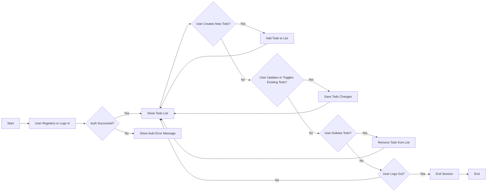

# Minimal Todo List Application Requirements

## Introduction
The Minimal Todo List Application provides a personal task management service that is intentionally designed to be as simple and focused as possible. All features and requirements in this document are limited strictly to the core business needs of a single user managing their own to-dos. The application supports only fundamental workflows essential for personal productivity, excluding all collaborative, administrative, or advanced features.

## Main Features
- Secure registration, login, and logout so a user can manage their own private todos.
- Creation of todo tasks with title and optional description, each todo belonging to a single user account.
- Real-time viewing of a user’s own todo list, with clear separation between completed and incomplete items for easy tracking.
- Editing of task title, description, or mark as completed/incomplete at any time by the task’s owner.
- Deletion of any task by its owner, permanently removing it from their data.
- All data persists reliably for each user, so their list is always restored after logout or session expiration.
- Every business function applies only to the authenticated user’s data. No shared, group, or administrative features exist in the system.

## User Actors
### todoListMember
- Any person who has registered and is logged in to the service.

## Core Functional Requirements (EARS Format)
| Activity | Business Requirement (EARS Format) |
|----------|-----------------------------------|
| Register | WHEN a prospective user provides necessary credentials, THE system SHALL create a new account and grant access to personal todos. |
| Login | WHEN a user provides valid credentials, THE system SHALL grant access to their personal todo list. |
| Logout | WHEN a user requests to log out, THE system SHALL end their authenticated session securely. |
| Create Todo | WHEN an authenticated user submits a new task with at least a non-blank title, THE system SHALL add it to that user's todo list. |
| View List | WHEN a user is authenticated, THE system SHALL display a list of all todos belonging to that user, grouped by incomplete and completed status. |
| Update Todo | WHEN a user edits the title or description of a todo they own, THE system SHALL update and save changes immediately. |
| Toggle Completion | WHEN a user toggles a todo’s status, THE system SHALL update its completion state instantly and reflect the change in their list. |
| Delete Todo | WHEN a user deletes one of their own todos, THE system SHALL remove it from their data without delay. |

## Usage Journeys & Workflows

## Detailed Usage Scenarios
### Typical Scenarios
- WHEN a user logs in, THE system SHALL immediately show their up-to-date todo list, including both completed and incomplete items.
- WHEN a user creates a todo with a valid title, THE system SHALL add the new item to that user's list and confirm display.
- WHEN a user edits an existing todo, THE system SHALL apply those changes and update the display in real time.
- WHEN a user marks a todo as complete, THE system SHALL re-group the item visually under the completed section.
- WHEN a user deletes a todo, THE system SHALL remove it from the list and reflect the change immediately.
- WHEN a user logs out, THE system SHALL securely clear all session information.

### Negative Permissions and Restrictions
- IF a user is not logged in, THEN THE system SHALL deny access to all todo operations and direct them to log in first.
- IF a user attempts to access, edit, or delete another user’s todos by any means, THEN THE system SHALL prevent the operation and show a suitable error.
- IF a user submits a todo with a blank or missing title, THEN THE system SHALL reject creation and provide a clear error message.

### Error and Edge Cases
- IF a user tries to update or delete a todo that does not exist or is no longer available (e.g., already deleted), THEN THE system SHALL show an error and not process the operation.
- IF the system experiences a temporary error (such as a network problem), THEN THE system SHALL notify the user and ask them to try again.
- WHILE a user is logged out, THE system SHALL prevent submission and editing of todos or access to user data.
- THE system SHALL validate that all todo items belong to the current user before permitting any change.

## Business Rules and Constraints
- Each todo MUST have a non-blank title set by the user at creation; description is optional.
- Users MAY edit a todo’s title, description, or completion status at any time, as long as the todo belongs to them.
- No user MAY access, view, edit, or delete any todo that belongs to another user under any circumstance.
- No administrative or moderation functions are present; users manage only their own data.
- Data for each user is securely partitioned and unavailable to anyone else.
- On logout, user session data is terminated but all todos persist and are re-accessible on the next login.

## Authentication and Authorization Requirements
- THE system SHALL require all users to register with unique credentials and log in before accessing any todo list operation.
- All todo creation, retrieval, update, toggle, and delete actions SHALL require the user to be authenticated.
- THE system SHALL not allow creation or management of todos without a valid session.
- THE system SHALL associate every todo strictly with the authenticated user.
- Permission checks SHALL be enforced at every operation to block access or modification attempts on any data not owned by the acting user.
- On logout, THE system SHALL immediately destroy the session token or equivalent, requiring full re-authentication on the next use.

## Performance and Reliability Constraints
- THE system SHALL display list, creation, update, and deletion results within 1 second in normal operation.
- THE system SHALL ensure all todo data is reliably stored so that users never lose tasks after logout, closing the app, or session termination.
- THE system SHALL gracefully handle temporary outages or failures, notifying users and requesting action retry as needed.
- THE system SHALL support multiple devices by showing the same todo list for a user on any authenticated login.

## Summary
The Minimal Todo List Application is built exclusively for a single user to manage their private to-do items. Every business requirement, constraint, and rule prioritizes user autonomy, privacy, and ease of use. All data is personal and protected, and the application enforces strict separation between users. Only authentication, core todo management, and personal data safety features are required by the specification. There are no administrative, collaborative, or advanced business capabilities considered for this initial minimal release.