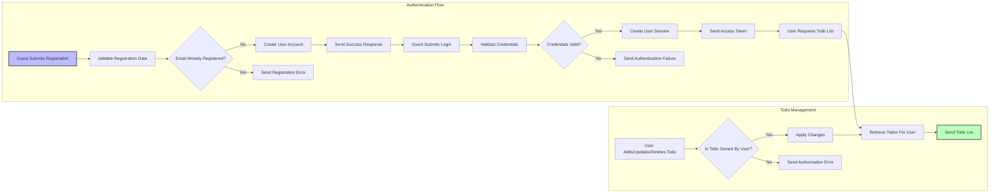

# Functional Requirements for Multi-User Todo List Application

## 1. User Authentication

### 1.1 Registration
- WHEN a guest provides a valid email and password for registration, THEN THE system SHALL create a new user account.
- IF the provided email is already registered, THEN THE system SHALL reject the registration with an error message indicating duplication.
- THE system SHALL securely hash and store user passwords.
- THE system SHALL send confirmation of successful registration to the user.

### 1.2 Login
- WHEN a guest submits login credentials (email and password), THEN THE system SHALL validate these credentials.
- IF credentials are valid, THEN THE system SHALL establish a secure user session and issue an access token.
- IF credentials are invalid, THEN THE system SHALL respond with an authentication failure error.

### 1.3 Session Management
- THE system SHALL maintain user sessions securely with expiration and refresh mechanisms.
- WHEN a user logs out, THEN THE system SHALL invalidate the session and revoke tokens.

### 1.4 Password Management
- THE system SHALL provide mechanisms for password recovery and reset, triggering secure email workflows.

## 2. User Authorization

- THE system SHALL enforce strict authorization ensuring each user can access only their own todo list data.
- WHEN a user attempts to access or modify todo data of another user, THEN THE system SHALL deny access and respond with an authorization error.

## 3. Todo Management

### 3.1 Create Todo
- WHEN an authenticated user submits a new todo item with a title (mandatory) and optional description, THEN THE system SHALL save the item associated with that user.

### 3.2 Retrieve Todos
- WHEN an authenticated user requests their todo list, THEN THE system SHALL return all todo items belonging to that user, ordered by creation date.

### 3.3 Update Todo
- WHEN an authenticated user submits updates to an existing todo item they own, THEN THE system SHALL apply the changes.
- IF the todo item does not belong to the user, THEN THE system SHALL reject the update request with an authorization error.

### 3.4 Delete Todo
- WHEN an authenticated user requests deletion of a todo item they own, THEN THE system SHALL delete the item.
- IF the todo item belongs to another user, THEN THE system SHALL deny the deletion request.

## 4. Error Handling

### 4.1 Registration Errors
- IF registration data is invalid or incomplete, THEN THE system SHALL respond with detailed error messages specifying the issues.

### 4.2 Authentication Errors
- IF login credentials are incorrect, THEN THE system SHALL respond with an authentication failure message.

### 4.3 Authorization Errors
- IF an unauthorized access attempt occurs, THEN THE system SHALL respond with an authorization error.

### 4.4 Todo Operation Errors
- IF a user attempts operations on a todo item that does not exist or is not owned by them, THEN THE system SHALL respond with an appropriate error message.

## 5. Performance Requirements

- THE system SHALL respond to registration and login requests within 2 seconds under normal load.
- THE system SHALL respond to todo retrieval, creation, update, and deletion requests within 1 second under normal load.
- THE system SHALL be capable of handling concurrent user sessions efficiently.

## 6. Business Rules

- THE todo title SHALL be non-empty and have a maximum length of 255 characters.
- THE todo description MAY be empty but SHALL have a maximum length of 1000 characters.
- ALL user actions SHALL be logged for audit purposes.

## 7. User Scenarios

### Scenario 1: User Registration
- WHEN a guest user submits registration details with a valid email and password, THEN THE system SHALL create the user account and send a confirmation.
- IF the email is already registered, THEN THE system SHALL return an error.

### Scenario 2: User Login
- WHEN a guest user submits valid login credentials, THEN THE system SHALL create a user session and return an access token.
- IF the credentials are invalid, THEN THE system SHALL deny access with an authentication failure message.

### Scenario 3: Todo Creation
- WHEN an authenticated user submits a new todo with valid title and optional description, THEN THE system SHALL associate it with the user and store it.

### Scenario 4: Unauthorized Access
- IF a user attempts to access or modify another user's todos, THEN THE system SHALL deny access and return an authorization error.

## 8. System Overview Diagram

