# Todo List User Scenarios Document

## Introduction

This document provides comprehensive user scenarios for the Todo List backend application, detailing both typical and alternative interaction flows. It serves as a guide for backend developers implementing all possible user actions, permission rules, and error handling from the user's perspective.

## 1. Primary User Journey

### 1.1 Creating a Todo Item

WHEN an authenticated user submits a new todo item with a valid title and an optional description, THE system SHALL create a new todo item associated exclusively with that user. The system SHALL respond with a confirmation including the unique identifier and metadata of the created todo item.

The system SHALL reject creation attempts where the todo item title is missing or empty, returning an input validation error.

### 1.2 Reading Todo Items

WHEN an authenticated user requests their todo list, THE system SHALL retrieve all todo items owned by the user, ordered by creation date descending. The system SHALL include all relevant fields such as title, description, creation date, last modification date, and completion status.

If the user has no todo items, THE system SHALL return an empty list without error.

### 1.3 Updating a Todo Item

WHEN an authenticated user submits updates to a todo item they own, including changes to the title, description, or completion status, THE system SHALL validate the changes and update the item accordingly. The system SHALL respond with the updated todo item details.

IF the updated title is missing or invalid, then THE system SHALL reject the update and return an input validation error.

IF the user attempts to update a todo item they do not own, then THE system SHALL deny the operation and return a permission denied error.

### 1.4 Deleting a Todo Item

WHEN an authenticated user requests deletion of a todo item they own, THE system SHALL delete the item and respond with confirmation.

IF the user attempts to delete a todo item they do not own, then THE system SHALL deny the operation and return a permission denied error.

## 2. Alternate Flows

### 2.1 Creating a Todo with Invalid Input

IF an authenticated user submits a todo item with no title or with a title exceeding the maximum allowed length (e.g., 255 characters), THEN THE system SHALL reject the request and return an error detailing the validation failure.

### 2.2 Updating or Deleting Todo Not Owned

IF a user attempts to update or delete a todo item that they do not own, THEN THE system SHALL deny the operation and return an error indicating insufficient permissions.

### 2.3 Actions Attempted by Guests

WHEN a guest (non-authenticated user) attempts to create, update, or delete todo items, THEN THE system SHALL deny access and return authentication required errors.

## 3. Edge Cases and Bulk Operations

### 3.1 Bulk Todo Creation

WHEN an authenticated user submits multiple todo items in a single request, THE system SHALL process each todo item independently. It SHALL create valid items and reject invalid ones with corresponding error messages. The response SHALL include a summary of successes and failures.

### 3.2 Bulk Todo Deletion

WHEN an authenticated user requests deletion of multiple todo items they own, THE system SHALL delete all specified items and confirm the operation's success.

### 3.3 Handling Empty Todo Lists

WHEN an authenticated user has no todo items, THE system SHALL return an empty list with a success status, indicating no data rather than an error.

### 3.4 Handling Simultaneous Updates

WHEN multiple concurrent update operations occur on the same todo item, THE system SHALL serialize modifications to maintain data integrity. THE system SHALL reject conflicting updates with clear conflict error responses, allowing the user to retry with the latest data.

## Mermaid Diagram of Primary User Journey

```mermaid
graph LR
  A["User Authenticates"] --> B["User Submits New Todo"]
  B --> C["Validate Input"]
  C -->|"Valid"| D["Create Todo Item"]
  C -->|"Invalid"| E["Return Validation Error"]
  D --> F["Return Success Confirmation"]

  F --> G["User Requests Todo List"]
  G --> H["Retrieve User Todos"]
  H --> I["Return Todos"]

  I --> J["User Updates Todo"]
  J --> K["Check Ownership"]
  K -->|"Owner"| L["Validate Update Input"]
  K -->|"Not Owner"| M["Return Permission Denied"]
  L -->|"Valid"| N["Update Todo Item"]
  L -->|"Invalid"| O["Return Validation Error"]
  N --> P["Return Updated Item"]

  P --> Q["User Deletes Todo"]
  Q --> R["Check Ownership"]
  R -->|"Owner"| S["Delete Todo Item"]
  R -->|"Not Owner"| T["Return Permission Denied"]
  S --> U["Return Delete Confirmation"]
```

---

This document provides business requirements only. All technical implementation decisions, including architecture, APIs, data persistence, and deployment, are left to the discretion of the development team. The document describes WHAT the system should do from the user perspective, NOT HOW to implement it.