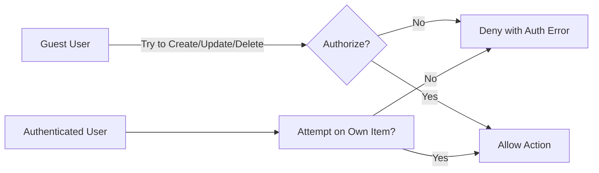
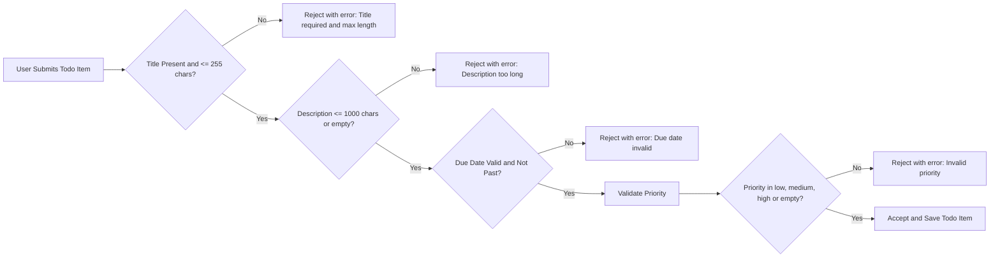

# Business Rules and Validation Requirements for Todo List Application

## 1. Introduction
This document specifies the detailed business rules, validation logic, and constraints for the Todo List application backend. It defines how todo items must be validated, what permissions users have, and how data retention is managed. The document ensures no ambiguity remains for developers implementing the backend logic.

## 2. Todo Item Validation Rules

### 2.1 Content Requirements
- WHEN a user creates a todo item, THE system SHALL require the title field to be a non-empty string with a maximum length of 255 characters.
- WHERE the description field is provided, THE system SHALL ensure it is a string with a maximum length of 1000 characters.
- WHEN a user creates or updates a todo item, THE system SHALL require the due date, if provided, to be a valid ISO 8601 date string representing a date/time not earlier than the current date/time.
- IF the due date is in the past, THEN THE system SHALL reject the creation or update with an error explaining that the due date cannot be in the past.

### 2.2 Status and Priority Rules
- THE system SHALL support the following status values for todo items: "pending", "completed".
- WHEN a todo item is created, THE system SHALL set its status to "pending" by default.
- WHEN a user marks a todo item as completed, THE system SHALL update its status to "completed".
- WHERE priority is provided, THE system SHALL accept only the values "low", "medium", or "high".
- IF a priority value outside of these is provided, THEN THE system SHALL reject the request with a validation error.

## 3. User Permissions and Constraints

### 3.1 Actor Descriptions
- **Guest**: Unauthenticated users who can browse any public or shared information but CANNOT create, update, or delete todo items.
- **User**: Authenticated users who CAN create, read, update, and delete only their own todo items.

### 3.2 Permission Matrix
| Action                | Guest | User |
|-----------------------|-------|------|
| View todo items       | ❌    | ✅   |
| Create todo items     | ❌    | ✅   |
| Update own todo items | ❌    | ✅   |
| Delete own todo items | ❌    | ✅   |
| Update others' items  | ❌    | ❌   |
| Delete others' items  | ❌    | ❌   |

### 3.3 Action Restrictions
- WHEN a guest attempts to create, update, or delete a todo item, THE system SHALL deny the request with an authorization error.
- WHEN a user attempts to update or delete a todo item that they do not own, THE system SHALL deny the request with an authorization error.
- THE system SHALL enforce that all create, update, and delete operations validate user ownership before processing.

## 4. Data Retention and Archival Policy

### 4.1 Retention Period
- THE system SHALL retain all active todo items indefinitely while the user account exists.
- WHEN a user deletes a todo item, THEN THE system SHALL permanently remove the todo item data immediately.

### 4.2 Archival Procedures
- WHERE a feature for archival is implemented in the future, THE system SHALL provide mechanisms to archive completed todo items older than 30 days. This feature is NOT within the current minimum functionality scope.

## 5. Business Rules Summary
- Todo item titles are mandatory and limited to 255 characters.
- Descriptions are optional but limited to 1000 characters.
- Due dates cannot be in the past; validation is enforced.
- Status defaults to "pending"; valid statuses are "pending" and "completed".
- Priority, if provided, must be one of "low", "medium", or "high".
- Only authenticated users can create, update, or delete their own todo items.
- Ownership validation is mandatory on update and delete actions.
- Guest users have no create, update, or delete access.
- Deleted todo items are removed permanently without archival in the minimum viable product.

## 6. Appendices

### 6.1 Mermaid Diagram: User Permission Flow

### 6.2 Mermaid Diagram: Todo Item Validation Flow

---

All described requirements are phrased using the EARS format to assure clarity and testability by backend developers. The document avoids technical implementation details and strictly focuses on business rules, validation logic, user permission constraints, and data retention policies. Mermaid diagrams have been validated and corrected to use standard syntax with double quotes on labels and proper arrow notation. This document is immediately actionable for implementation of the Todo List backend business logic.