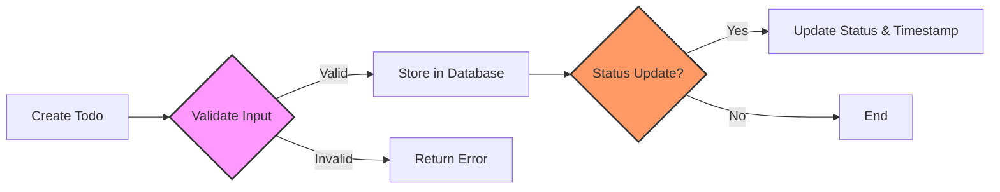

# Todo List Application Requirements Analysis

## 1. Introduction
This document defines the functional and non-functional requirements for the Todo List application. The goal is to create a minimal yet complete backend system that manages user tasks efficiently and securely.

## 2. Functional Requirements

### 2.1 Todo Item Management
- WHEN a user creates a todo item, THE system SHALL store the item with a title, optional description, creation timestamp, and status (defaulting to pending).
- WHEN a user updates a todo item, THE system SHALL allow modification of title, description, and status.
- WHEN a user deletes a todo item, THE system SHALL remove it from the system permanently.
- WHEN a user requests their todo list, THE system SHALL retrieve all todo items belonging to that user.

### 2.2 Status Values
- The status field SHALL permit only the following values: "pending", "completed", and "archived".
- WHEN a todo item's status changes to "completed", THE system SHALL record the completion timestamp.

### 2.3 Filtering and Sorting
- WHEN a user requests their todo list, THE system SHALL support filtering by status.
- WHEN a user requests their todo list, THE system SHALL support sorting by creation date or completion date.

## 3. Business Rules

### 3.1 Ownership and Access
- WHEN a user accesses todo items, THE system SHALL retrieve only those items created by that user.
- WHEN a user attempts to access or modify todo items they do not own, THE system SHALL deny access.

### 3.2 Data Validation
- WHEN a new todo item is created or updated, THE system SHALL validate that the title is provided and does not exceed 255 characters.
- The description field SHALL be optional but if provided, it SHALL not exceed 1024 characters.
- Status updates SHALL comply with allowed status values.

### 3.3 Auditing
- THE system SHALL record creation, update, and deletion timestamps for each todo item.
- THE system SHALL log user actions related to todo items for audit trails.

## 4. User Authentication and Authorization

### 4.1 User Authentication
- WHEN a user attempts to log in with valid credentials, THE system SHALL authenticate the user and issue a JWT token valid for 30 minutes.
- WHEN a user logs out, THE system SHALL invalidate the JWT token immediately.
- WHEN a user's session expires after 30 minutes of inactivity, THE system SHALL require re-authentication.

### 4.2 User Roles and Permissions
- The system SHALL define at least two user roles: "user" and "admin".
- "user" role SHALL be permitted to manage their own todo items only.
- "admin" role SHALL have permissions to view and manage all users and todo items.

### 4.3 Authorization Checks
- WHEN a user requests access to a resource, THE system SHALL verify the user's role and ownership.
- THE system SHALL deny unauthorized access attempts and log them.

## 5. Error Handling

### 5.1 Authentication Errors
- WHEN a user attempts to log in with incorrect credentials, THE system SHALL reject the request with an error message within 2 seconds.
- WHEN a user fails 5 consecutive authentication attempts, THE system SHALL lock the account for 30 minutes and notify the user.
- WHEN a user's JWT token is invalid or expired, THE system SHALL deny access and request re-authentication.

### 5.2 Authorization Failures
- WHEN a user attempts unauthorized actions, THE system SHALL deny the operation and log the incident.

### 5.3 Input Validation Errors
- WHEN requests contain missing required fields or invalid formats, THE system SHALL reject the request with descriptive error messages.
- WHEN a todo title exceeds 255 characters or description exceeds 1024 characters, THE system SHALL reject the request.
- WHEN status values are invalid, THE system SHALL reject the update request.

### 5.4 System Errors
- In case of unexpected internal errors, THE system SHALL respond with a generic error message and log details.
- IF the database is unavailable, THE system SHALL retry connection up to three times before failing.

## 6. Performance Requirements

- The system SHALL respond to all user requests within 2 seconds under normal load.
- The system SHALL support at least 100 concurrent users.

## 7. Security and Compliance

- THE system SHALL store passwords securely using salted hashing.
- THE system SHALL use HTTPS for all client-server communications.
- THE system SHALL comply with applicable data protection regulations.

## 8. Glossary

- "Todo Item": A task entered by a user to be completed.
- "JWT Token": JSON Web Token used for authentication.
- "User Roles": Defined roles with specific permissions.
- "EARS Format": Easy Approach to Requirements Syntax, a formal method for writing requirements.

## 9. Appendices

- References to security standards and libraries.
- List of future enhancements such as multi-user collaboration and reminders.

## Mermaid Diagram: Todo Item Lifecycle

