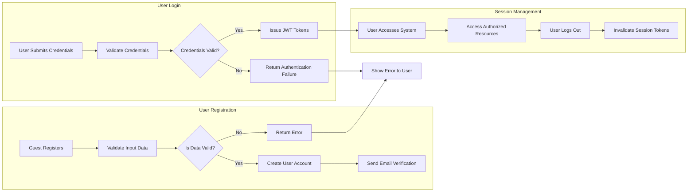
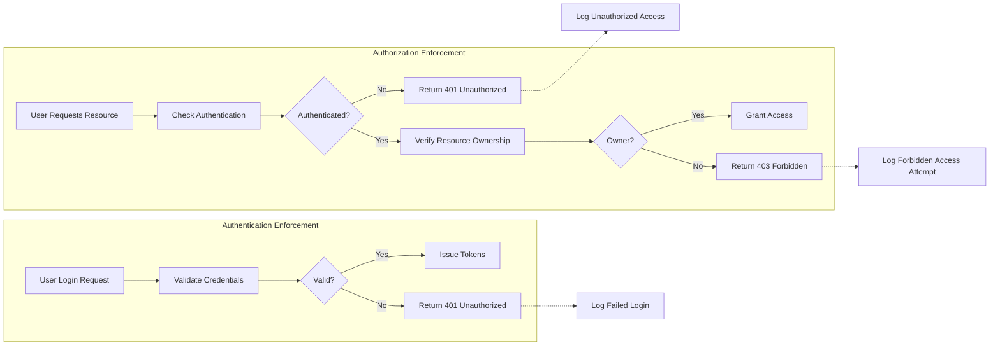

# Security and Authorization Requirements for todoApp

## Authentication Enforcement

### User Authentication Features

- WHEN a guest registers an account with email and password, THE system SHALL validate the input data and create a user account if the data is valid.
- WHEN a guest registers successfully, THE system SHALL send an email verification before granting full access.
- WHEN a registered user submits valid email and password credentials, THE system SHALL allow the user to log in and issue JWT access and refresh tokens.
- WHEN a registered user submits invalid login credentials, THE system SHALL deny access and return an authentication failure message.
- WHEN an authenticated user chooses to log out, THE system SHALL invalidate the associated session tokens and end the user session.
- THE system SHALL support password reset workflows allowing users to securely reset forgotten passwords.
- THE system SHALL allow authenticated users to change their passwords after successful re-authentication.
- THE system SHALL allow users to revoke all active sessions to log out from all devices.

### Authentication Flow Details

### Session and Token Management

- THE system SHALL use JWT access tokens with expiration times between 15 and 30 minutes.
- THE system SHALL use refresh tokens with expiration times between 7 and 30 days.
- THE system SHALL store session tokens securely, preferably using httpOnly cookies.
- THE JWT token payload SHALL include user identification, role, and permissions.
- THE system SHALL automatically expire sessions and require re-authentication after token expiration.

## Authorization Rules

### User Roles and Permissions

- THE system SHALL define the following user roles:
  - "guest": unauthenticated users who can register and log in.
  - "user": authenticated users who can manage their own private todo lists.

### Access Control Mechanisms

- WHEN a user attempts to access todo lists, THE system SHALL restrict access so that users can only access their own data.
- WHEN an unauthenticated user attempts to access private user data, THE system SHALL deny access.
- THE system SHALL enforce ownership checks on all CRUD operations on todo items.

### Permission Matrix

| Action                        | guest | user |
|------------------------------|-------|------|
| Register an account           | ✅    | ❌   |
| Log in                       | ✅    | ❌   |
| Log out                      | ❌    | ✅   |
| Create a todo item           | ❌    | ✅   |
| Read own todo items          | ❌    | ✅   |
| Update own todo items        | ❌    | ✅   |
| Delete own todo items        | ❌    | ✅   |
| Access others' todo items    | ❌    | ❌   |

## Data Protection Measures

### Data Privacy and Isolation

- THE system SHALL keep each user's todo list data private and isolated from other users.
- THE system SHALL prevent any data leakage or unauthorized access between users.
- THE system SHALL only expose data belonging to the authenticated user.

### Security Best Practices

- THE system SHALL hash user passwords securely using industry-standard algorithms (e.g., bcrypt).
- THE system SHALL require TLS/HTTPS for all client-server communications.
- THE system SHALL implement rate limiting to prevent brute-force login attacks.
- THE system SHALL log all authentication events, including successful and failed login attempts.
- THE system SHALL sanitize and validate all user inputs to protect against injection attacks.

### Error Handling related to Security

- WHEN authentication fails, THE system SHALL return an error message describing the failure within 2 seconds.
- WHEN a user attempts to access resources without proper authorization, THE system SHALL deny access and return a clear authorization error in the response.

## Security Workflows

This specification fully covers the multi-user todoApp's security, authentication, authorization, and privacy requirements with explicit business-level requirements issued in the EARS format, ready to be used by backend implementation teams.