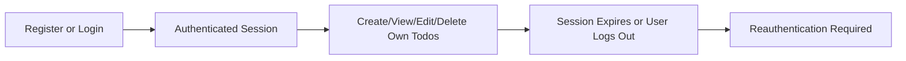

# User Actors and Permissions for Todo List Application

## 1. User Actor Definitions

### todoListMember
- The todoListMember is the sole actor permitted to interact with the system. This role is defined as a natural person who registers, authenticates, and manages personal todo items through the application. No administrative or shared/group functionality is present.

#### Role Characteristics
- Each todoListMember operates on their own data exclusively. There are no shared tasks, groups, or delegation features in the minimum product scope. All permissions and business processes reflect this solitary ownership model.
- User identity is based on unique email and password combinations. No extra profile data is required beyond what is necessary for secured authentication and account recovery.

## 2. Permission Matrix

| Action                                    | todoListMember |
|-------------------------------------------|:--------------:|
| Register an account                       |      ✅        |
| Log in to the system                      |      ✅        |
| Log out of the system                     |      ✅        |
| Create new Todo item                      |      ✅        |
| View own Todos                            |      ✅        |
| Edit (update) own Todo                    |      ✅        |
| Delete own Todo                           |      ✅        |
| View, edit, or delete others’ Todos       |      ❌        |
| Manage user accounts (other than own)     |      ❌        |
| Access admin/system settings              |      ❌        |
| Change own password                       |      ✅        |
| Request password reset                    |      ✅        |
| Delete personal account                   |      ✅        |

## 3. Authentication Overview
- Registration requires a valid email and password; multi-factor authentication, social logins, or other attributes are not part of the minimum product.
- Only logged-in users (todoListMembers) may access any Todo functionality, including basic viewing; no anonymous or guest access exists.
- Authentication results in the issuance of a secure session token with a firm expiry (e.g., JWT, handled transparently to the user).
- Session is valid until expiration, user logout, or credential change. Session invalidation is immediate on logout, password change, or account deletion.
- System ensures that each user’s session is cryptographically and logically isolated from every other user, and there is no possibility to query or interact with another user’s data under any circumstances.

## 4. Responsibilities and Limitations
- Every todoListMember bears full responsibility for their own data, account credentials, and actions. There is no feature or business process allowing management of or access to data belonging to any other user
- System enforces strict data isolation and privacy principles. Each action must be validated on the server side to enforce that only the owner may perform CRUD or account actions for their data
- The application forbids administrative overrides and does not support account or data recovery by operators. Password resets and account deletions are fully automated and require end-user confirmation

## 5. Sample Workflow (Mermaid Diagram)

## 6. Requirements and Error Scenarios (EARS Format)

- WHEN a user registers with a valid email and password, THE system SHALL create a new todoListMember account, associate it exclusively with the user’s submitted credentials, and permit access to personal Todo functionality
- WHEN a user logs in with correct credentials, THE system SHALL initiate a secure session and grant access exclusively to their personal Todo items
- IF authentication fails due to invalid credentials, THEN THE system SHALL deny access and provide a generic sign-in error, revealing no indication of which credential (email or password) was incorrect
- WHILE a user’s session remains valid, THE system SHALL enable the user to create, view, update, and delete only those Todo items owned by the user; all other data is inaccessible
- IF a user’s session expires, is explicitly revoked, or the user logs out, THEN THE system SHALL invalidate the session and require fresh authentication to access any Todo functionality
- IF a todoListMember attempts to view, edit, or delete a Todo that is not owned by them, THEN THE system SHALL deny the request and return an access restricted error message with zero information about the existence or state of the target item
- IF a user attempts any Todo-related operation while not authenticated, THEN THE system SHALL reject the operation and require login prior to further action
- IF a password reset or account deletion request is submitted, THEN THE system SHALL require explicit and clear user confirmation and SHALL ensure all current sessions are invalidated before changing user credentials or deleting data
- WHEN a user requests a password reset, THE system SHALL trigger an automated workflow to email password reset instructions for the registered email account, and SHALL block Todo list access until authentication is restored
- IF account deletion is requested, THEN THE system SHALL erase all associated Todo data and user information irreversibly, following explicit confirmation
- IF the application detects suspicious or repeated failed login attempts, THEN THE system SHALL temporarily lock the account for a defined period, notify the user by email, and require confirmation of account security

## 7. Additional Business Rules
- The system SHALL never allow creation of duplicate user accounts with the same email
- The system SHALL enforce minimum password complexity requirements (e.g., 8+ characters, including letter and number)
- Account recovery is strictly self-service; assistance beyond automated email-based flows is not part of the minimum service
- Changes to user credentials, such as email or password, require re-authentication and verification via email confirmation
- Todo items SHALL contain, at minimum, a short text description and optional completion status (details of the data model to be designed separately)
- No collaboration or sharing features are permitted; every Todo list is private by business mandate

---

This document defines, with absolute clarity and minimum necessary scope, the user actor and permission boundaries for a minimalist Todo List service, ensuring enforceable, testable business requirements for backend implementation. No technical API or schema details are included in accordance with pipeline requirements.