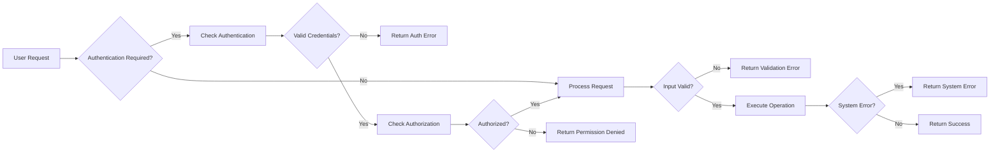

# Todo List Application
## Error Handling and Recovery Requirements

This document provides the business requirements for error detection, handling, and recovery in the Todo List backend system. It specifies expected error scenarios from the end user's perspective, business rules for error management, and performance criteria.

---

## 1. Authentication Errors

### 1.1 Failed Login Attempts
- WHEN a user submits invalid login credentials, THE system SHALL reject the login attempt and respond with an error message indicating invalid username or password.
- WHEN a user exceeds 5 failed login attempts within 15 minutes, THE system SHALL temporarily lock the user's account for 15 minutes.
- WHEN a locked account is accessed, THE system SHALL inform the user of the lockout period.
- WHEN the user successfully logs in after a lockout period, THE system SHALL reset the failed attempt counter.

### 1.2 Session Expiry
- WHEN a user’s authentication session expires due to inactivity or token expiration, THE system SHALL reject requests requiring authentication with an HTTP 401 Unauthorized error.
- WHEN an expired token is presented, THE system SHALL include error code AUTH_TOKEN_EXPIRED in the response.

### 1.3 Unauthorized Access
- WHEN a user attempts to access a resource or perform an action without required authentication, THE system SHALL respond with HTTP 401 Unauthorized and a descriptive error message.

---

## 2. Input Validation Failures

### 2.1 Missing Required Fields
- WHEN a request to create or update a todo item is submitted with missing required fields (e.g., todo title), THE system SHALL reject the request with an HTTP 400 Bad Request response specifying the missing fields.

### 2.2 Invalid Field Formats or Lengths
- WHEN a todo item's title exceeds 200 characters, THE system SHALL reject the request with an error indicating title length exceeded.
- WHEN a requested date or due date is invalid or incorrectly formatted, THE system SHALL reject the request with an error indicating invalid date format.

### 2.3 Unsupported Data Types
- WHEN a field contains data of unsupported type (e.g., boolean instead of string), THE system SHALL reject the request with an appropriate error message.

---

## 3. Permission Denied Errors

### 3.1 Unauthorized Modifications
- WHEN a user attempts to modify or delete a todo item they do not own, THE system SHALL reject the action with an HTTP 403 Forbidden response.

### 3.2 Accessing Protected Resources
- WHEN a guest user attempts to create, update, or delete todo items, THE system SHALL deny the request with an HTTP 401 Unauthorized response.

---

## 4. System Failures and Retries

### 4.1 Temporary Service Unavailability
- WHEN the backend service is temporarily unavailable (e.g., database down), THE system SHALL respond with HTTP 503 Service Unavailable.
- WHEN a request fails due to a temporary error, THE system SHALL allow the client to retry the request.

### 4.2 Data Consistency Failures
- WHEN an operation fails partway (e.g., failed database transaction), THE system SHALL roll back to maintain data integrity and respond with an error.

### 4.3 Error Logging
- THE system SHALL log all error events with sufficient detail to diagnose issues.

---

## Performance and User Experience Requirements

- WHEN error responses are returned, THE system SHALL respond within 2 seconds to maintain user experience quality.
- THE system SHALL provide clear, concise error messages to facilitate user understanding and recovery.

---

## Mermaid Diagram: Error Handling Flow

---

This document strictly describes business requirements related to error handling only. All technical implementation details, architecture, API specifications, and database designs are excluded and left to developer discretion. Developers have full autonomy to design the system components that satisfy these business requirements.