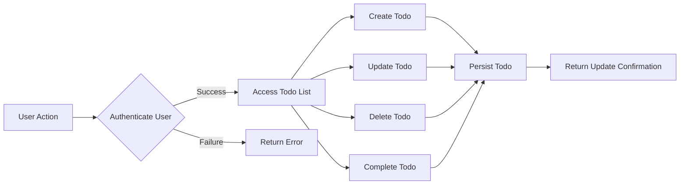

# Basic Todo List Application Requirements Analysis Report

## 1. Introduction

This report defines the minimum functional and non-functional requirements for a Todo list application aimed at users who want a simple and effective personal task management tool.

## 2. User Roles and Actors

- **User**: An authenticated individual who manages todo items.
- **System**: The backend service that manages task data and authentication.

## 3. Functional Requirements

- **Create Todo**: WHEN a user wants to add a new todo, THE system SHALL allow them to create a todo item with a mandatory title and an optional description.

- **Update Todo**: WHEN a user wants to modify an existing todo, THE system SHALL allow updating of the title, description, and completion status.

- **Delete Todo**: WHEN a user wants to remove a todo, THE system SHALL allow deletion of the todo item.

- **Complete Todo**: WHEN a user marks a todo as completed, THE system SHALL update the status to completed.

- **List Todos**: WHEN a user requests their todo list, THE system SHALL return all todos owned by that user.

- **User Authentication**: WHEN a user attempts to log in, THE system SHALL authenticate them using username and password.

## 4. Non-Functional Requirements

- **Performance**: WHEN a user performs any todo operation, THE system SHALL respond within 2 seconds under normal usage conditions.

- **Security**: WHEN handling user credentials, THE system SHALL store passwords securely using salted hashing algorithms.

- **Data Privacy**: THE system SHALL ensure a user can only access their own todo items.

## 5. Business Rules

- **Unique Titles**: WHEN a user creates a todo item, THE system SHALL ensure the title is unique among that user's todos.

- **Ownership Enforcement**: Users SHALL only be able to access, modify, or delete their own todo items.

## 6. Error Handling

- **Validation Errors**: WHEN invalid input is submitted, such as missing title, THE system SHALL provide descriptive error messages.

- **Authentication Errors**: WHEN login fails, THE system SHALL notify the user appropriately.

- **Authorization Errors**: WHEN unauthorized access is attempted, THE system SHALL deny the operation with a proper error message.

## 7. Authentication and Authorization

- Users SHALL authenticate with username and password.

- WHEN authentication succeeds, THE system SHALL provide a session or token for authenticated requests.

## 8. User Scenarios

- **Scenario 1: User Registration and Login**
  WHEN a new user registers, THEY SHALL create an account.
  WHEN a user logs in, THEY SHALL access their todo list.

- **Scenario 2: Managing Todos**
  WHEN a user adds, updates, or deletes a todo, THE changes SHALL reflect immediately in the user's list.

## 9. Glossary

- **Todo Item**: A task with a title, description, and status indicating completion.

- **Authentication**: The process verifying a user's identity.

## 10. Appendices

- No additional references or documents.
- Future enhancements may include sharing tasks and reminders.

