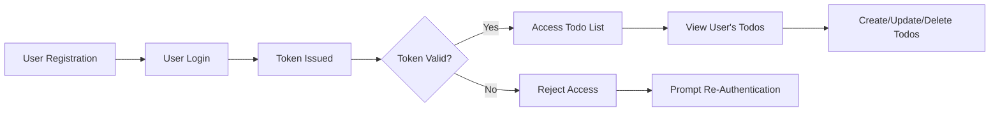

# todoApp Multi-User Todo List Service Requirements Specification

## 1. Service Overview

todoApp is a multi-user todo list application enabling users to register and log in to manage their own personal todo lists. Each user's todo list is private and securely isolated from others. The application offers minimalistic core todo functionality focused on essential features while providing robust authentication and authorization to ensure data privacy and user separation.

### Business Model
Users access the service via a web or mobile client to manage their todos. User authentication ensures secure access, and authorized users can perform CRUD operations on their personal todo items. The system maintains strict user data segregation and privacy.

### Service Goals and Scope
- Provide user registration and login capabilities with secure authentication.
- Support private, user-specific todo lists inaccessible by other users.
- Implement core CRUD operations for todo items: create, read, update, delete.
- Enforce strict authorization to protect user data.
- Deliver responsive performance for typical todo interactions.

## 2. User Actors and Authentication

### User Actors
| Actor | Description |
|---|---|
| Guest | Unauthenticated users who can register an account or attempt login. No access to todos.
| Registered User | Authenticated users who own and manage their personal todo list.

### Authentication Flow
- WHEN a user registers, THE system SHALL validate and create a new user account.
- WHEN a user logs in with valid credentials, THE system SHALL issue an access token (JWT) with expiration.
- WHEN a user provides an expired or invalid token, THE system SHALL reject access and require re-authentication.
- WHEN a user logs out, THE system SHALL invalidate the user session token.

### Authorization
- Registered users SHALL only access and manipulate their own todo data.
- Unauthorized access attempts SHALL result in clear error messages with status 401 Unauthorized.

### Session Management
- The system SHALL support multiple concurrent active sessions per user.
- Access tokens SHALL have a configurable expiration time (e.g., 1 hour).

## 3. Functional Requirements

### User Registration and Login
- WHEN a user submits valid registration details, THE system SHALL create a new user.
- WHEN a user submits invalid registration data (e.g., weak password), THE system SHALL reject the registration with descriptive errors.
- WHEN a user logs in with valid credentials, THE system SHALL issue a JWT token.

### Todo Item Management
- WHEN a registered user creates a todo item, THE system SHALL associate it with that user and store it securely.
- WHEN a registered user requests their todo list, THE system SHALL return only their todos.
- WHEN a user updates or deletes a todo item, THE system SHALL ensure only that user's items are affected.
- WHEN a todo operation fails due to invalid input, THE system SHALL provide clear error feedback.

### Data Privacy and Access Control
- The system SHALL NEVER expose one user's data to another user.
- All data access SHALL be filtered by user identity extracted from authenticated sessions.

## 4. User Scenarios

### Scenario 1: User Registration
WHEN a new user submits a registration form with valid details, THE system SHALL create a user account and confirm success.

### Scenario 2: User Login
WHEN a user submits valid login credentials, THE system SHALL authenticate and issue a JWT token.

### Scenario 3: Creating a Todo Item
WHEN an authenticated user sends a create todo request, THE system SHALL save the todo linked to the user and respond with the created item data.

### Scenario 4: Viewing Todo List
WHEN an authenticated user requests their todo list, THE system SHALL return all todos associated with that user.

### Scenario 5: Unauthorized Access Attempt
WHEN an unauthenticated user or a user tries to access another user's todo, THE system SHALL respond with 401 Unauthorized and an error message.

## 5. Security and Authorization

### Authentication Enforcement
- ALL API endpoints SHALL require a valid JWT bearer token except for registration and login.
- Token validation SHALL include signature verification and expiration checks.

### Authorization Rules
- Resource access checks SHALL ensure users can only operate on resources they own.
- Access control SHALL be enforced at the API and data access layers.

### Data Protection
- Passwords SHALL be stored securely using hash functions with salt.
- Sensitive data SHALL only be accessible in secured contexts.

## 6. Performance and Scalability

### Response Time Expectations
- WHEN a user sends a request to view their todo list, THE system SHALL respond within 2 seconds.
- WHEN a user adds, updates, or deletes a todo item, THE system SHALL respond within 2 seconds.
- WHEN a user registers or logs in, THE system SHALL complete the authentication response within 3 seconds.
- WHEN a request is invalid, THE system SHALL respond with an error within 1 second.

### Concurrent Request Handling
- THE system SHALL support multiple active sessions per user.
- THE system SHALL maintain response time requirements under concurrent requests.
- THE system SHALL protect against race conditions on user todo data.

### Scalability Strategies
- THE system SHALL support horizontal scaling behind load balancers.
- THE system SHALL implement caching mechanisms for frequently accessed data.
- THE system SHALL support database scalability techniques.
- THE system SHALL provide monitoring and auto-scaling capabilities.

## 7. Error Handling and Recovery

### Common Errors
- Unauthorized access attempts
- Invalid input data
- Token expiration
- Resource not found

### Error Responses
- WHEN an error occurs, THE system SHALL return appropriate HTTP status codes (e.g., 400, 401, 404, 500) with meaningful messages.

### User Recovery
- Users SHALL be prompted to re-authenticate if sessions expire.
- Validation errors SHALL clearly indicate fields and problem descriptions.

## 8. Business Rules

### Todo Validation Rules
- Todo item titles SHALL be non-empty strings up to 255 characters.
- Todo items MAY have optional descriptions.
- Todo items SHALL have a creation timestamp recorded.

### User Data Integrity
- User identity SHALL be immutable once registered.
- Data consistency SHALL be maintained during concurrent modifications.

### Access Restrictions
- Users SHALL NOT access other users' data.
- Attempts to bypass access controls SHALL be logged and monitored.

## 9. Data Privacy and Compliance

### Privacy Policies
- User data SHALL be handled according to applicable data protection regulations.

### Data Access Control
- Access to user data SHALL be strictly controlled based on authenticated user identity.

### Regulatory Compliance
- THE system SHALL comply with relevant compliance standards (e.g., GDPR).

## 10. Future Enhancements and Roadmap

- Support for reminder notifications
- Todo item categorization and tagging
- Collaborative shared todo lists
- Enhanced analytics and reporting

---

### Mermaid Diagram: User Authentication and Todo Management Flow

This specification defines all necessary functional and non-functional business requirements to build a secure, private, and performant multi-user todo list application with user authentication and strict authorization controls.