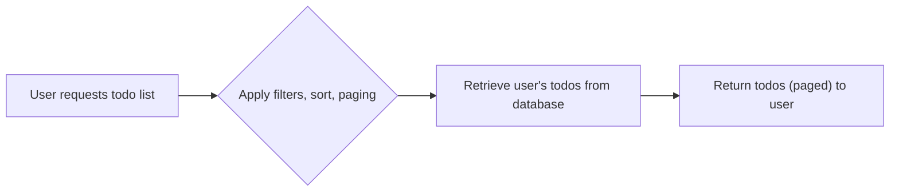

# Requirements Analysis Report: Todo List Application

## Introduction
The Todo List application delivers a minimal, production-grade digital checklist for authenticated users. The scope is limited to essential functionality: secure login/logout, creation, viewing, updating, and deletion of personal todo items. There is no sharing or collaboration; all data is strictly personal. The service prioritizes clarity, security, and compliance with best practices, focusing only on actions required to allow indiviuals to manage their own todos with minimal friction.

## User Actors
- **todoListMember**: An authenticated user with access to core features (create, view, update, delete their todos). There are no admin, guest, or additional roles in minimum configuration.

## Feature List (MVP)
1. Secure user authentication (login, persistent session management, logout).
2. Create new todo items with validation and association to user.
3. View list of own todos (with pagination).
4. Update existing todos (edit title, description, due date, completion status) owned by user.
5. Delete own todos, with finality; no recovery function in MVP.
6. All operations require active authentication.

## User Scenarios
### Authentication Flow
- WHEN a user submits valid credentials, THE system SHALL authenticate the user and start a session.
- IF credentials are invalid, THEN THE system SHALL deny access, displaying clear justification.
- WHEN an account is locked, disabled, or restricted, THE system SHALL prohibit login and indicate cause.
- WHEN a session expires or user logs out, THE system SHALL invalidate associated tokens, blocking access to todo functions until re-authentication.

#### Authentication Flow Diagram
```mermaid
graph LR
  UA["User attempts to log in"] --> LC{"Are credentials valid?"}
  LC --|"Yes"| S["Session is created"]
  S --> AD["Access granted to todo features"]
  LC --|"No"| ED["Display error message"]
  ED --> PA{"Password attempts < 3?"}
  PA --|"Yes"| UA
  PA --|"No"| LKD["Account temporarily locked"]
```

### Creating Todos
- WHEN an authenticated user submits a todo title (and optional fields), THE system SHALL create a new todo item linked to user's account.
- IF the title is missing or blank, THEN THE system SHALL reject creation and clearly cite the missing requirement.
- IF a due date is provided but invalid (non-date or in the past), THEN THE system SHALL reject creation with a message.
- WHEN a description is provided, THE system SHALL accept up to 1,000 characters; above this length, creation SHALL be denied with an explicit error.
- THE system SHALL complete creation within 1 second; failure to do so is considered an error.

#### Todo Creation Flow Diagram
```mermaid
graph LR
  CI["User initiates todo creation"] --> CF["Fill in required and optional fields"]
  CF --> VT{"Validate title, description, due date"}
  VT --|"All valid"| CC["Create todo item"]
  CC --> RC["Return todo data to user"]
  VT --|"Field error"| ERRC["Return error, indicate specific issue"]
```

### Viewing Todos
- WHEN an authenticated user requests their todo list, THE system SHALL return all items owned by that user, paged (default: 20 per page).
- IF there are no todos, THEN THE system SHALL return an empty list (not error).
- WHEN a user applies filters (by due date, status, etc.), THE system SHALL apply them before returning results.
- THE system SHALL return todo lists ordered by creation date descending; order can be changed only if explicitly specified.
- Response time SHALL not exceed 1 second for standard fetches.

#### Viewing Todos Diagram


### Updating Todos
- WHEN a user edits their own todo, THE system SHALL validate input (non-empty title, valid date, description length) and update record if valid.
- IF an invalid field is submitted (empty title, date in the past, overlength description), THEN THE system SHALL reject with clear error on affected field.
- WHEN a user tries to edit a todo they do not own, THEN THE system SHALL deny with access error.
- Success/failure is confirmed to user within 1 second of operation initiation.

#### Updating Todos Diagram
```mermaid
graph LR
  ED["User requests to edit todo"] --> FOT{"Ownership & field validation"}
  FOT --|"Valid & owned"| AP["Apply changes"]
  AP --> RU["Return updated todo data"]
  FOT --|"Invalid or unauthorized"| UER["Return field or access error"]
```

### Deleting Todos
- WHEN a user requests deletion of a todo they own, THE system SHALL delete the todo permanently and confirm to user (no undo).
- IF the targeted todo does not exist or is not owned by user, THEN THE system SHALL reject with access or not-found error.
- Delete operation SHALL complete and confirm within 1 second unless system error occurs.

#### Deleting Todos Diagram
```mermaid
graph LR
  DEL["User requests deletion of todo"] --> OWD{"Ownership and existence verified?"}
  OWD --|"Yes"| DLT["Delete todo item"]
  DLT --> CD["Confirm deletion to user"]
  OWD --|"No"| DER["Return access or missing error"]
```

## Business Rules and Constraints
- A todo must have a non-empty title (mandatory).
- Optional description limited to 1,000 characters.
- Optional due date must be today or in future; not in the past.
- Todos are owned by and only accessible to the user who created them.
- All CRUD operations require a valid, active session (access token/JWT per best practice; not specified here for abstraction).
- Users cannot create or manage todos on behalf of other users.
- IF systemic quota or rate limitation policy is in force, THEN daily/total creation/retrieval limits SHALL be enforced with explanatory error if exceeded.
- All error messages SHALL be actionable and specific to the field or operation that failed.

## Authentication
- All features except login and registration require a valid, authenticated session.
- Failed logins SHALL not disclose which field failed; only display generic failure or lockout error.
- Account lockout applies after three failed attempts and imposes a temporary ban (duration may be configured elsewhere or default 5 mins).
- Session tokens SHALL expire after a configurable period of inactivity; expired sessions REQUIRE re-login.

## Error Scenarios & Edge Cases
- Authentication errors: lockouts, expired, disabled accounts.
- Input validation: empty titles, excessively long descriptions, invalid dates.
- Access errors: attempts to access or modify todos by non-owner, or unauthenticated user.
- Simultaneous modification: first valid edit wins; subsequent submissions require client-side reload/confirmation.
- Systemic: any failure outside business rules (e.g., database unreachable) SHALL be logged for review and reported to user with a generic, non-technical error message.

## Summary
All requirements enforce the absolute minimal usable feature set for a Todo List application. Requirements employ strict, testable EARS format where applicable, complemented by process diagrams for main flows. Authentication, business rules, error handling, and CRUD actions are clear and unambiguous, ensuring production-grade specification for implementation in automated backend pipelines.