# Multi-User Todo Application Requirements Specification

## User Account

### Registration
WHEN a new user requests to sign up with an email and password, THE system SHALL create a new account associated with that email.

The email SHALL be unique across all users.

Password SHALL be stored securely using encryption and hashing.

The system SHALL validate the email format and the password strength.

IF the email is already used, THEN THE system SHALL inform the user with a descriptive error.

### Login
WHEN a user submits email and password credentials, THE system SHALL authenticate the user.

IF credentials are invalid, THEN THE system SHALL deny access and provide an error message.

THE system SHALL create a user session or issue a JWT token upon successful authentication.

### Password Change
WHEN an authenticated user requests to change their password, THE system SHALL validate the old password first.

IF the old password is incorrect, THEN THE system SHALL reject the change request with an error.

THE system SHALL enforce password policy on the new password.

### Account Deletion
WHEN an authenticated user requests account deletion, THE system SHALL delete the user account and all associated data including all todos and edit history, whether in trash or active.

The action SHALL be irreversible and permanent.

## User Profile

### Display Name
WHEN an authenticated user updates their display name, THE system SHALL update the stored profile accordingly.

Users SHALL NOT be able to view any other users' profiles.

## Creating Todos

WHEN an authenticated user creates a todo item, THE system SHALL accept the following fields:
- Title (required)
- Description (optional)
- Start date (optional)
- Due date (optional)

The system SHALL set the completion status of new todos as incomplete by default.

## Viewing Todos

WHEN an authenticated user requests their todo list, THE system SHALL return a paginated list of their own todos.

Each list item SHALL include title, completion status, start date (if set), due date (if set), and creation date.

WHEN a user requests details of a specific todo, THE system SHALL provide full details including full description.

## Completing Todos

WHEN an authenticated user toggles a todo's completion status, THE system SHALL update the todo's status between complete and incomplete accordingly.

## Editing Todos

WHEN an authenticated user edits a todo's title, description, start date, or due date, THE system SHALL update the todo and create an edit history record of the changes.

## Edit History

WHEN a todo is edited, THE system SHALL record a history entry with:
- Timestamp of edit
- The changed title (if any)
- The changed description (if any)
- The changed start date (if any)
- The changed due date (if any)

WHEN an authenticated user requests the edit history for a todo, THE system SHALL return a paginated list sorted from most recent to oldest.

## Deleting Todos

WHEN an authenticated user deletes a todo, THE system SHALL perform a soft delete, marking the todo as deleted.

Soft deleted todos SHALL NOT appear in the normal todo list.

## Trash

WHEN an authenticated user requests their trash list, THE system SHALL return a paginated list of their deleted todos.

WHEN a user restores a todo from trash, THE system SHALL mark the todo as active again.

WHEN a user permanently deletes a todo from trash, THE system SHALL remove the todo and all associated edit history permanently.

## Filtering Todos

WHEN a user applies a completion status filter (all, complete, incomplete) on their todo list, THE system SHALL return only todos matching the filter criteria.

## Sorting Todos

WHEN a user applies sorting on their todo list by creation date, start date, or due date in ascending or descending order, THE system SHALL sort the list accordingly.

Todos with null start or due dates SHALL appear at the end when sorting by those fields.

## Privacy

THE system SHALL enforce privacy such that users can only see their own todos.

No cross-user access SHALL be allowed.

## Authentication and Authorization

THE system SHALL require authentication for all user-specific operations.

Access control SHALL restrict data access to resource owners only.

## Error Handling

THE system SHALL provide clear error messages for invalid requests.

## Performance Requirements

THE system SHALL respond to requests within 2 seconds under normal load.

THE system SHALL support efficient pagination.

## Glossary

### Todo
A task created by a user with attributes such as title, description, start date, due date, and completion status.

### Edit History
A chronological record of changes made to a todo's attributes including title, description, start date, and due date.

### Trash
A list of todos that have been soft deleted by the user and can be either restored or permanently deleted.

### Soft Delete
A deletion operation that marks a todo as deleted without permanently removing it from the database immediately.

### Pagination
The process of dividing a large set of todos into discrete pages to improve performance and user experience.

## Mermaid Diagram

```mermaid
graph LR
  A["User Signs Up or Logs In"] --> B["User Authenticated"]
  B --> C["User Creates Todo"]
  C --> D["Todo Created with Incomplete Status"]
  D --> E["User Views Todo List"]
  E --> F["User Filters and Sorts Todos"]
  F --> G["User Views Todo Details"]
  G --> H["User Edits Todo"]
  H --> I["Todo Edit Recorded in History"]
  I --> J["User Deletes Todo (Soft Delete)"]
  J --> K["User Views Trash"]
  K --> L["User Restores or Permanently Deletes Todo"]
  L --> M["If Permanently Deleted, Remove Todo and History"]
  L --> N["If Restored, Todo Appears in Active List"]
  M --> O["End"]
  N --> O
```

