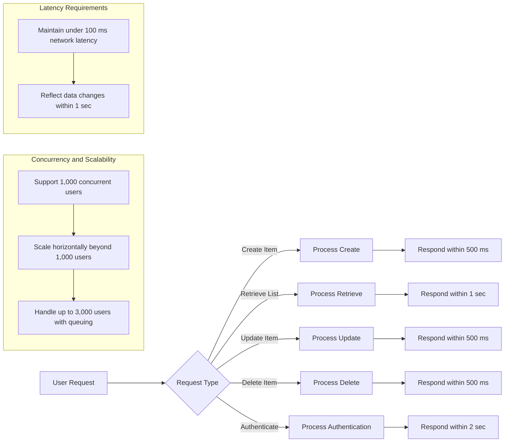

# Performance Requirements for Todo List Application

## 1. Introduction

The performance of the Todo List backend service is critical to delivering a seamless user experience. This document specifies measurable performance targets and expectations that the system must meet to ensure responsive interactions and reliable scalability. These requirements are essential for developers to design and optimize the system effectively.

## 2. Response Time Benchmarks

### 2.1 Todo Item Creation

- WHEN a user submits a request to create a todo item, THE system SHALL process and respond to the request within 500 milliseconds.

### 2.2 Todo Item Retrieval

- WHEN a user requests their list of todo items, THE system SHALL return the complete list within 1 second for up to 100 items.

### 2.3 Todo Item Update

- WHEN a user updates an existing todo item, THE system SHALL process the update and confirm success within 500 milliseconds.

### 2.4 Todo Item Deletion

- WHEN a user deletes a todo item, THE system SHALL remove it and respond with confirmation within 500 milliseconds.

### 2.5 Authentication and Session Management

- WHEN a user attempts to log in, THE system SHALL authenticate credentials and respond within 2 seconds.

- WHEN a user logs out, THE system SHALL invalidate the session and confirm within 1 second.

## 3. Concurrency and Scalability

### 3.1 Concurrent Users

- THE system SHALL support at least 1,000 concurrent authenticated users performing typical CRUD operations without degradation of response times beyond the specified benchmarks.

### 3.2 Scalability

- WHERE the number of concurrent users exceeds 1,000, THE system SHALL scale horizontally to maintain response times within defined benchmarks.

- THE system SHALL gracefully handle peak loads with up to 3,000 concurrent users by queuing requests and providing appropriate feedback when maximum capacity is reached.

## 4. Latency Requirements

### 4.1 Network Latency

- THE system SHALL optimize network communication to ensure that typical latency between client requests and server responses does not exceed 100 milliseconds under normal operating conditions.

### 4.2 Data Consistency Latency

- WHEN a todo item is created, updated, or deleted, THE system SHALL ensure that subsequent retrieval requests reflect the most recent data within 1 second.

## 5. Summary

The Todo List backend service performance requirements defined herein serve as concrete goals to achieve a responsive, scalable, and reliable system that meets user expectations. Meeting these benchmarks will ensure that the service delivers prompt responses under typical and peak usage scenarios.

---

This document specifies business requirements only. All technical implementations including architecture, API designs, and database configurations are the responsibility of the development team. Developers have full autonomy to determine the most effective implementation approach.

---

