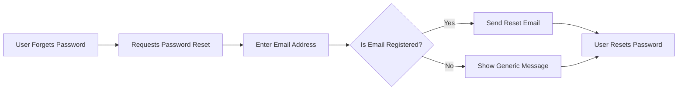
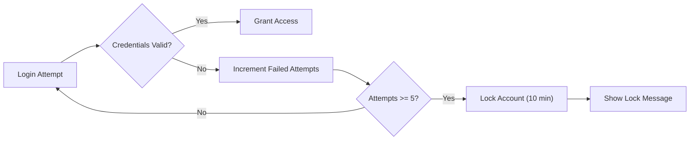
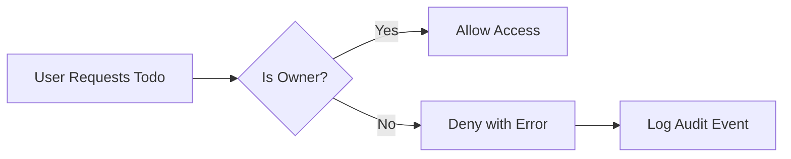
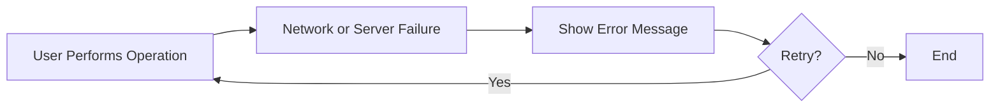

# Secondary Scenarios and Exception Handling for Todo List Application

## 1. Account Recovery

### 1.1 Password Recovery
- WHEN a todoListMember forgets their password, THE system SHALL provide a secure password recovery process using a registered email address.
- WHEN a todoListMember requests password recovery, THE system SHALL send a password reset code or link to their verified email address within 1 minute.
- IF a todoListMember provides an invalid or unregistered email, THEN THE system SHALL not reveal account existence and SHALL display a generic message indicating that a reset email will be sent if such an account exists.
- WHEN a password reset is successful, THE system SHALL require authentication with the new password for all future sessions.

### 1.2 Account Deactivation/Lock
- WHEN a todoListMember attempts login to a locked or deactivated account, THE system SHALL deny access and SHALL show a message indicating the account is unavailable.
- WHEN a todoListMember has 5 or more consecutive failed login attempts, THE system SHALL temporarily lock the account for 10 minutes and SHALL inform the user of the lock and expected unlock time via the login page.
- WHEN a todoListMember requests support for account reactivation, THE system SHALL display instructions to contact support or an administrator via specified channels.

### 1.3 Session Expiry and Renewal
- WHILE the user session is expired or invalid, THE system SHALL deny access to protected resources and SHALL instruct the user to log in again.
- WHEN a todoListMember's refresh token expires, THE system SHALL require complete re-authentication using password and email.

## 2. Edge Cases

### 2.1 Inactive or Locked Accounts
- WHEN an account is disabled or locked, THE system SHALL prevent any create, read, update, or delete (CRUD) operations on todo items for that user.
- WHEN a user attempts to access the Todo List service from multiple devices, THE system SHALL allow concurrent sessions and SHALL ensure authentication and data privacy boundaries for each active session.

### 2.2 Duplicate or Conflicting Actions
- WHEN a todoListMember creates a new todo with the same content and date as an existing one, THE system SHALL allow creation unless business rules explicitly restrict duplicates (reference: business rules section).
- WHEN a todoListMember issues multiple rapid requests (e.g., double-clicking create), THE system SHALL debounce and process each create action only once, preventing accidental duplication.

### 2.3 Todo Limits and Data Boundaries
- IF a todoListMember exceeds allowed todo limits, THEN THE system SHALL prevent new todo creation and SHALL display a clear error message explaining the limit.
- WHEN a todoListMember attempts to modify or delete a todo item that no longer exists, THE system SHALL inform the user the item is unavailable, without disclosing sensitive system details.

## 3. Error Handling and Recovery

### 3.1 Unauthorized Access
- WHEN a todoListMember attempts to access or modify a todo belonging to another account, THE system SHALL deny the request and SHALL log the event for security auditing.
- WHEN authentication fails due to invalid credentials, THE system SHALL provide a generic error message and SHALL NOT reveal specific account information.

### 3.2 Validation and Input Errors
- WHEN a todoListMember submits incomplete, invalid, or malformed data (such as missing required fields), THE system SHALL reject the request with a detailed but generic error message specifying the input requirements.
- WHEN the system receives unexpected or unsupported data values, THE system SHALL validate all inputs against current business rules (see business rule reference document).

### 3.3 Data Loss and Network Failures
- WHEN an operation fails due to a server or network error, THE system SHALL clearly alert the user of a temporary issue and SHALL request they retry their action.
- WHEN a data save (persistence) operation fails during todo creation, update, or deletion, THE system SHALL not confirm the operation and SHALL prompt the user to try again later; no partial or misleading confirmations SHALL be displayed.

### 3.4 Recovery and User Experience
- WHEN recovering from errors, THE system SHALL give the user actionable steps, such as retrying or contacting support, and SHALL NOT leave the user in an ambiguous state.
- WHEN error conditions occur, THE system SHALL hide technical details and SHALL present user-friendly and actionable error messages at all times.

## 4. Mermaid Diagrams

### 4.1 Password Recovery Flow

### 4.2 Failed Login & Account Lock

### 4.3 Unauthorized Todo Access

### 4.4 Network Failure & Retry

## 5. References to Related Documents
- Primary flows: See Primary User Scenarios document
- Limits: See Business Rules and Constraints
- Actors and roles: See User Actors and Permissions

## 6. Glossary
- CRUD: Create, Read, Update, Delete
- Session: Authenticated period of user activity
- Debounce: System prevents duplicate processing of rapid, repeated requests

## 7. Notes
- All requirements above are in EARS format for clarity and implementation readiness.
- Technical implementation (API specification, DB schema) is handled in later stages.
- This document ensures all exception and error handling is clear from the business and user perspective for a minimum, production-ready Todo List application.