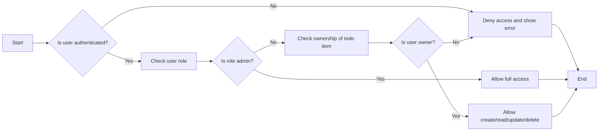

# Todo List Application Requirements Analysis

## 1. Introduction
This document specifies the business requirements for a minimal Todo List application. The purpose is to clearly define the features, user roles, business rules, and security considerations necessary to build a functional and secure Todo List backend.

## 2. Business Model
The core business of the Todo List application is to allow users to manage personal tasks effectively. Users can create, read, update, and delete their todo items, each of which contains a title, optional description, and status indicating completion.

## 3. User Actors
- **Guest**: Unauthenticated user who may register for an account.
- **User**: Authenticated user who can manage their own todo items.
- **Admin**: User with full privileges to manage all users and todo items.

## 4. Functional Requirements

### 4.1 Todo Item Management
- WHEN a user is authenticated, THE system SHALL allow the user to create a new todo item with a title and optional description.
- WHEN a user is authenticated, THE system SHALL allow the user to read the list of their own todo items.
- WHEN a user is authenticated, THE system SHALL allow the user to update the title, description, or completion status of their own todo items.
- WHEN a user is authenticated, THE system SHALL allow the user to delete their own todo items.
- WHEN a user is not authenticated, THE system SHALL deny access to todo item management features and provide an appropriate error message.

### 4.2 Todo Item Attributes
- THE system SHALL associate each todo item with the user who created it.
- Todo items SHALL contain the following fields:
  - Title (string, required)
  - Description (string, optional)
  - Completion Status (boolean, default false)
  - Creation Timestamp (ISO 8601 format)
  - Last Update Timestamp (ISO 8601 format)

### 4.3 List Retrieval
- WHEN a user requests their todo list, THE system SHALL retrieve and return only the todo items owned by that user.
- THE system SHALL support filtering the todo list by completion status (completed or not completed).

## 5. Business Rules
- THE system SHALL ensure that users cannot access, modify, or delete todo items owned by other users.
- THE system SHALL validate input data to prevent invalid entries (e.g., empty titles).
- THE system SHALL enforce limits to prevent excessive todo items per user (e.g., a maximum of 1000 items).

## 6. Error Handling
- WHEN a user attempts an unauthorized action, THE system SHALL respond with an appropriate error message indicating insufficient permissions.
- WHEN input validation fails, THE system SHALL provide specific messages indicating which fields are invalid.
- WHEN any unexpected error occurs, THE system SHALL log the error and provide a generic error message to the user.

## 7. Performance Requirements
- THE system SHALL respond to user requests within 2 seconds under normal load.
- THE system SHALL be capable of handling simultaneous requests from at least 1000 users.

## 8. Security and Compliance
Refer to the Security and Compliance Requirements Document for detailed requirements.

### 8.1 Authentication and Authorization
- WHEN a user attempts to access todo item management features, THE system SHALL require authentication.
- THE system SHALL implement role-based access control with the roles Guest, User, and Admin as defined above.

### 8.2 Data Protection
- THE system SHALL ensure that all user data is securely stored and transmitted using industry-standard encryption.

### 8.3 Session Management
- THE system SHALL maintain secure user sessions and expire them after a configurable period of inactivity.

### 8.4 Audit and Logging
- THE system SHALL maintain audit logs for critical operations such as login attempts, todo item creations, updates, and deletions.

## 9. Glossary
- **Todo Item**: A task entered by a user into the system to be tracked and managed.
- **Completion Status**: A boolean indicator whether the todo item is completed or not.
- **User Roles**: Different classifications of system users with varying permissions.

## 10. Appendices
### 10.1 Mermaid Diagram for Authentication Flow

