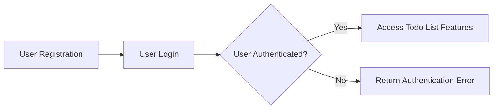
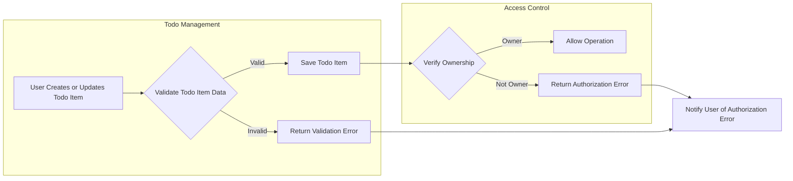

# Multi-User Todo List Application Requirements Specification

## 1. Introduction

### Purpose
The purpose of this specification is to define the detailed business and functional requirements for a multi-user Todo list application. This service will allow users to register, authenticate, and manage their own private Todo lists securely and efficiently.

### Scope
This document covers all essential features for user management, authentication, authorization, and minimal Todo list management functionality. The focus is on ensuring data privacy and secure user separation.

### Definitions and Acronyms
- **User:** A person registered in the system who can create and manage private todo lists.
- **Todo Item:** A task record owned by a user containing title, description, status, and optional due date.
- **Authentication:** The process of verifying user identity.
- **Authorization:** The enforcement of access control to ensure users can only access their own data.
- **EARS:** Easy Approach to Requirements Syntax, a method for clearly specifying requirements.

## 2. Business Model

### Service Overview
The service allows multiple users to register and authenticate. Each user maintains a private Todo list with multiple Todo items. Users can perform CRUD (Create, Read, Update, Delete) operations on their own todo items.

### User Roles and Actors
- **Guest:** Unregistered or unauthenticated user. Can only register or log in.
- **Registered User:** Authenticated user who can manage their own todo list.

### Data Ownership and Privacy
Each user's todo list data is strictly private and must be inaccessible by any other user. The system enforces ownership checks on all data access and modification attempts.

## 3. Functional Requirements

### User Registration and Authentication
- WHEN a guest user submits registration data, THE system SHALL validate and create a new user account.
- WHEN a user logs in with valid credentials, THE system SHALL create a secure session for that user.
- WHEN a user provides invalid login credentials, THE system SHALL reject the attempt with an appropriate error message.
- WHEN a user is authenticated, THE system SHALL allow access to their todo list management functionalities.

### Todo List Management
- WHEN a registered user creates a new todo item, THE system SHALL validate the input and add the item to the user's list.
- WHEN a user updates a todo item, THE system SHALL validate proper ownership and input data before saving changes.
- WHEN a user deletes a todo item, THE system SHALL verify ownership before removal.
- WHEN a user requests to view their todo list, THE system SHALL return the list of todo items owned by that user.

### Access Control and Authorization
- THE system SHALL require authentication for all todo management operations.
- THE system SHALL ensure users can only access todo items that they own.
- IF a user attempts to access or modify todo items not owned by them, THEN THE system SHALL deny access and return an authorization error.

## 4. User Scenarios

### User Registration
WHEN a guest user provides required registration details (email and password), THE system SHALL validate the information and create a new user account if valid.

### User Login
WHEN a registered user provides correct credentials, THE system SHALL authenticate the user and create a session.
WHEN credentials are incorrect, THE system SHALL reject the login.

### Creating Todo Items
WHEN a logged-in user submits valid todo item data (title must be non-empty and <= 100 characters, description optional and <= 500 characters, due date optional and in future), THE system SHALL create the todo item linked to that user.

### Updating Todo Items
WHEN a user updates a todo item they own with valid data, THE system SHALL save the changes.
WHEN the user attempts to update a todo they do not own, THE system SHALL reject the request.

### Viewing Todo List
WHEN a user requests their todo list, THE system SHALL return only todo items that belong to that user.

### Deleting Todo Items
WHEN a user deletes a todo item they own, THE system SHALL remove it from the system.
WHEN a user attempts to delete a todo they do not own, THE system SHALL deny the request.

### Unauthorized Access Handling
IF an unauthenticated user attempts to perform any todo item action, THEN THE system SHALL redirect or respond with an authentication error.

## 5. Business Rules

### Todo Item Validation
- WHEN creating or updating a todo item, THE system SHALL ensure the title is not empty and does not exceed 100 characters.
- WHEN a description is provided, THE system SHALL ensure it does not exceed 500 characters.
- WHEN a due date is provided, THE system SHALL verify it is a valid date in the future.
- THE system SHALL maintain todo item status as one of: Pending, In Progress, Completed.
- WHEN a todo is marked Completed, THE system SHALL record the completion timestamp.

### Ownership and Access Restrictions
- THE system SHALL verify ownership for every todo item access and modification.
- IF a user attempts to access or modify a todo item not owned by them, THEN THE system SHALL deny access with an authorization error.

### Error Handling
- IF validation fails on todo item creation or update, THEN THE system SHALL return specific validation error messages.
- IF unauthorized access is attempted, THEN THE system SHALL return an authorization error.
- IF authentication fails, THEN THE system SHALL return an authentication failure message.

## 6. Security and Privacy

### Authentication Mechanism
- THE system SHALL use secure password hashing for storing credentials.
- THE system SHALL issue JWT tokens upon successful authentication.
- TOKEN expiration and renewal policies SHALL be implemented.

### Authorization Enforcement
- THE system SHALL enforce user-based access control on all todo item operations.

### Session Management
- THE system SHALL expire user sessions after 30 minutes of inactivity.

### Data Privacy Considerations
- THE system SHALL never share user todo data with other users.
- THE system SHALL log access for security auditing.

## 7. Performance

### Response Time
- WHEN authenticating users, THE system SHALL respond within 2 seconds.
- WHEN retrieving todo lists with up to 100 items, THE system SHALL respond within 2 seconds.

### Scalability
- THE system SHALL be designed to handle concurrent access by multiple users without performance degradation.

## 8. Error Handling

### Validation Errors
- IF a todo item title is empty or too long, THEN THE system SHALL return a validation error specifying the issue.
- IF a description is too long, THEN THE system SHALL return a validation error.
- IF a due date is in the past, THEN THE system SHALL return a validation error.

### Authorization Errors
- IF unauthorized access to todo items occurs, THEN THE system SHALL return a clear authorization error message.

### Authentication Errors
- IF login credentials are invalid, THEN THE system SHALL return an authentication failure message.

## 9. Summary

This multi-user Todo list application specification defines a minimal viable product with secure user separation and complete authentication. The documented requirements ensure each user's todo list is private, the system enforces ownership, and all operations adhere to strict validation and security practices.

Backend developers should use this specification as the foundation for building a robust, production-ready service.

## 10. Diagrams

### User Authentication and Authorization Flow

### Todo Item Lifecycle and Access Control Flow

## 11. References

- Business Rules and Validation Logic (08-business-rules.md)
- Security and Authorization (05-security.md)
- Functional Requirements Specification (03-functional-requirements.md)
- Error Handling and Recovery (07-error-handling.md)