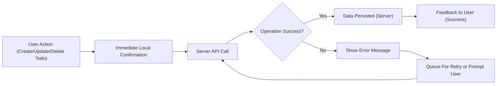
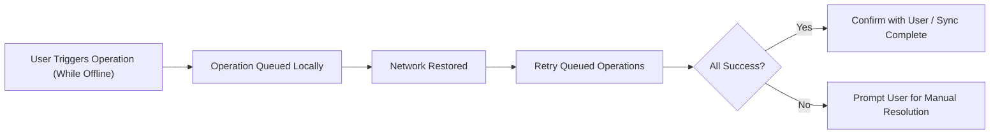

# Todo List Application: Performance and Reliability Requirements

## Introduction

The Todo List application is designed for rapid, trustworthy task management with absolute focus on responsiveness, data safety, and scalability. Users must always be able to create, view, update, and delete Todos instantly and with complete confidence their data is never lost. All business requirements here describe measurable expectations using the EARS (Easy Approach to Requirements Syntax) standard and are actionable for backend implementation.

## Response Time Expectations

Fast response times are essential for both usability and user trust. Every operation must complete predictably, even during peak loads or adverse network conditions.

- WHEN a user creates, updates, or deletes a Todo, THE system SHALL display visible feedback (such as a loading indicator or notification) within 100 milliseconds.
- WHEN a single Todo operation (create, read, update, delete) is performed, THE system SHALL fully complete the request and provide final confirmation within 500 milliseconds in typical network environments.
- WHEN a user loads their list of Todos, THE system SHALL retrieve and display all Todos (up to 100 items) within 1 second.
- WHERE users perform batch operations (e.g., marking multiple Todos complete), THE system SHALL complete and confirm changes for up to 50 Todos within 2 seconds.
- WHERE backend failure or network issues interrupt an operation, THE system SHALL notify the user within 1 second and SHALL provide explicit options to retry or recover.
- IF an operation cannot be completed within 2 seconds, THEN THE system SHALL show a progress state and SHALL enable the user to cancel or retry.
- WHERE a user requests more than 100 Todos at once, THE system SHALL implement automatic pagination or infinite scroll, maintaining these timing requirements per page.

### Examples: EARS-formatted Requirements
- WHEN a user saves a Todo item, THE system SHALL confirm with the user (via update or success message) within 500 milliseconds.
- WHEN a user deletes a Todo item, THE system SHALL visually remove it and confirm within 1 second.
- IF a network timeout or error occurs, THE system SHALL display a failure message within 1 second and offer retry.

## Data Reliability

The Todo List system must guarantee safety and consistency for all user data across sessions, devices, and network states. Reliability is non-negotiable and is measured as 100% user trust in task persistence.

- WHEN a user creates or modifies a Todo, THE system SHALL persist changes to secure storage immediately after user action.
- WHEN data is changed, THE system SHALL guarantee these changes remain accessible across all user sessions and devices.
- WHEN a user switches device or re-authenticates, THE system SHALL retrieve and display the most current Todo state, mirroring server data without omissions.
- IF network connectivity is unavailable when a change occurs, THEN THE system SHALL cache modifications locally and SHALL synchronize all updates on reconnection, ensuring no data loss.
- IF parallel edits or sync conflicts occur, THE system SHALL identify the conflict, notify the user with an explicit summary, and SHALL offer clear options for resolution.
- WHEN a user logs out and later logs in, THE system SHALL restore all Todos exactly as last saved on the server.
- IF data loss or sync failure is detected at any time, THE system SHALL alert the user, attempt recovery automatically, and SHALL log the event for later audit.
- WHILE the user is offline, THE system SHALL queue all changes and process them as soon as connectivity resumes.
- AT ALL times, THE system SHALL store all changes atomically — actions are either fully completed or not applied at all; partial saves are prohibited.

### EARS Examples for Edge Cases
- IF the server restarts unexpectedly, THEN THE system SHALL ensure no user data is lost and all completed actions remain valid.
- IF a user attempts to sync after network failure, THE system SHALL either complete all operations or provide a detailed error, never leaving items in an incomplete state.

## Scalability Considerations

The application is expected to handle user growth and workload bursts without any compromise on core promises. Service must scale linearly with user count and Todo volume.

- THE system SHALL support at least 1,000 concurrent users with no degradation in response times or data integrity.
- THE system SHALL maintain consistent operation times and data correctness across all geographic regions and times of day.
- WHERE a user account stores more than 1,000 Todos, THE system SHALL continue to support all CRUD operations, each with <2 seconds latency.
- IF sudden load spikes occur, THE system SHALL prioritize all core CRUD flows and SHALL maintain user operations contracts; non-essential features may be temporarily scaled back as needed.
- IF write operations exceed 10 per user per second, THE system SHALL rate limit further writes and provide the user with an explicit, actionable message.
- WHEN overall system load is high, THE system SHALL queue and retry failed operations automatically, guaranteeing eventual consistency.
- THE system SHALL never allow any feature to violate response time or data reliability requirements during scaling events.

### Key Metrics (KPIs)
| Metric                                | Target Value | Description                                       |
|----------------------------------------|--------------|---------------------------------------------------|
| Single Todo Operation (CRUD)           | < 500 ms     | Create, read, update, or delete - end-to-end time |
| Bulk Operation (≤ 50 items)            | < 2 s        | Confirm completion of group operations            |
| Data Consistency Across Devices        | 100%         | No data loss, perfect sync between devices        |
| Essential Feature Uptime               | 99.9%+       | Service available for all CRUD operations         |
| Sync Latency (Device/Session Change)   | < 2 s        | Time to access latest Todos on new device         |
| Supported Concurrent Users             | ≥ 1,000      | Scalable with maintained performance              |
| Rate Limit Enforcement                 | Per Rule     | Limit write volume and provide clear reasoning    |
| Error Notification Latency             | < 1 s        | Users notified nearly instantly on error          |

## Process Flows (Mermaid Diagrams)

### User Action to Persistence

### Network Failure Recovery Edge Case

## Summary and Implementation Guidance

All requirements in this document use business language and explicit, testable standards. Backend developers must implement architecture, persistence strategy, and error handling to meet every timing, reliability, and conflict-resolution guarantee herein. Automated testing and monitoring are required to enforce these EARS-formatted commitments. No operation may proceed to production without demonstrable and consistent compliance with these goals.