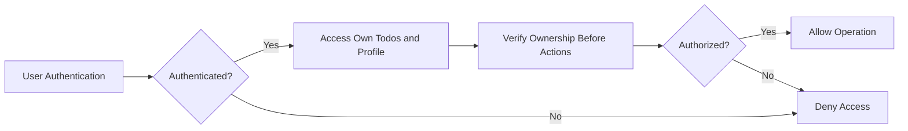
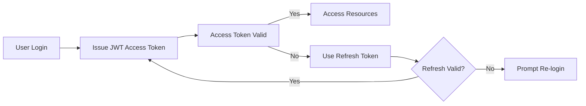

# Multi-User Todo Application Requirements Specification

## 1. User Account

- Users SHALL sign up using a unique email and password.
- WHEN a user signs up, THE system SHALL validate the email format and password strength.
- WHEN a user logs in with valid credentials, THE system SHALL authenticate the credentials and issue a JWT access token.
- WHEN a user changes their password, THE system SHALL invalidate all existing sessions and require re-authentication.
- WHEN a user deletes their account, THE system SHALL permanently delete the user profile, all todos, including those in trash, and all associated edit histories.

## 2. User Profile

- EACH user SHALL have a private profile containing a display name.
- Users SHALL be able to edit their own display name.
- Users SHALL NOT be able to view or access other users' profiles.

## 3. Todo Creation

- Users SHALL be able to create a todo with a mandatory title.
- Users MAY optionally add a description, start date, and due date.
- Newly created todos SHALL be incomplete by default.

## 4. Viewing Todos

- Users SHALL be able to view a paginated list of their own todos.
- The todo list SHALL display title, completion status, start date (if set), due date (if set), and creation date.
- Users SHALL be able to view the full details of a single todo including the full description.

## 5. Completing Todos

- Users SHALL be able to mark a todo as complete or incomplete by toggling its completion status.

## 6. Editing Todos

- Users SHALL be able to edit the todo's title, description, start date, and due date.
- WHEN a todo is edited, THE system SHALL record an edit history entry capturing the timestamp and the previous and new values of any changed fields.

## 7. Edit History Management

- EACH todo SHALL maintain an edit history tracking all modifications.
- EACH edit history entry SHALL record when the edit was made and the specific field changes (title, description, start date, due date).
- Edit history SHALL be sorted from most recent to oldest.
- Users SHALL be able to view the full edit history of their todos.

## 8. Deleting Todos and Trash

- WHEN a user deletes a todo, THE system SHALL perform a soft delete, removing it from the normal todo list and moving it to the trash.
- Users SHALL be able to view a paginated list of their deleted todos (trash).
- Users SHALL be able to restore a todo from trash, returning it to the normal list.
- Users SHALL be able to permanently delete a todo from trash, which SHALL also delete all related edit history entries.

## 9. Filtering and Sorting Todos

- Users SHALL be able to filter their todo list by completion status: all, complete only, or incomplete only.
- Users SHALL be able to sort the todo list by creation date, start date, or due date in ascending or descending order.
- Todos without start or due dates SHALL appear at the end of the list when sorting by those dates.

## 10. Privacy and Security Requirements

- EACH user's data SHALL be fully private and accessible only by that user.
- THE system SHALL strictly enforce authorization checks preventing cross-user data access.

### Authentication

- Users SHALL sign up and authenticate using email and password.
- Passwords SHALL be stored securely using hashing.
- Successful authentication SHALL issue JWT access tokens with 15-minute expiration.
- Refresh tokens SHALL be used to maintain sessions, valid for up to 30 days.
- Password changes SHALL invalidate existing sessions.

### Authorization

- Users SHALL only be authorized to perform actions on their own todos and profiles.
- Unauthorized requests SHALL be denied with proper error responses.

### Data Protection

- All sensitive data SHALL be encrypted at rest and transmitted over TLS.
- Passwords SHALL never be logged in plain text.

### Compliance

- THE system SHALL comply with data protection regulations such as GDPR and CCPA.
- Permanently deleted data SHALL be handled according to retention policies.

## 11. Error Handling and Notifications

- THE system SHALL provide clear, actionable error messages for authentication failures, authorization issues, and validation errors.
- Error responses SHALL be timely and informative without exposing sensitive information.

## 12. Diagrams

### User Data Access Flow

### Session and Token Management Flow

## 13. Glossary and References

- JWT: JSON Web Token
- GDPR: General Data Protection Regulation
- CCPA: California Consumer Privacy Act
- TLS: Transport Layer Security

---