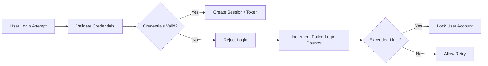
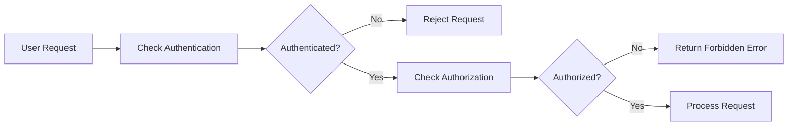

# Security and Compliance Requirements for the Todo List Application

## Introduction
This document specifies all business and functional requirements related to security, data privacy, and compliance for the Todo List backend application. It defines the expected behaviors and constraints for authentication, authorization, data handling, audit logging, and monitoring to ensure the system operates securely and in compliance with regulations.

## 1. Authentication and Authorization Security

### 1.1 Authentication Requirements
- WHEN a guest attempts to create, read, update, or delete a todo item, THE system SHALL deny access and respond with an appropriate error indicating authentication is required.
- WHEN a user attempts to register a new account, THE system SHALL validate the user's email and password.
- WHEN a user attempts to log in, THE system SHALL verify credentials securely.
- WHEN a login attempt is successful, THE system SHALL create a secure session or issue a JWT access token with a validity period of 30 minutes.
- THE system SHALL implement refresh tokens with validity of 7 days to allow users to extend their session securely.
- IF login credentials are invalid, THEN THE system SHALL respond with an error status indicating authentication failure.
- THE system SHALL securely store passwords using state-of-the-art cryptographic hashing algorithms with salt (e.g., bcrypt or Argon2).
- THE system SHALL implement rate limiting on login attempts to prevent brute force attacks.

### 1.2 Authorization Requirements
- THE system SHALL enforce that users can only view, update, or delete their own todo items.
- IF a user attempts to access or modify todo items owned by another user, THEN THE system SHALL deny access and respond with a forbidden error.
- THE system SHALL validate user permissions on every protected endpoint.

### 1.3 Security Best Practices
- THE system SHALL use HTTPS for all communication between client and server.
- THE system SHALL implement secure HTTP headers (e.g., Content Security Policy, X-Frame-Options).
- THE system SHALL apply input validation on all user inputs to prevent injection attacks.

## 2. Data Privacy and GDPR Compliance

### 2.1 Data Minimization and Purpose Limitation
- THE system SHALL collect only the minimum necessary personal data: user email and password.
- THE system SHALL use personal data only for authentication and account management.

### 2.2 User Consent and Rights
- WHEN a user registers, THE system SHALL record explicit consent to privacy policy.
- THE system SHALL allow users to request deletion of their account and associated personal data.
- THE system SHALL provide mechanisms to export user personal data upon request.

### 2.3 Data Retention
- THE system SHALL retain user personal data only as long as the account is active.
- WHEN a user deletes their account, THE system SHALL securely erase all associated personal data within 30 days.

### 2.4 Data Protection Measures
- THE system SHALL encrypt sensitive personal data at rest.
- THE system SHALL ensure regular backups of data are encrypted and securely stored.
- THE system SHALL store logs securely with access controls to prevent unauthorized access.

### 2.5 GDPR Compliance
- THE system SHALL provide mechanisms to comply with GDPR requests such as data access, correction, deletion, and portability.
- THE system SHALL maintain records of consent and privacy policy acceptance.

## 3. Audit Logging and Monitoring

### 3.1 Audit Logging Requirements
- THE system SHALL log all authentication attempts (successful and failed) with timestamp, user ID (if available), and IP address.
- THE system SHALL log all todo item create, update, and delete operations with timestamp, user ID, and changed resource identifiers.
- THE system SHALL log all authorization failures with details to support security analysis.
- THE system SHALL retain logs for a minimum of 90 days in secure storage with restricted access.

### 3.2 Monitoring and Alerts
- THE system SHALL monitor for suspicious activity such as repeated failed login attempts or unusual access patterns.
- THE system SHALL generate alerts for potential security incidents including brute force attacks or unauthorized access attempts.
- THE system SHALL define incident response procedures to address detected security issues promptly.

## Summary
This document defines critical security, privacy, and compliance requirements for the Todo List backend application. Successful implementation ensures user data protection, regulatory compliance, and operational security.

> *This document provides business requirements only. All technical implementation decisions belong to developers. Developers have full autonomy over architecture, APIs, and database design. This document describes WHAT the system should do, not HOW to build it.*

## Mermaid Diagrams

### Authentication Flow

### Authorization Check

