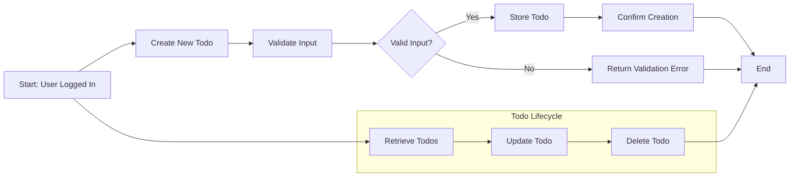

# Todo List Application Requirements Analysis Report

## 1. Introduction

The Todo List application provides a minimal yet functional digital tool allowing users to effectively manage their tasks. This specification outlines the business requirements, intended to guide backend development of a secure, reliable, and maintainable service based on clear, natural language descriptions.

## 2. Business Model

The Todo List service exists to fulfill the widespread demand for a simple, easy-to-use personal task management tool. It targets users seeking efficiency without complicated features. Although the initial scope is basic and free, revenue streams may emerge from premium features or subscriptions in future expansions.

Organic growth via user referral and simple, reliable functionality form the core of the growth strategy. Success will be measured primarily by active user counts, engagement metrics such as tasks created and completed, and consistent system uptime and response times.

## 3. User Actors

Three primary user roles define the system's interaction boundaries:

- **Guest**: Can view public resources and register accounts but cannot manage todos.
- **User**: Registered individuals able to create, view, update, and delete their own todo items.
- **Admin**: System administrators with full control over all users and todo items.

Permissions are finely controlled; guests have minimal access, users can manage only their data, and admins have comprehensive management rights.

## 4. Functional Requirements

- WHEN a registered user submits a new todo item, THE system SHALL create and persist the todo with a unique identifier.
- WHEN a registered user requests their todo list, THE system SHALL retrieve all todo items owned by that user.
- WHEN a registered user updates an existing todo, THE system SHALL verify ownership before applying changes.
- WHEN a registered user deletes a todo, THE system SHALL verify ownership before removing it permanently.
- THE system SHALL support the following todo attributes: title (mandatory text), description (optional text), creation timestamp, optional due date, and completion status (boolean).
- WHEN a user marks a todo as complete, THE system SHALL update the completion status accordingly.

## 5. Business Rules

- THE system SHALL restrict todo access and modification strictly to the owning user.
- THE system SHALL enforce non-empty titles on all todos.
- THE system SHALL reject any todo creation or update requests with due dates set in the past.
- THE system SHALL automatically assign the creation timestamp at the moment of todo creation.

## 6. Error Handling

- IF a guest attempts to create, update, or delete a todo, THEN THE system SHALL respond with an authorization error.
- IF a user attempts to access or modify a todo not owned by them, THEN THE system SHALL deny the request with an appropriate error message.
- IF validation fails due to missing title or invalid due date, THEN THE system SHALL return an informative error identifying the problematic inputs.
- IF any unexpected system error occurs, THEN THE system SHALL return a generic error message to the user and log the incident internally for review.

## 7. Performance Requirements

- THE system SHALL respond to all todo operations (creation, reading, updating, deletion) within 2 seconds under normal operating conditions.
- THE system SHALL maintain data consistency and support concurrent operations from multiple users without errors or race conditions.

## 8. Diagrams

## 9. Future Considerations

Future development may include features such as categorizing and tagging todos, user notifications and reminders, collaborative todo management, and mobile as well as offline access capabilities.

This specification is a finalized, production-ready requirements base suitable for backend implementation without ambiguity or technical implementation details.