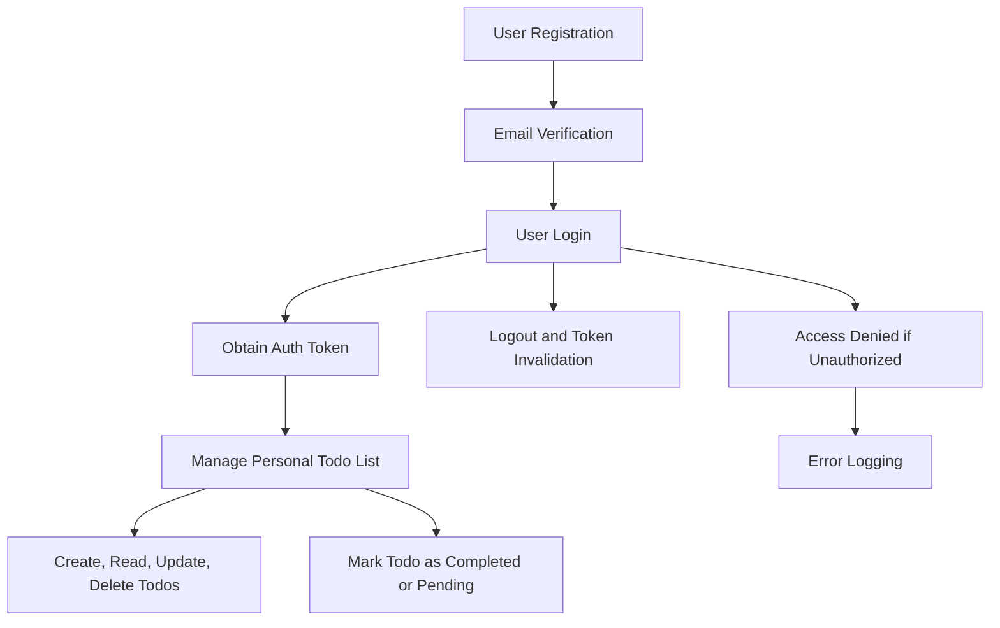

# Requirements Specification for Multi-user Todo List Application

## Introduction
This document specifies the detailed requirements for a multi-user todo list application. Users must be able to register, authenticate, and manage their private todo lists which are inaccessible to others. The design enforces complete user data isolation and robust authentication and authorization.

## Privacy Policies

### Data Collection
- WHEN a user registers or logs in, THE system SHALL collect only the minimum necessary personal information, specifically email and password.
- THE system SHALL NOT collect any unnecessary personal data beyond what is required for authentication and managing todo items.

### Data Usage
- THE system SHALL use user data solely to provide, maintain, and improve the todo list services.
- THE system SHALL NOT share user data with any third parties without explicit user consent.

### Data Retention
- THE system SHALL retain user data only as long as the user account remains active.
- WHEN a user deletes their account, THE system SHALL permanently delete all associated personal data and todo list data within 30 days.

## Data Access Control

### Authentication
- THE system SHALL provide secure user registration and login functionalities.
- WHEN a user successfully logs in, THE system SHALL generate a secure authentication token (e.g., JWT) tied to the user's identity.
- THE system SHALL maintain user sessions securely and invalidate tokens upon logout or expiration.

### Authorization
- THE system SHALL enforce strict access control ensuring users access ONLY their own todo lists.
- IF a user attempts to access another user's todo list data, THEN THE system SHALL deny access and log the unauthorized attempt.

### User Data Isolation
- THE system SHALL isolate user data at the data storage and application levels to protect privacy.
- THE system SHALL architect the backend to prevent data leakage between users.

### Access Logging and Monitoring
- THE system SHALL record access logs for user data operations, noting timestamps, user identity, and operation type.
- THE system SHALL monitor logs for suspicious activities and raise alerts for potential breaches.

## Regulatory Compliance

### Applicable Regulations
- THE system SHALL comply with GDPR and applicable country-specific data protection laws.
- THE system SHALL enforce compliance measures according to the geographic origin of the user data.

### Compliance Mechanisms
- THE system SHALL provide users with means to access, correct, and delete their personal data upon request.
- THE system SHALL encrypt user data both at rest and in transit using industry-standard cryptographic protocols.
- THE system SHALL conduct regular security audits to ensure compliance with data protection standards.

## Core Todo List Functionality

### Todo Item Management
- WHEN a user creates a todo item, THE system SHALL associate it exclusively with that user's account.
- THE system SHALL support CRUD (Create, Read, Update, Delete) operations on todo items, limited strictly to the owning user.
- THE system SHALL allow users to mark todo items as completed or pending.
- THE system SHALL support pagination and filtering of todo items by status and creation date.

### User Registration and Login
- THE system SHALL provide user registration with email and password.
- THE system SHALL send verification emails upon registration and require email verification for account activation.
- THE system SHALL provide login functionality with secure password hashing and rate limiting to prevent brute force attacks.
- THE system SHALL allow password reset via secure token-based links sent to the registered email.

### Error Handling and Security
- WHEN authentication or authorization fails, THE system SHALL provide clear error messages without exposing sensitive information.
- THE system SHALL limit login attempts and apply account locking policies after repeated failures.
- THE system SHALL log all significant security events.

## Architectural and Business Model Assumptions

- Users interact with the system via a secure RESTful API.
- The backend uses token-based authentication (JWT) with appropriate expiration and refresh mechanisms.
- User todo data is stored securely with strict access control enforced.
- The system is designed to scale for a large number of users efficiently.

## Summary
The multi-user todo list application requires robust user authentication and stringent data privacy controls. Each user's data must remain confidential and inaccessible to others. The system shall conform to all relevant security and data protection standards, providing a minimal but complete set of todo list functionalities focused on user privacy and secure access.

---

This specification provides an implementation-ready, detailed requirements baseline for backend developers to implement the multi-user todo list application with privacy and security best practices strictly enforced.