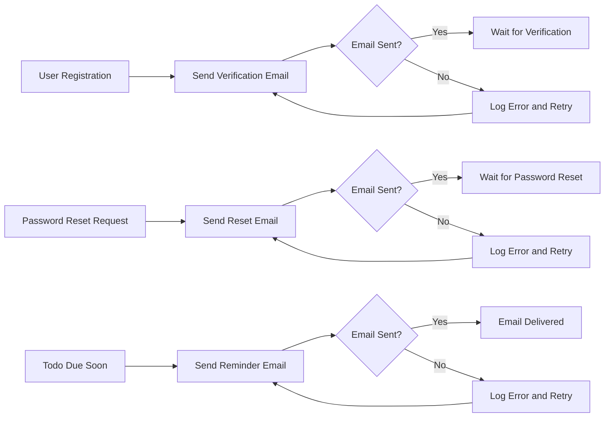
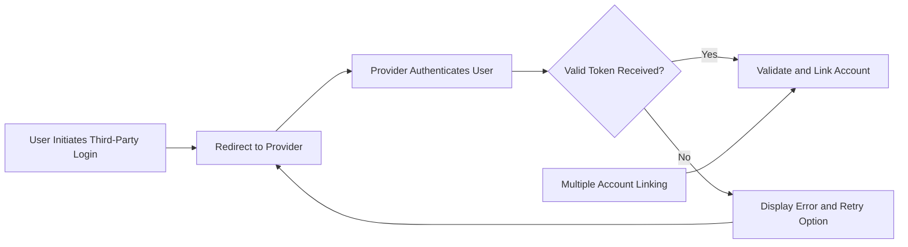

# External Integrations Requirement Analysis for Todo List Application

## 1. Introduction

The Todo List application integrates with external systems to enhance user experience and provide essential functionalities related to account management and user notifications. This document defines the business requirements for these integrations, focusing on what the system must achieve without dictating technical implementation details.

## 2. Scope

This requirements analysis covers two main external integrations:

- Email service for sending transactional emails including account verification, password resets, and todo reminders.
- Third-party authentication providers supporting OAuth 2.0 protocols to facilitate user login and account linking.

The document excludes frontend or UI considerations and any detailed technical implementation aspects. It focuses on how these integrations serve user and business needs within the Todo List backend system.

## 3. Email Service Integration

### 3.1 Objectives

The email service enables the Todo List system to communicate with users effectively by sending critical transactional emails.

### 3.2 Functional Requirements

- WHEN a new user registers, THE system SHALL send a verification email with a unique verification link within 1 minute.
- WHEN a user requests a password reset, THE system SHALL send a secure, time-limited reset email within 2 minutes.
- WHEN a todo item is due in less than 24 hours AND the user has opted-in for email reminders, THE system SHALL send a reminder email.
- THE system SHALL queue all outbound emails reliably to prevent loss due to transient failures.
- THE system SHALL retry failed email sends up to 3 times using exponential backoff.

### 3.3 Business Rules

- Verification and password reset links SHALL be valid for exactly 24 hours.
- Users who explicitly opt out SHALL not receive email notifications.
- Emails SHALL conform to company branding and use HTML format.

### 3.4 Error Handling

- IF the email service is unreachable, THEN THE system SHALL log the failure and retry according to retry policies.
- IF an email address is invalid, THEN THE system SHALL not retry and SHALL notify the user about the invalid address.
- WHEN email sending repeatedly fails after retries, THE system SHALL alert the support team promptly.

## 4. Third-Party Authentication Providers

### 4.1 Objectives

To simplify user authentication, the system integrates with OAuth 2.0 providers allowing users to log in using existing accounts.

### 4.2 Supported Providers

- Google OAuth 2.0
- Facebook OAuth 2.0

### 4.3 Functional Requirements

- WHEN a user initiates login through a third-party, THE system SHALL redirect the user to the provider's authentication page.
- WHEN the provider returns a valid token, THE system SHALL validate and link or create the user account accordingly.
- THE system SHALL allow multiple third-party accounts to link to a single user account.
- THE system SHALL store only minimal user identity information necessary for mapping.

### 4.4 Business Rules

- Third-party authentication SHALL not bypass the requirement for verified emails.
- THE system SHALL provide fallback to standard email/password login if external services are unavailable.

### 4.5 Error Handling

- IF authentication with the provider fails, THEN THE system SHALL display a clear error message.
- IF tokens are invalid or expired, THEN THE system SHALL ask the user to retry authentication.

## 5. Security and Compliance Considerations

- THE system SHALL ensure HTTPS for all communications with external providers.
- Credentials and tokens SHALL be securely stored and handled.
- THE system SHALL comply with GDPR, including data minimization and user consent.

## 6. Summary

Integrating with email services and OAuth 2.0 providers is essential for the Todo List application’s user management and notification functionalities. These requirements ensure reliable, secure, and user-friendly external system interactions.

All technical architectural decisions and detailed implementation are left to the developers’ discretion.

---

### Mermaid Diagram: Email Integration Flow

### Mermaid Diagram: Third-Party Authentication Flow

---

This is a business requirement document. It excludes implementation and technical details, focusing on WHAT must be accomplished by the external integrations for the Todo List backend application.