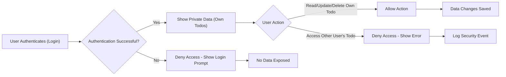

# Security and Privacy Requirements for the Todo List Application

## Data Privacy

Data privacy is foundational to the Todo List application’s reliability and user trust. Personal data, defined as all information linked to a user account or any Todo item content, must be strictly protected against unauthorized access or disclosure.

### Business Privacy Requirements (EARS Format)

- THE service SHALL keep all user data, including Todo items and account details, confidential, accessible only to their respective owner at all times.
- THE service SHALL never use user-generated data (Todos, account info) for non-core functions without the user’s explicit, informed consent.
- THE service SHALL never disclose, sell, or share any user data to any third party except by user action or legal mandate.
- THE service SHALL always display a Privacy Policy describing, in clear language accessible to everyday users, how data is collected, managed, and deleted.
- WHEN a user provides or updates personal data, THE service SHALL request and log the user’s explicit, unambiguous consent for its necessary use.
- IF a user is not authenticated, THEN THE system SHALL never display, transmit, or leak any Todo or personal data.

### Consent and Transparency (EARS Format)

- THE service SHALL provide accessible explanations at sign-up and in-app settings regarding all data collection, retention, usage, and protection processes.
- WHEN the service is governed by regional privacy regulation (such as GDPR, CCPA), THE service SHALL prompt users to review and accept privacy policies that impact their data rights and retention.
- THE service SHALL allow users to withdraw consent at any time and will honor such requests immediately wherever technically feasible.

## Access Control

Access control ensures that every user (i.e., todoListMember) can only access, view, modify, or delete their own data. There are no shared workspaces or cross-user data flows in this minimum Todo List application.

### User-Based Access Controls (EARS Format)

- THE service SHALL ensure all operations (create, read, update, delete of Todo items) are only performed on data owned by the authenticated user.
- IF a user attempts to access any resource not belonging to them, THEN THE service SHALL prevent the action and show a simple, human-readable message stating that access is denied, with no technical details about the protected data.
- WHEN any authentication state is invalid or a user session expires, THE service SHALL immediately deny all access to protected data until re-authentication occurs.
- THE service SHALL never expose any information about other users via API, system errors, or logs.
- THE service SHALL require re-authentication for all high-security actions, such as password changes, email changes, or account deletions.

### Data Segregation (EARS Format)

- WHILE a user is authenticated, THE service SHALL store and process all data such that each user’s data remains completely separated.
- IF a backend/system process interacts with user data (e.g., admin logs, backup scripts), THEN THE service SHALL enforce access boundaries for privacy compliance at all layers.

### Access Control: Edge Case Handling (EARS Format)

- IF an unauthenticated request is made to access, modify, or retrieve any personal or Todo resource, THEN THE service SHALL always return a clear unauthorized error and never reveal any data.

## User Data Deletion and Portability

All users (todoListMembers) are entitled to manage the lifecycle of their data with clear, dependable rules about deletion and export.

### Data Deletion (EARS Format)

- WHEN a user requests permanent deletion of their account, THE service SHALL erase all data for that account (including Todos) from all active systems, without possibility of restoration, within 7 calendar days of the request.
- WHEN a user deletes an individual Todo, THE service SHALL remove the Todo from all customer-facing systems within 24 hours.
- IF any item or account is unrecoverable, THEN THE service SHALL confirm the permanence and irreversibility of the action at the time of the user’s request.
- THE service SHALL not retain any backup or copy of deleted information beyond the grace or legally-required periods defined in the privacy policy.

### Data Portability (EARS Format)

- WHEN a user requests a personal data export, THE service SHALL deliver a complete export of all personal and Todo data in a standard machine-readable format (such as JSON or CSV) to the authenticated user within 48 hours.
- THE service SHALL make exports available only to the authenticated account owner and never allow one user to access the export of another.

### User-Driven Correction and Updates (EARS Format)

- THE service SHALL permit users to update their personal data or Todo content, with the changes effective immediately in all service functions and data stores.
- IF a user attempts to update data with invalid input or malformatted requests, THEN THE system SHALL return a clear, human-readable error message explaining the rejection.

## Diagram: Data Privacy and Access Control Flow

## Additional Constraints and Best Practices

- WHERE applicable laws require specific data privacy measures, THE service SHALL fully comply for all users.
- THE service SHALL keep a confidential audit log of data deletions, exports, and access requests—this log is not visible to users, but supports auditability.
- THE service SHALL always default to the most privacy-preserving settings for all features and all users unless explicitly changed by the user.
- WHERE confirmation is required for sensitive actions (data deletion/export, password changes), THE service SHALL require clear, explicit user confirmation before processing the request.