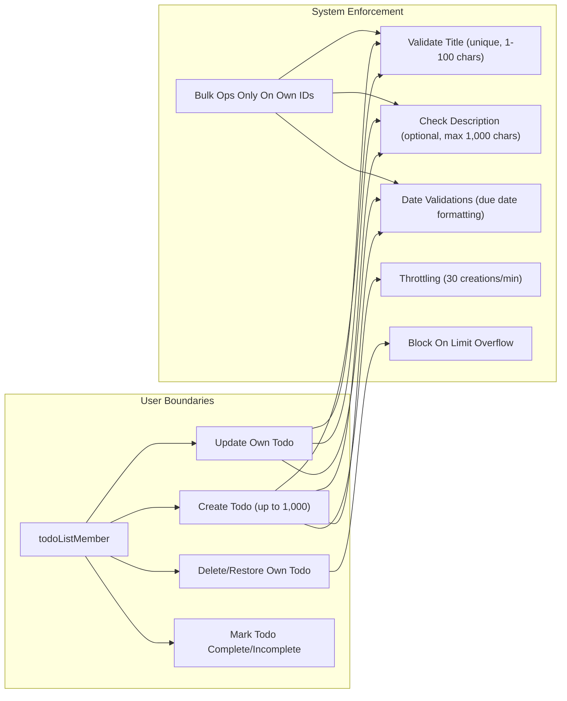

# Todo List Application - Business Requirements and Constraints

## 1. Introduction
The Todo List application enables individual users to manage a personal list of actionable items ("Todos") via creation, update, completion, and deletion features. The system provides only core functionality essential for a minimum viable Todo List, with strict attention to data validation, boundary enforcement, and operational constraints to ensure reliable and secure operation for all users.

## 2. Actors
- **todoListMember**: An authenticated user who owns and manages their personal Todo items. This actor may create, read, update, complete/incomplete, and delete their own Todos, but is strictly prohibited from accessing any other user's Todos.

## 3. Key Business Rules (EARS Format)
- WHEN a todoListMember creates or updates a Todo, THE system SHALL require a non-empty, unique title (per user) of 1-100 visible characters, rejecting titles with forbidden or unsafe content (e.g., control characters, embedded formatting, or XSS attempts).
- IF a title duplicate is detected for the same user, THEN THE system SHALL reject the request and provide code/type indicating a duplicate error.
- WHEN a description/content is included, THE system SHALL allow up to 1,000 characters; IF invalid unicode or binary data appears, THEN THE system SHALL reject the operation.
- WHEN a description is omitted or blank, THE system SHALL accept and store an empty string or null as appropriate.
- WHEN a Todo is marked 'complete', THE system SHALL store a completion timestamp; WHEN marked 'incomplete', THE system SHALL clear any stored completion timestamp.
- Status changes SHALL be permissible ONLY by the todoListMember for their own items.
- WHEN a due date is provided, THE system SHALL only accept a valid ISO 8601 date string. Overdue dates SHALL be accepted for historical tracking, but SHALL NOT activate future reminders or alerts.
- IF tags/categories are supported, THEN THE system SHALL restrict each tag to 30 characters maximum and permit no more than 10 tags per Todo. Forbidden content SHALL cause validation errors.

## 4. Validation and Error Scenarios
- THE system SHALL display specific validation errors for all rejected operations (duplicate title, invalid character, length overflow, binary or malformed content, tag overlimit, etc.), referencing the requirement violated.
- WHEN a modification is attempted for a deleted Todo, THE system SHALL return an error indicating the resource no longer exists.
- WHEN a bulk operation is performed (batch delete, batch complete/incomplete), THE system SHALL process valid IDs and return error results for invalid or unauthorized IDs. Bulk operations SHALL be limited to only Todos owned by the requesting user.
- IF two or more update/status change requests for the same Todo occur near-simultaneously, THEN THE system SHALL use last-write-wins but SHALL notify users in conflict cases.

## 5. Status and Completion Logic
- Todos SHALL have a mandatory status field (incomplete by default, or complete).
- WHEN status is toggled, THE system SHALL always update timestamps as appropriate.
- Only the owner (todoListMember) SHALL have permission for status changes.

## 6. Optional Features (Tagging/Categorization)
- If implemented, tag input SHALL be string-based, up to 10 tags with max 30 characters each, without forbidden/prohibited content or injections.

## 7. Operational Constraints
- THE system SHALL permit at most 1,000 active Todos per user. Attempting to exceed this limit SHALL result in a clear, actionable error. Deleted Todos do not count toward this quota.
- Todo creation SHALL be throttled: at most 30 new Todos per minute per user. Exceeding this SHALL trigger a rate-limit error message.
- All CRUD operations SHALL be limited strictly to the user's own Todos. Any attempt to read, update, or operate on another user's Todos SHALL be rejected and logged.
- WHEN a Todo has been deleted, THE system SHALL prevent any further actions (update, complete, re-delete, etc.) and provide a clear error message.
- Ordering, bulk modifications, and batch status changes SHALL only be accepted for IDs validated as belonging to the logged-in user.

## 8. Edge Cases
- IF a user tries to rename or create a Todo to a title already in use for their account, THEN THE request SHALL be denied.
- IF a bulk operation includes any invalid or unauthorized Todo IDs, THEN THE operation SHALL be performed only for authorized IDs, with errors for the remainder.
- WHEN race conditions arise in status changes or updates across multiple sessions/devices, THE system SHALL protect data consistency and reliably resolve using last-write-wins, notifying users if conflicts are detected.
- WHEN a failed modification would leave a Todo in an inconsistent state, THE system SHALL roll back the change, preserving the last-known-good version.

## 9. Mermaid Diagram: Operational Boundaries

## 10. Summary for Implementation
- All requirements above SHALL be implemented exactly as described, strictly following EARS format and providing clear, testable error messages for each failure scenario.
- No operation is permitted outside declared user boundaries, and all CRUD logic SHALL ensure absolute data isolation per user.
- System behavior MUST guarantee no data loss or partial failure: if any operation cannot be completed as defined, the system MUST revert to the previous consistent state and return descriptive errors.
- All validation, throttling, and limit enforcement are mandatory for production deployment.
