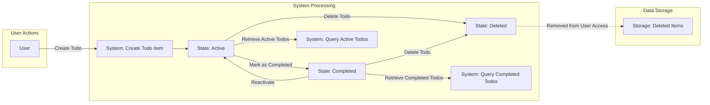

# Todo List Backend Data Flow and Lifecycle Documentation

## 1. Introduction

The Todo List backend application manages personal task items for authenticated users. Understanding the data flow and lifecycle of todo items is crucial for designing a seamless and consistent user experience. This document clearly outlines all business requirements related to the management of todo data from creation to deletion, focusing on ownership, state transitions, and access controls.

## 2. Data Lifecycle Overview

Todo items undergo a defined lifecycle that dictates their existence and visibility within the system:

- **Creation**: When a user adds a new todo item, it enters the system as an active task awaiting completion.
- **Active**: The todo item is visible in the user's active task list and is pending action.
- **Completed**: Users mark tasks as completed to indicate finished work.
- **Deleted**: When users remove tasks, those items are effectively deleted and no longer accessible.

Requirements:

- WHEN a user creates a todo item, THE system SHALL assign it a unique identifier and set its initial state to active.
- WHEN a todo item is active, THE system SHALL include it in the user's active todo list responses.
- WHEN a user marks a todo item as completed, THE system SHALL transition its state to completed.
- WHEN a todo item is in the completed state, THE system SHALL include it in completed todo list queries.
- WHEN a user deletes a todo item, THE system SHALL mark it as deleted and remove it from all active or completed queries.
- WHEN a todo item is deleted, THE system SHALL prevent any further access or modification by any user.

## 3. State Transitions

The state machine for todo items shall follow these rules:

- INITIAL STATE: A todo item does not exist before creation.
- CREATION: WHEN a user creates a todo item, THE system SHALL set the state to active.
- ACTIVATION: Active is the primary state where todos await completion or deletion.
- COMPLETION: WHEN a user marks an active todo as completed, THE system SHALL transition the state to completed.
- REACTIVATION: WHEN a user changes a completed todo back to active, THE system SHALL perform the state transition accordingly.
- DELETION: WHEN a user deletes a todo item in any state, THE system SHALL transition the state to deleted.

These transitions SHALL be strictly enforced to maintain data consistency.

## 4. Data Persistence and Access Patterns

- Each todo item SHALL be uniquely identified within the system.
- Persistent storage SHALL associate each todo item exclusively with its owning user.
- Access to todo items SHALL be strictly limited to their owners.
- THE system SHALL exclude deleted todo items from all user queries.
- Retrieval operations SHALL support filtering by state (active, completed) to facilitate user interface requirements.

Business rules:

- WHEN a user requests their active todo list, THE system SHALL return all active todos belonging exclusively to that user.
- WHEN a user requests their completed todo list, THE system SHALL return all completed todos belonging exclusively to that user.
- Guests or unauthenticated users SHALL NOT have access to todo data.

## 5. Data Flow Diagrams

## 6. Summary

The todo item data flow and lifecycle follow strict state transitions ensuring data integrity, user ownership, and proper access controls. Deleted items are excluded from user access, and only active and completed tasks are returned in queries. This document defines the essential business requirements for these behaviors without dictating technical implementation.

Developers have full autonomy to implement storage, data models, and APIs as long as these business rules are met.

---

This document contains all business requirements related to todo item data flows and lifecycle management. It is intended for backend developers and product stakeholders.

All technical implementation decisions, such as database design or API specification, are outside the scope of this document and left to developer discretion.