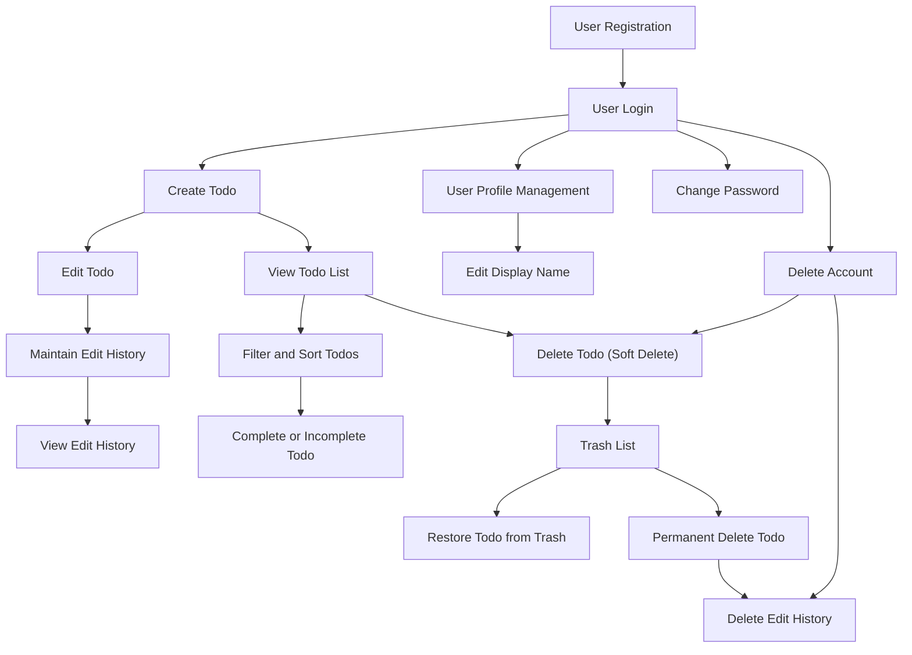

# Multi-User Todo Application Requirements Specification

## 1. User Account Management

### 1.1 User Registration
- WHEN a new user registers with an email and password, THE system SHALL create a user account with the provided credentials.
- WHEN a user attempts to register with an already registered email, THE system SHALL reject the registration and inform the user that the email is already in use.

### 1.2 User Login
- WHEN a user attempts to log in with email and password, THE system SHALL authenticate the credentials.
- IF the credentials are invalid, THE system SHALL deny access and provide an error message stating "Invalid email or password." with HTTP 401 status.
- IF a user fails more than 5 login attempts within 15 minutes, THEN THE system SHALL lock the account for 15 minutes and notify the user.

### 1.3 Password Change
- WHEN a logged-in user requests a password change, THE system SHALL verify the current password.
- IF the current password is incorrect, THE system SHALL reject the request with an error message "Current password incorrect.".
- WHEN the current password is correct, THE system SHALL update the user's password to the new password.

### 1.4 Account Deletion
- WHEN a user requests account deletion, THE system SHALL permanently delete the user's account.
- WHEN a user's account is deleted, THE system SHALL permanently delete all the user's todos including those in trash and all associated edit histories.

## 2. User Profile Management

### 2.1 Profile Details
- Each user SHALL have a profile containing a display name.

### 2.2 Editing Profile
- WHEN a user updates their display name, THE system SHALL save the new display name.

### 2.3 Privacy
- USERS SHALL NOT be able to view other users' profiles.
- All user profiles are private to their respective owners.

## 3. Todo Management

### 3.1 Creating Todos
- WHEN a user creates a new todo, THE system SHALL allow input of title (required), description (optional), start date (optional), due date (optional).
- Newly created todos SHALL be marked as incomplete by default.

### 3.2 Viewing Todos
- Users SHALL be able to view a paginated list of their own todos.
- Each todo in the list SHALL display title, completion status, start date (if set), due date (if set), and creation date.
- Users SHALL be able to view detailed information of a single todo including full description.

### 3.3 Completing Todos
- Users SHALL be able to toggle a todo's completion status between complete and incomplete.

### 3.4 Editing Todos
- Users SHALL be able to edit a todo's title, description, start date, and due date.
- WHEN a todo is edited, THE system SHALL record an edit history entry capturing the edit time and fields changed with their new values.

### 3.5 Edit History
- Each todo SHALL maintain an edit history.
- Edit history entries SHALL include timestamp, and changed values for title, description, start date, and due date.
- WHEN users view edit history, THE system SHALL present entries sorted from most recent to oldest.

### 3.6 Deleting Todos (Soft Delete)
- Users SHALL be able to delete their own todos.
- Deleted todos SHALL be soft-deleted and excluded from the normal todo list.

## 4. Trash Management

### 4.1 Trash Listing
- Users SHALL be able to view a paginated list of their soft-deleted todos (trash).

### 4.2 Restoring Todos
- Users SHALL be able to restore a soft-deleted todo from trash, returning it to the normal todo list.

### 4.3 Permanent Deletion
- Users SHALL be able to permanently delete todos from the trash.
- WHEN a todo is permanently deleted, THE system SHALL also delete all associated edit history entries.

## 5. Filtering and Sorting

### 5.1 Filtering
- Users SHALL be able to filter their todo list by completion status:
  - All todos
  - Only complete todos
  - Only incomplete todos

### 5.2 Sorting
- Users SHALL be able to sort their todo list by:
  - Creation date (newest first or oldest first)
  - Start date (earliest first or latest first)
  - Due date (earliest first or latest first)
- Todos without start date SHALL appear at the end when sorting by start date.
- Todos without due date SHALL appear at the end when sorting by due date.

## 6. Privacy and Security

### 6.1 Privacy
- Users SHALL only have access to their own todos and profile.
- The system SHALL prevent access to other users' data under any circumstances.

### 6.2 Authentication
- The system SHALL require users to authenticate with email and password to access any personal data.
- User sessions SHALL be managed securely and expire after inactivity.

## 7. Error Handling and Recovery

### 7.1 Authentication Errors
- WHEN a user attempts to sign up with an email already registered, THE system SHALL reject the registration with a clear error message.
- WHEN a user attempts to log in with invalid credentials, THE system SHALL reject access with an HTTP 401 response.
- IF multiple failed login attempts exceed 5 within 15 minutes, THEN THE system SHALL lock the user account temporarily.

### 7.2 Authorization Failures
- WHEN a user attempts to access or modify data not owned by them, THE system SHALL deny access with HTTP 403 Forbidden.

### 7.3 Validation Errors
- WHEN user input data is invalid (missing required fields, invalid dates, title length limits), THE system SHALL reject the request with descriptive validation errors.
- WHEN the start date is after the due date, THE system SHALL reject the update with an error about date inconsistency.

### 7.4 Data Integrity and Recovery
- WHEN a todo is permanently deleted, THE system SHALL ensure cascading deletion of associated edit history.
- WHEN a todo is restored from trash, THE system SHALL reinstate all related metadata including edit history.

## 8. Glossary

- Todo: a task item that a user creates and manages.
- Edit History: the record of changes made to a todo's fields over time.
- Trash: a temporary storage for soft-deleted todos before permanent deletion.

---

