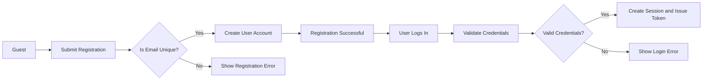
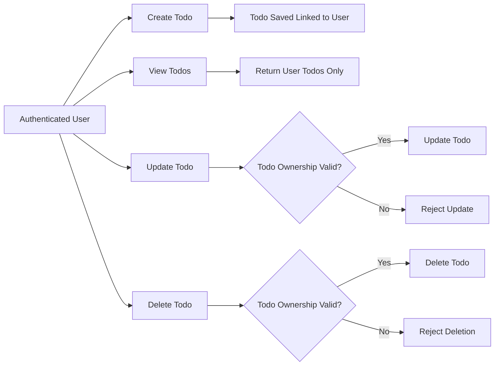

# todoApp Multi-User Todo List Application - Business Requirements Specification

## Introduction

todoApp is a minimalistic multi-user todo list application designed to provide registered users with a secure environment to manage their personal todo lists. Each todo list is private and inaccessible to other users, ensuring strict data separation.

This specification outlines the functional and business requirements for the todoApp service, focusing on secure user authentication, authorization, and essential todo management features to maintain simplicity and privacy.

---

## Business Model

### Purpose

The todoApp service exists to offer a straightforward, privacy-first personal task management tool accessible from anywhere. It aims to provide users with a minimalistic yet secure platform to manage their tasks without unnecessary complexity.

### Revenue Strategy

Initially offered for free to maximize adoption, with potential for future monetization through premium features or subscriptions.

### Growth Plan

Growth will be driven by user acquisition campaigns, social media promotion, and potential integration with existing productivity tools. Retention will focus on reliable, fast, and private todo management features.

### Success Metrics

- Monthly Active Users (MAU)
- User Retention Rate
- Average Number of Todos Created per User
- System Uptime and Average Response Time

---

## User Actors and Authentication

### Actors

| Actor | Description |
|-------|-------------|
| Guest | Unauthenticated users who can register and log in. |
| User  | Authenticated users who can manage their private todo lists. |

### Authentication Flow

- Users register using a unique email and secure password.
- Users log in with their credentials to receive JWT access and refresh tokens.
- Secure sessions are maintained using tokens.
- Password reset functionality is available via email.
- Optional email verification for new user registrations.

### Token Management

- JWT tokens used for authentication.
- Access tokens expire after 30 minutes.
- Refresh tokens expire after 14 days.
- Tokens include minimal information such as userId.

### Permission Matrix

| Action              | Guest | User |
|---------------------|-------|------|
| Register            | ✅    | ❌   |
| Log In              | ✅    | ❌   |
| Log Out             | ❌    | ✅   |
| Create Todo         | ❌    | ✅   |
| View Own Todos      | ❌    | ✅   |
| Edit Own Todos      | ❌    | ✅   |
| Delete Own Todos    | ❌    | ✅   |
| Access Others Todos | ❌    | ❌   |

---

## Functional Requirements

### Todo Items

- WHEN a user creates a todo, THE system SHALL save it linked exclusively to that user's account.
- WHEN a user requests their todo list, THE system SHALL return only their todos.
- WHEN a user updates a todo's content or status, THE system SHALL verify ownership before updating.
- WHEN a user deletes a todo, THE system SHALL verify ownership before deletion.
- THE system SHALL prevent users from accessing or modifying others' todos.

### User Registration and Login

- WHEN a guest submits registration with valid credentials, THE system SHALL create a new user.
- IF registration data is invalid or email already exists, THE system SHALL return an error.
- WHEN a guest submits login credentials, THE system SHALL validate and create a session with tokens.
- IF credentials are invalid, THE system SHALL reject login with a clear error.

### Data Privacy

- THE system SHALL enforce access controls so todos are only accessible by their owners.
- Authentication tokens shall be used to identify users and enforce data access restrictions.

---

## User Workflows and Business Scenarios

### User Registration and Authentication Flow

### Todo Management Flow

---

## Business Rules and Data Privacy

- WHEN a new todo is created, THE system SHALL assign a unique identifier.
- THE todo's ownership SHALL be immutable.
- THE system SHALL reject any attempt to access, edit, or delete todos not owned by the user.
- IF unauthorized access is detected, THE system SHALL respond with an authorization error.
- Todos are strictly private and non-shareable among users.

---

## Error Handling and Recovery

- IF registration data is invalid, THE system SHALL return clear validation errors.
- IF login credentials are incorrect, THE system SHALL return HTTP 401 with error code AUTH_INVALID_CREDENTIALS.
- IF a user attempts unauthorized todo access or modification, THE system SHALL return HTTP 403 Forbidden with an appropriate message.
- IF tokens expire, THE system SHALL require reauthentication.
- Security-related errors SHALL be logged for monitoring.

---

## Performance and Scalability

- THE system SHALL respond to login and registration requests within 2 seconds under normal load.
- THE system SHALL retrieve user todo lists in under 1 second.
- THE system SHALL support concurrent user actions without data leakage or corruption.
- THE system SHALL be horizontally scalable to handle growth reliably.

---

## Summary

todoApp provides a simple, secure multi-user todo list service focused on user privacy and essential functionality. The complete business and functional requirements detailed here define a system that delivers secure authentication, strict data ownership, and minimal todo management features, ensuring ease of use and trustworthiness.

---