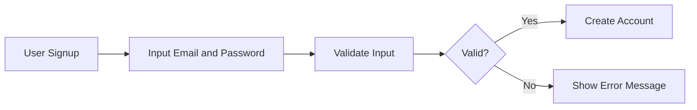
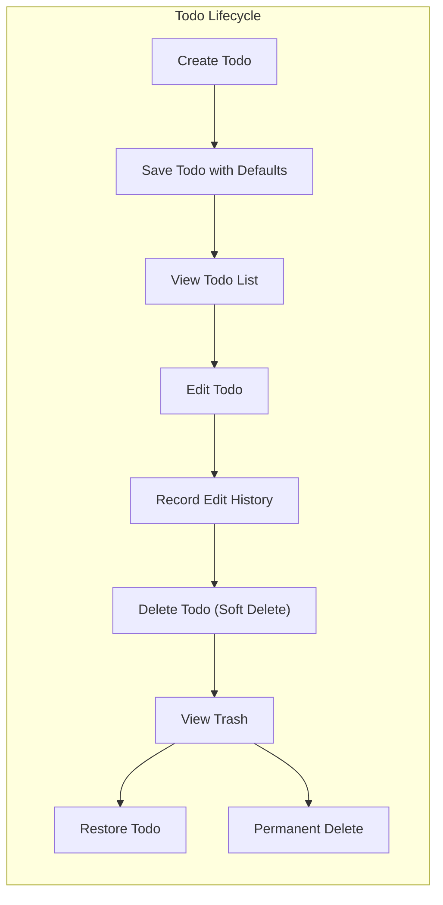

# Multi-User Todo Application Requirements Specification

## 1. Introduction

The Multi-User Todo Application provides a private, secure, and fully-featured platform for individual users to manage their personal task lists. Each user has exclusive access to their todos, enabling organization and tracking of tasks with a focus on privacy and ease of use.

Users authenticate via email and password and have personalized profiles, which are not visible to other users.

## 2. User Account Management

### 2.1 User Registration and Login
- WHEN a user signs up, THE system SHALL create a new user account with a unique email and a securely hashed password.
- WHEN a user logs in, THE system SHALL validate the email and password credentials.
- WHEN a user changes their password, THE system SHALL update the stored credentials securely.
- WHEN a user deletes their account, THE system SHALL permanently delete the user record along with all associated todos and their edit histories.

### 2.2 Authentication Workflows
- THE system SHALL enforce email uniqueness for user accounts.
- Passwords SHALL be stored securely using industry-standard hashing algorithms.
- User sessions SHALL be managed securely, with token expiration and refresh mechanisms.
- THE system SHALL restrict access to authenticated users only.

## 3. User Profile

### 3.1 Profile Attributes
- EACH user SHALL have a display name associated with their profile.
- THE display name SHALL be editable by the user.

### 3.2 Privacy Considerations
- Users CANNOT view other users' profiles or any information about other users.
- PROFILE data SHALL be isolated per user to prevent unauthorized access.

## 4. Todo Management

### 4.1 Creating Todos
- WHEN a user creates a todo, THE system SHALL require a non-empty title.
- The description, start date, and due date fields MAY be left empty.
- THE system SHALL set the new todo as incomplete by default.

### 4.2 Viewing Todos
- USERS SHALL be able to retrieve a paginated list of their own todos.
- Each todo in the list SHALL display title, completion status, start date (if set), due date (if set), and creation date.
- Users SHALL be able to view the complete details of a single todo including the full description.

### 4.3 Editing Todos
- USERS SHALL be able to edit a todo's title, description, start date, and due date.
- The system SHALL record every edit as a history entry capturing the timestamp and the changed fields.

### 4.4 Completing Todos
- USERS SHALL be able to toggle the completion status of a todo between complete and incomplete.

## 5. Edit History

### 5.1 Recording Edits
- THE system SHALL create a history entry whenever a todo is edited.
- EACH history entry SHALL record:
  - The timestamp of the edit
  - Changes to title, description, start date, and due date, if any

### 5.2 Viewing History
- Users SHALL be able to view the full edit history of their todos.
- History entries SHALL be sorted from most recent to oldest.

## 6. Deletion and Trash

### 6.1 Deleting Todos
- WHEN a user deletes a todo, THE system SHALL perform a soft delete.
- Deleted todos SHALL be excluded from the normal todo list.

### 6.2 Trash Management
- Users SHALL be able to view a paginated list of their deleted todos (trash).
- Users SHALL be able to restore a todo from trash, returning it to the normal list.
- Users SHALL be able to permanently delete a todo from trash, which deletes it and all associated edit history permanently.

## 7. Filtering and Sorting

### 7.1 Filtering
- Users SHALL be able to filter their todo list by completion status: all, only complete, only incomplete.

### 7.2 Sorting
- Users SHALL be able to sort todos by creation date, start date, or due date.
- Sorting SHALL support ascending and descending orders as appropriate.
- Todos without a start date or due date SHALL appear at the end when sorting by those fields.

## 8. Privacy and Security

- THE system SHALL ensure strict data isolation so users can access ONLY their own todos and profiles.
- Access control SHALL prevent viewing or editing of other users' data.
- THE system SHALL follow secure practices for authentication and data storage.

## 9. Business Rules

- EVERY user's email MUST be unique.
- ALL passwords SHALL be stored securely using best practice hashing algorithms.
- Titles MUST be non-empty strings.
- Dates SHALL be formatted in ISO 8601 format.
- Edit histories SHALL be preserved until todos are permanently deleted.

## 10. Error Handling

- WHEN invalid credentials are provided during login, THE system SHALL return a clear unauthorized error within 2 seconds.
- WHEN unauthorized access is attempted, THE system SHALL deny access with a proper error message.
- WHEN required fields are missing or invalid, THE system SHALL return validation errors specifying the issue.

## 11. Definitions and References

Refer to the glossary for terminology definitions and related standards.

## 12. User Interaction Workflows

### 12.1 User Registration and Login Workflow

### 12.2 Todo Lifecycle Workflow

