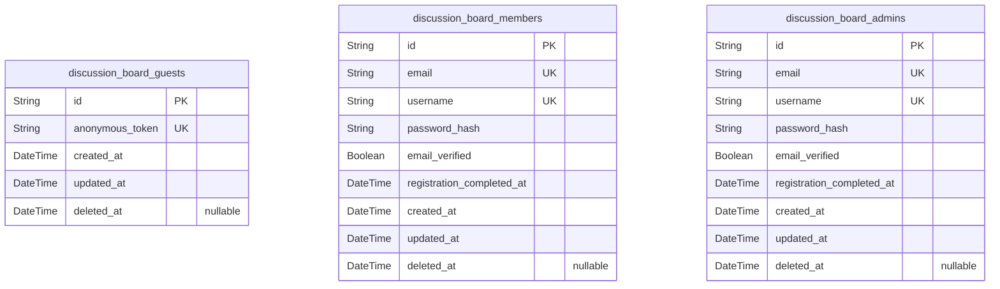
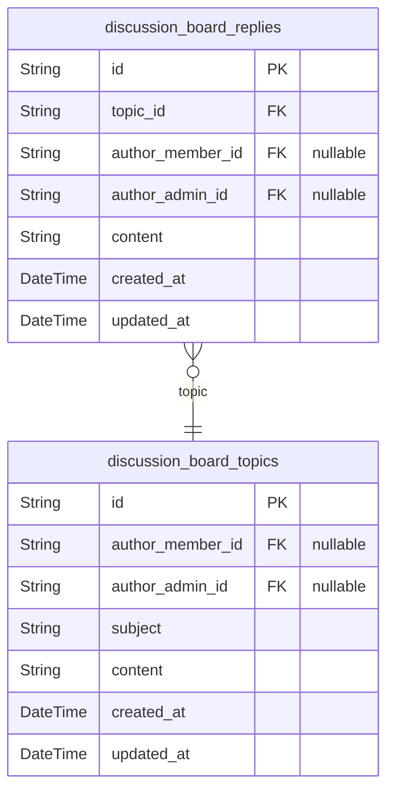

# Prisma Markdown

> Generated by [`prisma-markdown`](https://github.com/samchon/prisma-markdown)

- [Actors](#actors)
- [Discussions](#discussions)

## Actors

### `discussion_board_guests`

Guest actor entity representing unauthenticated visitors of the
discussion board system. Used for tracking browsing or search activity
and potential auditing. Guests do not have login credentials, and do not
author topics or replies. This table facilitates tracking session
history, device fingerprinting, or future personalization without
registration.

Properties as follows:

- `id`: Primary Key.
- `anonymous_token`
  > Randomly generated anonymous token for tracking session or device
  > activity. Used for distinguishing unique guest sessions without revealing
  > personal data.
- `created_at`
  > Timestamp when the guest record is first created. Used for session and
  > analytics tracking.
- `updated_at`: Timestamp for the last update of the guest record (e.g., session refresh).
- `deleted_at`
  > Timestamp for soft-deletion of the guest record, if applicable. Null when
  > active.

### `discussion_board_members`

Registered user (member) entity representing authenticated users of the
discussion board. Members have login credentials, author topics and
replies, and can be uniquely identified by email and username. This
entity stores hashed password for authentication, and supports full audit
and soft-delete tracking for compliance.

Properties as follows:

- `id`: Primary Key.
- `email`
  > Unique business email address for member login and communication. Must be
  > verified via registration process.
- `username`
  > Display name chosen by member, used in topics and replies. Must be unique
  > for identity within the discussion board.
- `password_hash`
  > Hashed password for secure login authentication. Never stored in plain
  > text. Required for authentication process.
- `email_verified`
  > Indicates whether the member's email address has been verified via
  > confirmation link.
- `registration_completed_at`
  > Timestamp when the member's registration was fully completed and email
  > verified. Used for audit and onboarding analytics.
- `created_at`
  > Timestamp when the member record is first created. Used for traceability
  > and analytics.
- `updated_at`
  > Timestamp for the last update of the member record (e.g., profile or
  > password change).
- `deleted_at`: Timestamp for soft-deletion of the member account. Null when active.

### `discussion_board_admins`

Administrator entity representing privileged users with management rights
over the discussion board system. Admins require authentication and are
granted system-level permissions such as user management and, if enabled,
moderation. Designed as a standalone entity (not a member subtype) per
business directive, supporting distinct audit trails and privilege
separation.

Properties as follows:

- `id`: Primary Key.
- `email`
  > Unique email address for administrator login and communication. Must be
  > business-verified as part of privileged account control.
- `username`
  > Display name selected by admin, used for identifying admin actions and
  > events.
- `password_hash`
  > Securely hashed password for administrator authentication. Never stored
  > as plain text.
- `email_verified`
  > Indicates whether the admin's email has been verified via a confirmation
  > workflow.
- `registration_completed_at`
  > Timestamp when the admin account has successfully completed verification
  > and is enabled for privileged access.
- `created_at`
  > Timestamp for account creation, establishing audit trail for admin
  > onboarding.
- `updated_at`
  > Timestamp for the most recent administrative account update, such as
  > profile changes or security resets.
- `deleted_at`
  > Timestamp for soft-deletion (optional) of the admin account, null for
  > active admins.

## Discussions

### `discussion_board_topics`

Discussion board topics representing main discussion threads for economic
and political conversations. Each topic is authored by a member or admin
and contains a subject/title, content/body, and timestamps for auditing.
Supports many topics per member/admin. Links to discussion_board_members
or discussion_board_admins (via author foreign key), enforcing that only
authenticated users can create topics. Forms the primary entity for all
board discussions, supporting full CRUD and search capabilities. Related
entity: [discussion_board_replies](#discussion_board_replies) for topic replies.

Properties as follows:

- `id`: Primary Key.
- `author_member_id`
  > Author's [discussion_board_members.id](#discussion_board_members). Used when the author is a
  > standard member. One and only one of author_member_id or author_admin_id
  > must be set.
- `author_admin_id`
  > Author's [discussion_board_admins.id](#discussion_board_admins). Used when the author is an
  > admin. One and only one of author_member_id or author_admin_id must be
  > set.
- `subject`
  > Subject or title of the discussion topic. Minimum 5, maximum 120
  > characters, required.
- `content`
  > Main body/content of the topic. Minimum 10, maximum 4000 characters,
  > required.
- `created_at`: Timestamp when the topic was created.
- `updated_at`: Timestamp when the topic was last edited or updated.

### `discussion_board_replies`

Replies to discussion board topics, representing user-generated
contributions to threads. Each reply must reference its parent topic
([discussion_board_topics](#discussion_board_topics)), link to an author (member or admin),
and include reply content and timestamps. Many replies per topic, many
replies per author. Designed for independent retrieval: enables finding
all replies by user or by topic. Essential for interaction between users
in the discussion board. No moderation, voting, or extra metadata
included at this phase.

Properties as follows:

- `id`: Primary Key.
- `topic_id`
  > The topic that this reply is attached to. References {@link
  > discussion_board_topics.id}. Every reply must belong to a valid topic.
- `author_member_id`
  > Reply author's [discussion_board_members.id](#discussion_board_members). Used when reply is by
  > a member. One and only one of author_member_id or author_admin_id must be
  > set.
- `author_admin_id`
  > Reply author's [discussion_board_admins.id](#discussion_board_admins). Used when reply is by
  > an admin. One and only one of author_member_id or author_admin_id must be
  > set.
- `content`: Content/body of the reply. Minimum 3, maximum 2000 characters, required.
- `created_at`: Timestamp when the reply was created.
- `updated_at`: Timestamp when the reply was last edited or updated.
