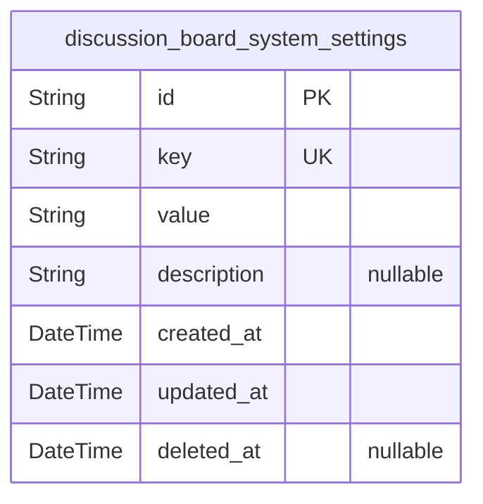
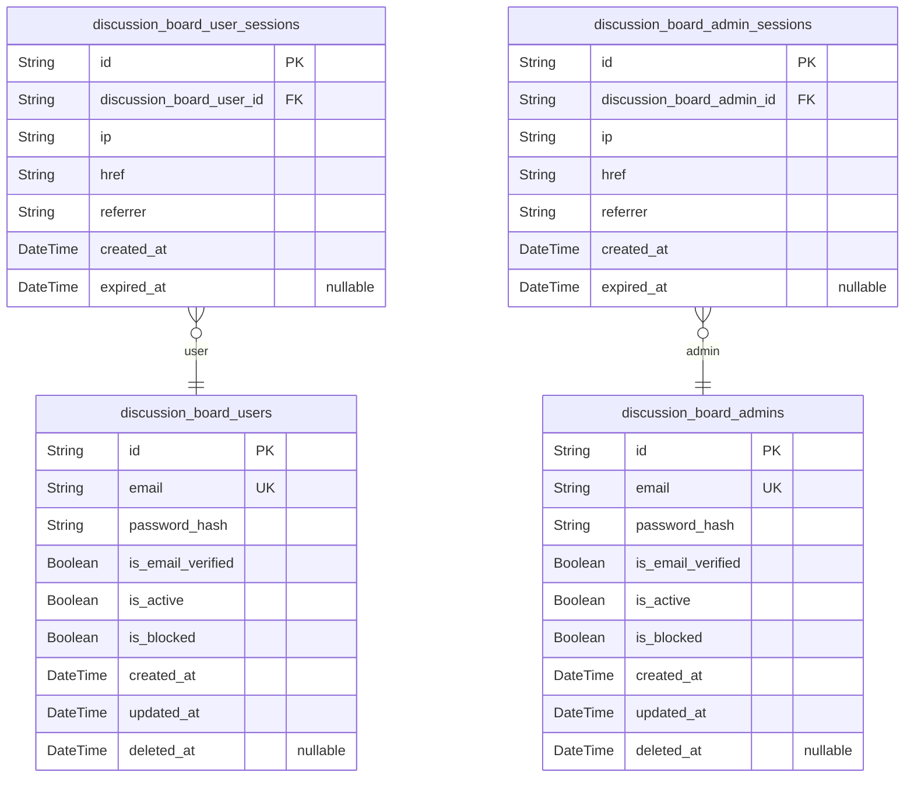
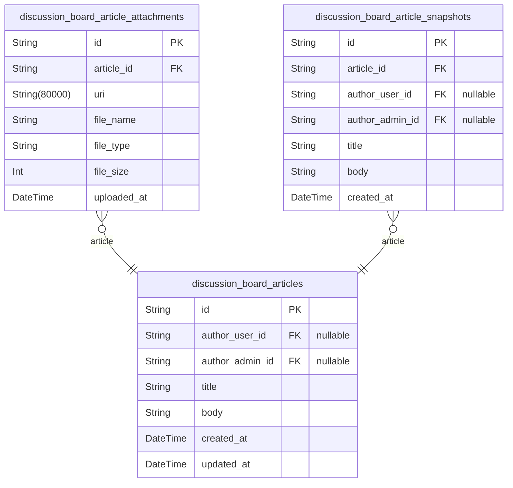
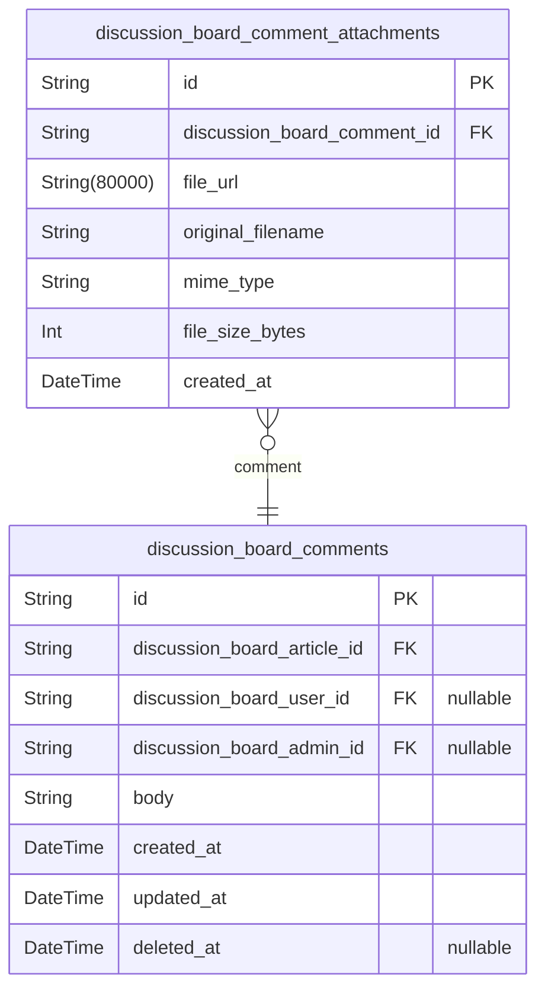
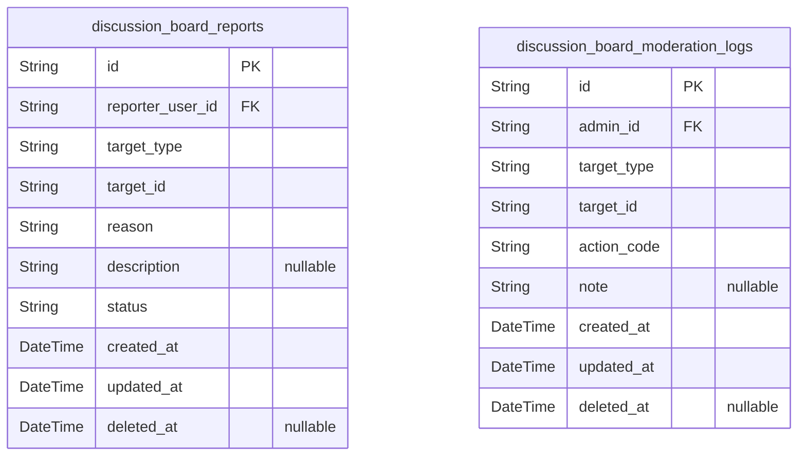

# Prisma Markdown

> Generated by [`prisma-markdown`](https://github.com/samchon/prisma-markdown)

- [Systematic](#systematic)
- [Actors](#actors)
- [Articles](#articles)
- [Comments](#comments)
- [Moderation](#moderation)

## Systematic

```mermaid
erDiagram
"discussion_board_system_settings" {
  String id PK
  String key UK
  String value
  String description "nullable"
  DateTime created_at
  DateTime updated_at
  DateTime deleted_at "nullable"
}
```

### `discussion_board_system_settings`

Platform-wide configuration and placeholder for systematic board settings.

This model holds system-level settings, toggles, or infrastructure
parameters that may affect platform-wide policy, appearance, or technical
operation. It allows for minimal, future-proof configuration management,
ensuring the backend can support extension or modification without schema
disruption.

Initially designed as a placeholder, this table supports single or
multiple business-defined settings through a key/value pattern. All
change events (creation, updates, and deletion) are tracked for audit and
rollback. The model enables admins or operators to programmatically
control or audit system-wide states, without duplicating config in other
domain schemas.

Properties as follows:

- `id`: Primary Key for the system settings entry.
- `key`
  > Unique identifier for this configuration setting or policy entry. Used to
  > retrieve or update specific settings programmatically.
- `value`
  > Value for this system setting. May encode raw value, serialized JSON, or
  > application-specific policy text.
- `description`: Optional human-readable explanation or policy summary for this setting.
- `created_at`: Timestamp for creation of this settings entry.
- `updated_at`: Timestamp for last update or modification.
- `deleted_at`
  > Soft deletion timestamp for audit and rollback; null unless marked for
  > deletion.

## Actors

```mermaid
erDiagram
"discussion_board_users" {
  String id PK
  String email UK
  String password_hash
  Boolean is_email_verified
  Boolean is_active
  Boolean is_blocked
  DateTime created_at
  DateTime updated_at
  DateTime deleted_at "nullable"
}
"discussion_board_user_sessions" {
  String id PK
  String discussion_board_user_id FK
  String ip
  String href
  String referrer
  DateTime created_at
  DateTime expired_at "nullable"
}
"discussion_board_admins" {
  String id PK
  String email UK
  String password_hash
  Boolean is_email_verified
  Boolean is_active
  Boolean is_blocked
  DateTime created_at
  DateTime updated_at
  DateTime deleted_at "nullable"
}
"discussion_board_admin_sessions" {
  String id PK
  String discussion_board_admin_id FK
  String ip
  String href
  String referrer
  DateTime created_at
  DateTime expired_at "nullable"
}
"discussion_board_user_sessions" }o--|| "discussion_board_users" : user
"discussion_board_admin_sessions" }o--|| "discussion_board_admins" : admin
```

### `discussion_board_users`

User accounts for platform participants.

Represents each registered end-user on the discussion board. Contains
identity fields for login, authentication, account status, and minimal
profile information. Every user may have multiple concurrent active
sessions tracked in the discussion_board_user_sessions table. Business
logic ensures email is unique for secure login. Temporal fields enable
soft deletion and audit trails. Fields facilitate account recovery and
future extensibility for additional user profile attributes.

Properties as follows:

- `id`: Primary key. Universally unique identifier for the user.
- `email`
  > User's email address for login and notification purposes. Must be unique.
  > Used for authentication and password recovery.
- `password_hash`
  > Secure hash of the user's password. Used for authentication. Plain
  > passwords are never stored.
- `is_email_verified`
  > Indicates whether the user's email address has been verified. Email
  > verification is required before participation.
- `is_active`
  > Denotes if the user account is active and allowed to log in. Blocked
  > users have this set to false.
- `is_blocked`
  > Indicates if the user is blocked for rule violations. Blocked users
  > cannot log in or participate until reactivated.
- `created_at`: Timestamp when the user account was created.
- `updated_at`: Timestamp when the user account was last updated.
- `deleted_at`
  > Optional timestamp for soft deletion. If set, the account is considered
  > deleted but can be restored.

### `discussion_board_user_sessions`

Session records for user authentication.

Tracks each login session established by a user. Enables multiple
concurrent sessions for a single user (multi-device support). Stores IP
and contextual metadata for audits and access control. Sessions are
associated with discussion_board_users via a foreign key. Expired
sessions are notable for audit and security purposes. No other business
data is stored in this subsidiary table.

Properties as follows:

- `id`: Primary key. Universally unique identifier for the session.
- `discussion_board_user_id`
  > Reference to the associated user account. {@link
  > discussion_board_users.id}.
- `ip`: IP address from which the session was initiated.
- `href`: URL from which the login or session was established.
- `referrer`: HTTP referrer value at the start of the session.
- `created_at`: Time the session was created.
- `expired_at`: Time the session expired or ended, nullable until session ends.

### `discussion_board_admins`

Administrator accounts for platform oversight and moderation.

Stores credentials and status flags for admin users who govern the
discussion board. Admins are promoted from the user base by operators and
have enhanced privileges for moderation, content management, and account
control. Email addresses must be unique for proper authentication. Admins
feature the same authentication and status patterns as regular users but
are managed in a distinct, secured table. Soft deletion and audit fields
help maintain compliance and traceability for admin actions.

Properties as follows:

- `id`: Primary key. Universally unique identifier for the admin.
- `email`: Admin's unique email address used for login and communication.
- `password_hash`: Secure hash of the admin's password for authentication.
- `is_email_verified`: Indicates if the admin's email address has been verified.
- `is_active`: True if admin account is active and enabled for moderation activity.
- `is_blocked`: True if the admin is suspended or blocked from accessing admin features.
- `created_at`: Timestamp when the admin account was created.
- `updated_at`: Timestamp of the last update to the admin's profile or status.
- `deleted_at`: Timestamp of soft deletion; nullable if the account is not deleted.

### `discussion_board_admin_sessions`

Session records for administrator authentication and moderation tracking.

Stores all admin login sessions, supporting audit trails and concurrent
multi-device moderation. Each session references the corresponding admin
in the discussion_board_admins table. Tracks connection context and
session lifecycle. Sessions are removed or expired for security and
operational management. Essential for logging admin actions and
maintaining platform integrity.

Properties as follows:

- `id`: Primary key. Universally unique identifier for the admin session.
- `discussion_board_admin_id`
  > Reference to the associated admin account. {@link
  > discussion_board_admins.id}.
- `ip`: Network IP address for this moderation session.
- `href`: URL at start of session or moderation activity.
- `referrer`: Referrer value for admin connection context.
- `created_at`: Session creation time.
- `expired_at`: Session end time, nullable until expired.

## Articles

```mermaid
erDiagram
"discussion_board_articles" {
  String id PK
  String author_user_id FK "nullable"
  String author_admin_id FK "nullable"
  String title
  String body
  DateTime created_at
  DateTime updated_at
}
"discussion_board_article_attachments" {
  String id PK
  String article_id FK
  String(80000) uri
  String file_name
  String file_type
  Int file_size
  DateTime uploaded_at
}
"discussion_board_article_snapshots" {
  String id PK
  String article_id FK
  String author_user_id FK "nullable"
  String author_admin_id FK "nullable"
  String title
  String body
  DateTime created_at
}
"discussion_board_article_attachments" }o--|| "discussion_board_articles" : article
"discussion_board_article_snapshots" }o--|| "discussion_board_articles" : article
```

### `discussion_board_articles`

Discussion board articles representing user- or admin-authored posts as
primary content for economic and political debate.

Each article contains essential business data such as title and body,
subject to length limits and business rules described in requirements.
Articles are attributed to the creating user or admin. File and image
attachments are handled via a separate table. Articles are the main entry
point for debate, searchable by title or content. Edits and deletions are
fully audit-trailed by related snapshot and moderation tables. Removal
will cascade to attachments and comments.

Properties as follows:

- `id`: Primary key. Unique article identifier.
- `author_user_id`
  > Optional reference to the user who authored this article. Null if
  > authored by an admin. [discussion_board_users.id](#discussion_board_users).
- `author_admin_id`
  > Optional reference to the admin who authored this article. Null if
  > authored by a user. [discussion_board_admins.id](#discussion_board_admins).
- `title`: Article headline. Required. Must be between 5 and 150 characters.
- `body`: Main content of the article. Must be between 20 and 5000 characters.
- `created_at`: Timestamp when article was created.
- `updated_at`: Timestamp when article was last updated.

### `discussion_board_article_attachments`

Attachments associated with articles, such as images or documents,
supporting evidence-based discussion.

Each attachment is directly tied to a single article. Allowed file types
and size limits are enforced at business logic layer. Attachments are
stored as URIs referencing backend storage locations. Deletion of the
parent article cascades to attachments.

Properties as follows:

- `id`: Primary key. Unique attachment identifier.
- `article_id`
  > Reference to the article this attachment belongs to. {@link
  > discussion_board_articles.id}.
- `uri`: Storage URI for the file or image attachment.
- `file_name`: Original filename of the uploaded attachment.
- `file_type`: MIME type of the attachment, as checked on upload.
- `file_size`: Size of attachment in bytes. Enforced maximum 10MB via business rules.
- `uploaded_at`: Timestamp when the attachment was uploaded.

### `discussion_board_article_snapshots`

Historical snapshots of article states for versioning, edit trails, and
audit purposes.

Stores a copy of article content, title, and author information at each
versioning event. New snapshot records are created whenever an article is
edited. Snapshots ensure a complete edit history for compliance,
moderation, and rollback analysis. Snapshots are never modified or
deleted outside of full article or system purge events.

Properties as follows:

- `id`: Primary key. Snapshot identifier.
- `article_id`
  > Reference to the article whose state this snapshot captures. {@link
  > discussion_board_articles.id}.
- `author_user_id`
  > Reference to the user author at the time of this snapshot. Nullable if
  > authored or modified by admin. [discussion_board_users.id](#discussion_board_users).
- `author_admin_id`
  > Reference to the admin author at the time of this snapshot. Nullable if
  > authored/modified by user. [discussion_board_admins.id](#discussion_board_admins).
- `title`: Snapshot of the article title at the time of snapshot creation.
- `body`: Snapshot of the main article content at the snapshot time.
- `created_at`: When the snapshot was created.

## Comments

```mermaid
erDiagram
"discussion_board_comments" {
  String id PK
  String discussion_board_article_id FK
  String discussion_board_user_id FK "nullable"
  String discussion_board_admin_id FK "nullable"
  String body
  DateTime created_at
  DateTime updated_at
  DateTime deleted_at "nullable"
}
"discussion_board_comment_attachments" {
  String id PK
  String discussion_board_comment_id FK
  String(80000) file_url
  String original_filename
  String mime_type
  Int file_size_bytes
  DateTime created_at
}
"discussion_board_comment_attachments" }o--|| "discussion_board_comments" : comment
```

### `discussion_board_comments`

Commentary created by registered users or administrators on discussion
board articles.

Each comment is associated with a specific article. Comments can be
authored by either normal users or admins, linked by foreign keys. The
content of each comment is subject to length validations and may include
up to 2 attached files managed via subsidiary attachments table.

Comments are visible under their parent article and support creation,
editing, and deletion by their owner (user or admin) as well as by
administrators for moderation. When an article is deleted, all its
comments are deleted as well. Comment deletions are implemented as soft
deletes for traceability and moderation audit.

Comment creation and modification times are recorded for sorting and
review. Provides the central entity for all discussion under articles.

Properties as follows:

- `id`: Primary Key.
- `discussion_board_article_id`
  > The article to which this comment belongs. {@link
  > discussion_board_articles.id}.
- `discussion_board_user_id`
  > User author of the comment, if authored by a regular user. Nullable for
  > admin-authored comments. [discussion_board_users.id](#discussion_board_users).
- `discussion_board_admin_id`
  > Admin author of the comment, if authored by an admin. Nullable for
  > user-authored comments. [discussion_board_admins.id](#discussion_board_admins).
- `body`
  > The content text of the comment. Subject to business validation (2-1000
  > characters).
- `created_at`: Timestamp when the comment was created.
- `updated_at`: Timestamp when the comment was last edited.
- `deleted_at`
  > Soft deletion time. Set when the comment is removed for user or
  > moderation reasons.

### `discussion_board_comment_attachments`

Files or images attached to a comment on the discussion board.

Each record links a single file/image to one parent comment. Used to
manage comment attachment uploads (max two per comment). Only attachments
of allowed types and sizes may be added per business validation.

Attachment entities are always dependent on their parent comment and
deleted when the parent is deleted. Includes information needed to
implement download authorization (only for authenticated users), as well
as metadata for moderation and auditing.

Properties as follows:

- `id`: Primary Key.
- `discussion_board_comment_id`
  > The comment this attachment belongs to. {@link
  > discussion_board_comments.id}.
- `file_url`: Storage location URI for the attachment file.
- `original_filename`: The filename as originally uploaded by the user.
- `mime_type`: MIME type of the attachment (e.g., 'image/png', 'application/pdf').
- `file_size_bytes`: The file size in bytes. Enforced as max 10MB by business rules.
- `created_at`: Timestamp when the attachment was created/uploaded.

## Moderation

```mermaid
erDiagram
"discussion_board_reports" {
  String id PK
  String reporter_user_id FK
  String target_type
  String target_id
  String reason
  String description "nullable"
  String status
  DateTime created_at
  DateTime updated_at
  DateTime deleted_at "nullable"
}
"discussion_board_moderation_logs" {
  String id PK
  String admin_id FK
  String target_type
  String target_id
  String action_code
  String note "nullable"
  DateTime created_at
  DateTime updated_at
  DateTime deleted_at "nullable"
}
```

### `discussion_board_reports`

User-submitted moderation reports tracking flagged content or abusive
behavior.

This table captures all reported cases by users regarding articles,
comments, or attachments requiring moderation or review. Each report
includes metadata for the reporter (user), the type and ID of the entity
reported, the nature of the report (reason/category), and the processing
status. Only authenticated users may submit reports, and every report is
associated with the precise timestamp of its creation.

The moderation team uses this table to review, resolve, or escalate
reported incidents, providing an audit trail for transparency and
compliance. All content and user references point to existing normalized
tables. Deletion is soft to maintain historical audit integrity.

Properties as follows:

- `id`: Primary Key.
- `reporter_user_id`
  > Reporter user account that created the moderation report. {@link
  > discussion_board_users.id}.
- `target_type`
  > Type of entity being reported (e.g., 'article', 'comment', 'attachment').
  > Used to distinguish the context of the moderation report.
- `target_id`
  > ID of the reported entity (referencing articles, comments, or attachments
  > depending on target_type). Not a foreign key due to multi-entity
  > polymorphism, but always references business entities.
- `reason`
  > Reason or category provided for the report (e.g., spam, abuse, illegal
  > content).
- `description`
  > Additional details or user explanation for the report. Optional extended
  > text field for further clarification.
- `status`
  > Current status of the report (e.g., open, in_review, resolved, rejected,
  > escalated).
- `created_at`: Timestamp when the report was created.
- `updated_at`: Timestamp of the most recent update or review of the report.
- `deleted_at`
  > Soft delete timestamp. Null if not deleted; set when report is removed
  > for business or compliance reasons.

### `discussion_board_moderation_logs`

Audit trail for all moderation and administrative actions performed by
platform admins.

This table records every explicit moderation or admin action on user
content, including edits, deletions, warnings, user suspensions, and
others. Each log includes references to the admin who performed the
action, the type of entity targeted, the specific target entity ID, a
code describing the action (e.g., 'delete', 'edit', 'suspend'), freeform
notes, and timestamps.

Log records are immutable business events and form the foundation for
auditability, compliance, and future incident review. All admin and
content references point to pre-existing, normalized entities. Deletion
is soft to allow for complete audit history even when entries are hidden
from routine views.

Properties as follows:

- `id`: Primary Key.
- `admin_id`
  > Administrator who performed this moderation action. {@link
  > discussion_board_admins.id}.
- `target_type`
  > Type of entity or user subjected to moderation action (e.g., 'article',
  > 'comment', 'user', 'attachment').
- `target_id`
  > ID of the entity or user affected by admin action. Polymorphic reference;
  > resolved at application level based on target_type.
- `action_code`
  > Code or keyword for the action performed (e.g., 'delete', 'edit',
  > 'restore', 'suspend', 'warn').
- `note`
  > Optional additional explanation or notes from the admin about the action
  > taken.
- `created_at`: Timestamp when this moderation action was recorded.
- `updated_at`
  > Timestamp of the most recent update to log entry (if any corrections or
  > updates are made).
- `deleted_at`
  > Soft delete timestamp. Null if log entry is active; set for hidden or
  > expunged from casual display, never hard-deleted for audit purposes.
