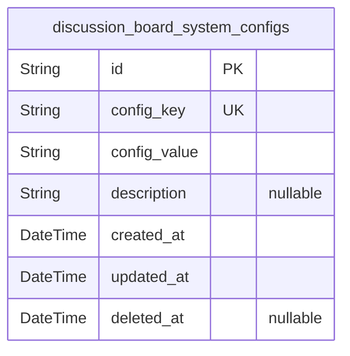
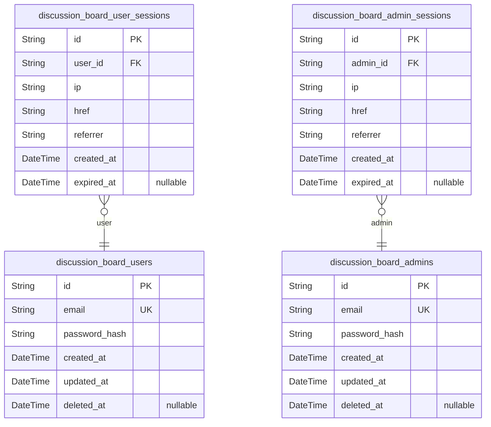
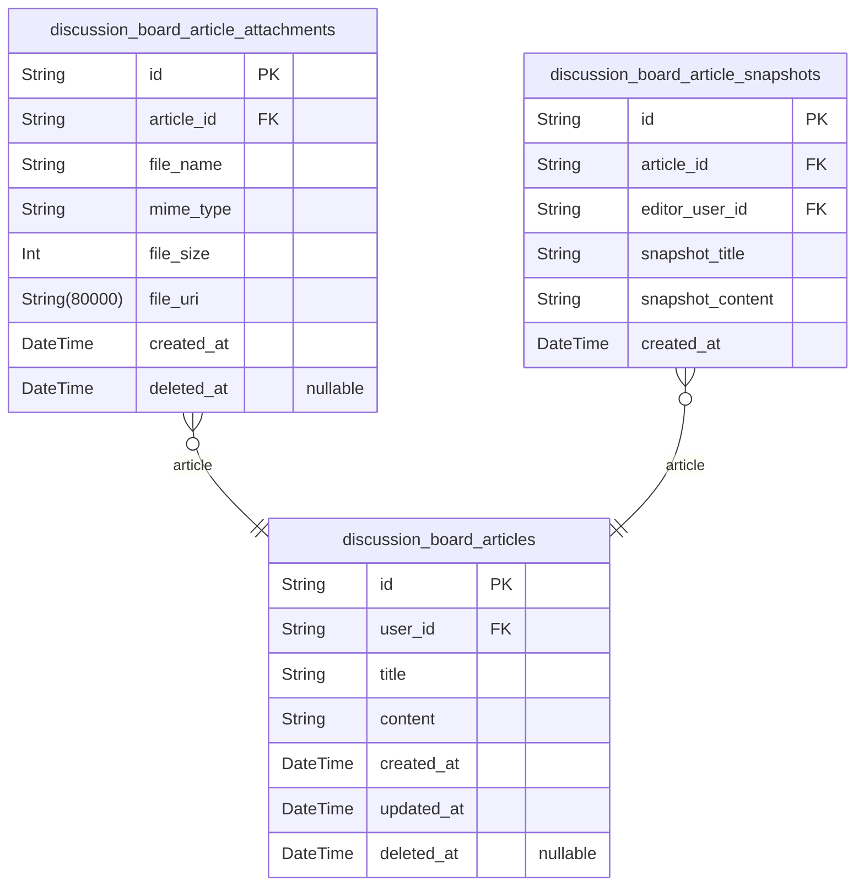
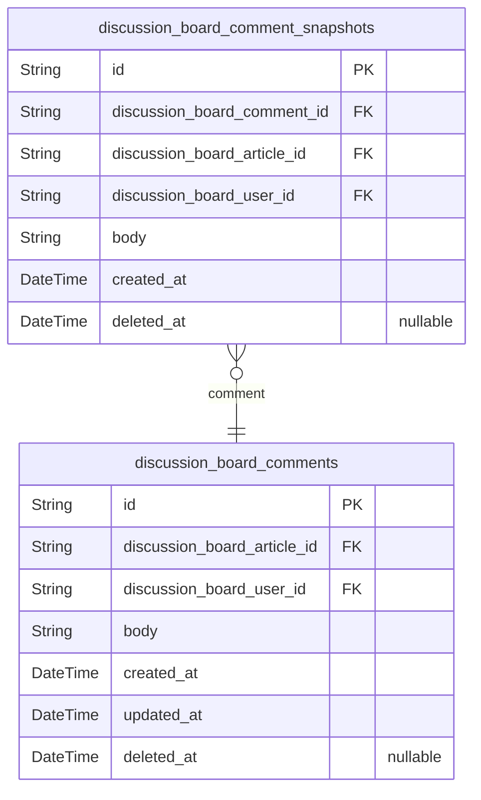
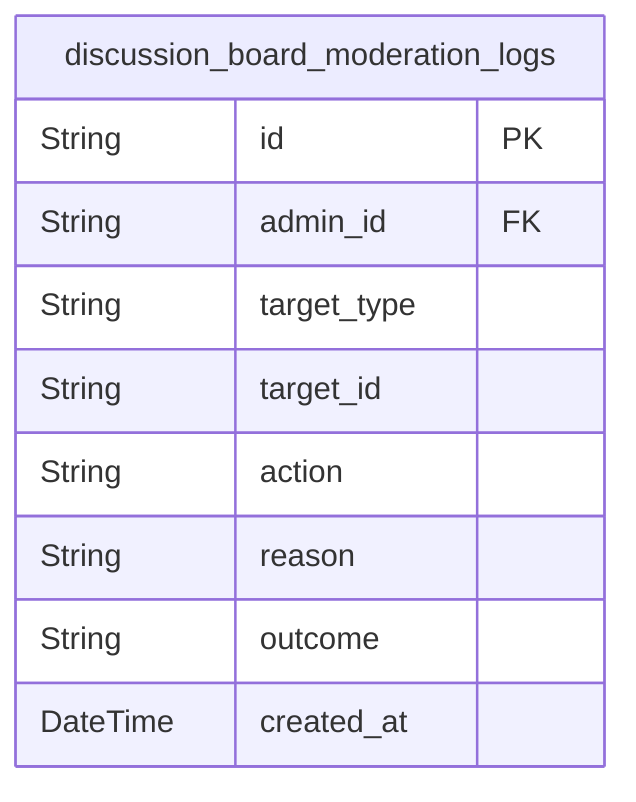
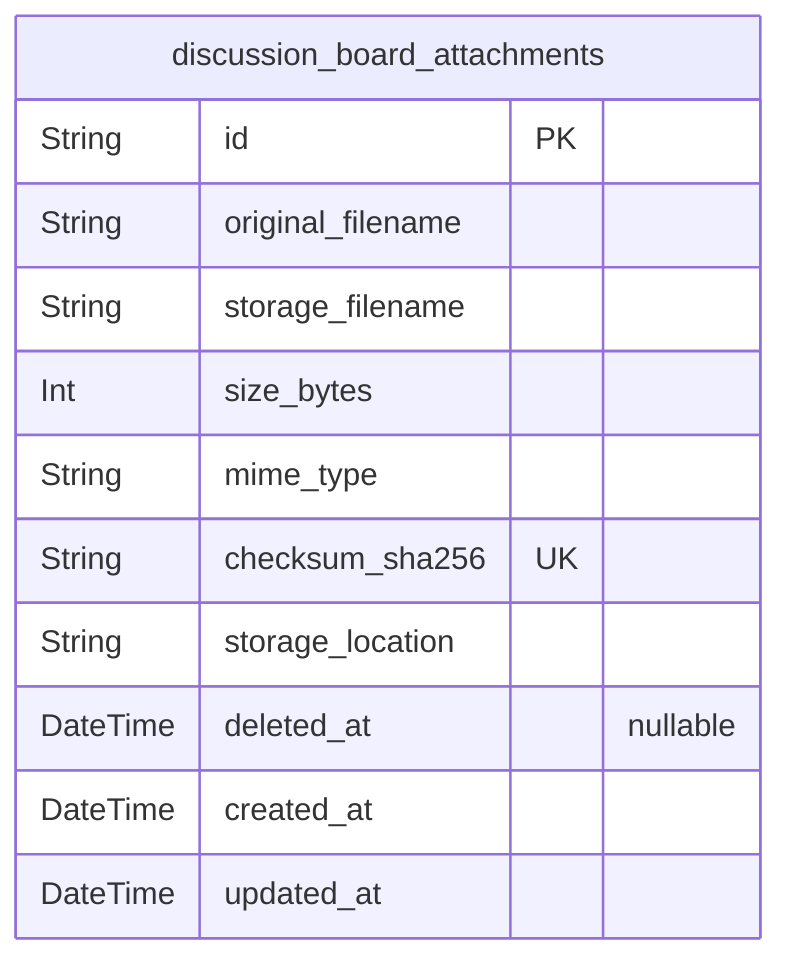

# Prisma Markdown

> Generated by [`prisma-markdown`](https://github.com/samchon/prisma-markdown)

- [Systematic](#systematic)
- [Actors](#actors)
- [Articles](#articles)
- [Comments](#comments)
- [Moderation](#moderation)
- [Attachments](#attachments)

## Systematic

```mermaid
erDiagram
"discussion_board_system_configs" {
  String id PK
  String config_key UK
  String config_value
  String description "nullable"
  DateTime created_at
  DateTime updated_at
  DateTime deleted_at "nullable"
}
```

### `discussion_board_system_configs`

System-wide configuration table for board-level settings and feature flags.

Stores key-value pairs representing runtime tunable parameters or
business policies. Used as a foundation for global configuration, such as
toggling features, maintenance mode, upload limits, or descriptive
metadata that governs the entire discussion board. No foreign keys as
this is an isolated domain for maintainability. Allows for future
extensibility and immediate board-wide change management without database
migrations. All updates are auditable thanks to temporal fields.

Properties as follows:

- `id`: Primary Key for each configuration entry.
- `config_key`
  > Unique key identifying the configuration item, e.g.,
  > 'feature_upload_enabled', 'max_file_size_mb'. Must be unique for each
  > system setting.
- `config_value`
  > Configuration value as a string. May contain JSON or plain scalar values
  > depending on application logic. Stores the current value for the given
  > setting.
- `description`
  > Optional human-readable explanation of this setting's business role and
  > usage.
- `created_at`: Timestamp of configuration entry creation for audit purposes.
- `updated_at`: Timestamp of the last update to this configuration record.
- `deleted_at`
  > If set, marks this configuration as deprecated or inactive; preserves
  > audit trail.

## Actors

```mermaid
erDiagram
"discussion_board_users" {
  String id PK
  String email UK
  String password_hash
  DateTime created_at
  DateTime updated_at
  DateTime deleted_at "nullable"
}
"discussion_board_user_sessions" {
  String id PK
  String user_id FK
  String ip
  String href
  String referrer
  DateTime created_at
  DateTime expired_at "nullable"
}
"discussion_board_admins" {
  String id PK
  String email UK
  String password_hash
  DateTime created_at
  DateTime updated_at
  DateTime deleted_at "nullable"
}
"discussion_board_admin_sessions" {
  String id PK
  String admin_id FK
  String ip
  String href
  String referrer
  DateTime created_at
  DateTime expired_at "nullable"
}
"discussion_board_user_sessions" }o--|| "discussion_board_users" : user
"discussion_board_admin_sessions" }o--|| "discussion_board_admins" : admin
```

### `discussion_board_users`

Registered user identities for standard discussion board participants.

Each user entity represents a distinct account able to post, comment, and
upload attachments within the platform. Account includes essential
authentication data, such as email and password_hash, for secure login.
Created/updated/deleted timestamps track account lifecycle. Only accounts
of this type can manage their own content; administrative privileges are
not granted by this entity. User data is minimal per privacy
requirements, and no extra profile fields or roles are included.

Properties as follows:

- `id`: Primary Key.
- `email`
  > User's unique email address for registration and login. Serves as natural
  > key for authentication; must be unique across all users.
- `password_hash`
  > Bcrypt-hashed user password for secure authentication. Raw passwords are
  > never stored; field holds the hashed value only.
- `created_at`: Timestamp of account creation. Immutable after initial registration.
- `updated_at`
  > Timestamp of most recent account modification, including password or
  > email changes.
- `deleted_at`
  > Timestamp marking user account as soft-deleted. Nullable; null indicates
  > active account.

### `discussion_board_user_sessions`

Login session records for standard discussion board users.

Each session records an authenticated login event, supporting JWT or
refresh token handling for auditing and revocation. Linked to parent user
via user_id foreign key, not unique (multiple concurrent sessions per
user allowed). Session stores connection metadata (IP address, request
referrer, href) for traceability and potential abuse investigation.
Session expiration is recorded for proper logout/idle handling.

Properties as follows:

- `id`: Primary Key.
- `user_id`
  > Reference to authenticated discussion board user. {@link
  > discussion_board_users.id}.
- `ip`: IP address recorded at session start for audit and traceability.
- `href`
  > Full request URL (href) at authentication. Helps with session context and
  > abuse investigation.
- `referrer`
  > HTTP referrer for session initialization. Provides context for user
  > navigation during login.
- `created_at`: Timestamp of session creation; marks login instant.
- `expired_at`
  > Timestamp indicating when session was terminated, logged out, or token
  > expired. Null if still active.

### `discussion_board_admins`

Registered system administrator accounts for board governance and
moderation.

Admins possess full privileges for content and user management, able to
edit or remove any article, comment, or attachment, and manage user
accounts. Authentication is via unique admin email and password_hash.
Admins act independently of user accounts; no normalization or shared
credentials exist between users and admins per requirements. Full
lifecycle and soft deletion are supported for audit and compliance.

Properties as follows:

- `id`: Primary Key.
- `email`
  > Unique email address for administrator authentication. Distinct from user
  > emails; must be unique among all admins.
- `password_hash`
  > BCrypt password hash for administrator login. Raw passwords are never
  > stored; field holds the cryptographic hash.
- `created_at`: Timestamp when admin account was created.
- `updated_at`
  > Timestamp when admin account was last modified, including password
  > changes.
- `deleted_at`
  > Soft-delete marker; null if account is active, set when account is
  > deactivated or removed.

### `discussion_board_admin_sessions`

Administrator login session records for audit and privilege enforcement.

Each record tracks an authenticated admin session, supporting privilege
control, JWT/refresh token context, and audit trail. Sessions are linked
to the admin via foreign key. IP address, accessed href, and referrer are
captured to enable investigation and compliance. Session expiration
timestamp provides logout or force-expiry tracking. Multiple sessions per
admin are permitted (not unique).

Properties as follows:

- `id`: Primary Key.
- `admin_id`: Reference to parent admin account. [discussion_board_admins.id](#discussion_board_admins).
- `ip`: IP address of the admin login session for auditing and security review.
- `href`: Full authentication request URL (href) at session establishment.
- `referrer`: HTTP referrer at session authentication for user flow tracking.
- `created_at`: Timestamp for when this session was created (login time).
- `expired_at`
  > Nullable timestamp marking session logout or forced expiry. Null
  > indicates active session.

## Articles

```mermaid
erDiagram
"discussion_board_articles" {
  String id PK
  String user_id FK
  String title
  String content
  DateTime created_at
  DateTime updated_at
  DateTime deleted_at "nullable"
}
"discussion_board_article_attachments" {
  String id PK
  String article_id FK
  String file_name
  String mime_type
  Int file_size
  String(80000) file_uri
  DateTime created_at
  DateTime deleted_at "nullable"
}
"discussion_board_article_snapshots" {
  String id PK
  String article_id FK
  String editor_user_id FK
  String snapshot_title
  String snapshot_content
  DateTime created_at
}
"discussion_board_article_attachments" }o--|| "discussion_board_articles" : article
"discussion_board_article_snapshots" }o--|| "discussion_board_articles" : article
```

### `discussion_board_articles`

Main table for user-generated discussion articles on economic or
political topics.

Each record represents a single article authored by a registered user.
Includes a required textual title and content, as well as audit fields
for creation/update and soft deletion. Supports edit/audit history via
the related [discussion_board_article_snapshots](#discussion_board_article_snapshots). Attachments such
as images or files are managed by the subsidiary {@link
discussion_board_article_attachments} table.

Articles are directly managed as standalone business entities and linked
to their author via user ID. Deletion is soft for traceability and
moderation. No business-calculated fields are included; statistics or
aggregates are handled externally.

Properties as follows:

- `id`: Primary Key.
- `user_id`: Author of the article. References the [discussion_board_users.id](#discussion_board_users).
- `title`
  > Title of the article, required for submission. Limited to 200 characters,
  > whitespace-trimmed, and sanitized.
- `content`
  > Full text body of the article, required. Limited to 10000 characters,
  > supports only plain text.
- `created_at`: Article creation datetime (ISO 8601 UTC). Never changes after insertion.
- `updated_at`: Datetime of last update to the article content or attachments.
- `deleted_at`
  > Soft delete timestamp. Null unless the article is deleted either by owner
  > or admin.

### `discussion_board_article_attachments`

Attachment metadata and reference table for images or files linked to
articles.

Each record indicates a file (image/document) attached to a specific
article, capturing both a unique UUID and metadata about the original
file, storage, size, and type for validation, audit, and secure
retrieval.

Attachments are always managed as secondary to the parent article; they
cannot exist without an owning article. This structure supports
moderator/admin removal of individual files and business constraints on
allowed types. Records reference the owning article, store original
filename, MIME type, size, and storage URI, and support soft deletion per
article deletion or direct moderation.

Properties as follows:

- `id`: Primary Key.
- `article_id`
  > Parent article. Indicates which [discussion_board_articles.id](#discussion_board_articles) this
  > attachment belongs to.
- `file_name`: Original name of the uploaded file (user-visible), including extension.
- `mime_type`: MIME type of the upload, validated and whitelisted per business rules.
- `file_size`: Attachment size in bytes. Maximum per requirements is 10MB.
- `file_uri`
  > Storage URI for the actual file (external S3 or local path as
  > configured). Not directly accessible by users.
- `created_at`: Datetime when the attachment record was created (upload timestamp).
- `deleted_at`
  > Soft deletion timestamp; indicates if attachment was removed by the
  > article owner or admin moderation.

### `discussion_board_article_snapshots`

Table for storing immutable snapshots of articles, supporting edit
history, recovery, and audit trails for moderation.

Each snapshot records a historical version of its parent article,
including title, content, the editing user, and all audit timestamps. All
fields are captured at the moment of edit or update, providing
traceability for changes and supports roll-back or admin review of
edited/deleted content.

Snapshots are created on every edit to [discussion_board_articles](#discussion_board_articles),
referencing the current article. Not editable after insertion; only
appended for new versions. Accessible by admin for moderation and
compliance auditing.

Properties as follows:

- `id`: Primary Key.
- `article_id`
  > Reference to the target article whose version is being saved. {@link
  > discussion_board_articles.id}.
- `editor_user_id`
  > User who performed the edit (could be the original author or an admin).
  > References [discussion_board_users.id](#discussion_board_users).
- `snapshot_title`: Snapshot of the article title as captured at edit.
- `snapshot_content`: Snapshot of the article content as captured at edit.
- `created_at`: Datetime when this snapshot was recorded (edit or moderation time).

## Comments

```mermaid
erDiagram
"discussion_board_comments" {
  String id PK
  String discussion_board_article_id FK
  String discussion_board_user_id FK
  String body
  DateTime created_at
  DateTime updated_at
  DateTime deleted_at "nullable"
}
"discussion_board_comment_snapshots" {
  String id PK
  String discussion_board_comment_id FK
  String discussion_board_article_id FK
  String discussion_board_user_id FK
  String body
  DateTime created_at
  DateTime deleted_at "nullable"
}
"discussion_board_comment_snapshots" }o--|| "discussion_board_comments" : comment
```

### `discussion_board_comments`

Main comment entity for article-based discussions.

Stores user comments posted beneath articles on the economic/political
discussion board. Every comment is individually created by a registered
user and explicitly linked to a parent article and author. The model
supports text-only discussion—no nested replies, attachments, or
media—ensuring flat, readable discussion per requirements. Each comment
may be edited or soft deleted by its author or by admins; a full version
history is preserved via companion snapshot table. Audit logging,
moderation, and compliance flows refer to this entity for comment
lifecycle management.

Foreign keys reference existing user and article tables. Indexing
supports rapid retrieval by article and chronological ordering. All
lifecycle fields (created/updated/deleted) included. Only authenticated
users may comment, as enforced in business logic.

Properties as follows:

- `id`: Primary Key.
- `discussion_board_article_id`
  > Reference to the parent article this comment belongs to. {@link
  > discussion_board_articles.id}.
- `discussion_board_user_id`
  > Comment author; the registered user who created the comment. {@link
  > discussion_board_users.id}.
- `body`
  > Comment content text as provided by the author. Limited to 5,000
  > characters per business rules. Cannot be blank or empty.
- `created_at`
  > Timestamp when this comment was originally posted. Immutable, set
  > automatically on creation.
- `updated_at`
  > Timestamp of last update to this comment. Updates whenever author or
  > admin edits content.
- `deleted_at`
  > Soft-delete marker for comment lifecycle management. Nullable; populated
  > when comment is hidden/deleted.

### `discussion_board_comment_snapshots`

Historical snapshot table capturing every prior version of a comment.

Stores immutable records of all comment edits for compliance, auditing,
and rollback support. Each row reflects a single state of a comment at a
specific edit moment. Snapshots preserve all key attributes: article,
author, and content body alongside full timestamp information. Indexing
supports audit trail queries and moderation review workflows. This table
is append-only; rows are never updated or deleted except via data
retention policies. Foreign keys echo the primary comment table for
robust relational traceability.

Use this table for audit, compliance, and recovery of previous comment
revisions; exposed via read-only access in typical application flows.

Properties as follows:

- `id`: Primary Key.
- `discussion_board_comment_id`
  > Reference to the comment whose version is captured. {@link
  > discussion_board_comments.id}.
- `discussion_board_article_id`
  > Reference to the parent article for context at edit time. {@link
  > discussion_board_articles.id}.
- `discussion_board_user_id`
  > Original author of the comment at the version's point in time. {@link
  > discussion_board_users.id}.
- `body`
  > The entire comment text as it existed at the point of edit or deletion.
  > Limited to 5,000 characters, never blank. Saved exactly as submitted at
  > edit.
- `created_at`
  > Timestamp the snapshot was taken (i.e., comment edit or delete event
  > occurred). Set automatically.
- `deleted_at`
  > Optional marker if the snapshotted version corresponded to a deletion
  > event. Nullable; otherwise null.

## Moderation

```mermaid
erDiagram
"discussion_board_moderation_logs" {
  String id PK
  String admin_id FK
  String target_type
  String target_id
  String action
  String reason
  String outcome
  DateTime created_at
}
```

### `discussion_board_moderation_logs`

Moderation log tracking all administrative actions on articles, comments,
and attachments.

Each event records the type of action performed (remove, edit, ban,
etc.), the target entity (article, comment, or attachment) by ID, the
acting admin, action rationale, outcome, and exact timestamp. Supports
transparent audit trails and minimal compliance needs for this discussion
board. Entries are never deleted to maintain historical traceability. The
log references existing core entities via type+ID, allowing polymorphic
tracking of acted-upon items in a normalized, non-redundant way.

Properties as follows:

- `id`: Primary key for moderation event.
- `admin_id`
  > Admin account responsible for moderation action. {@link
  > discussion_board_admins.id}.
- `target_type`: Type of thing acted on ("article", "comment", "attachment").
- `target_id`: UUID of the item moderated (article, comment, or attachment).
- `action`: Moderation action performed (e.g., "remove", "edit", "ban").
- `reason`: Reason for this moderation action as entered by the admin.
- `outcome`
  > Result or status after moderation (e.g., "deleted", "edited", "banned",
  > "restored").
- `created_at`
  > Timestamp representing when this moderation action was performed (UTC,
  > ISO 8601).

## Attachments

```mermaid
erDiagram
"discussion_board_attachments" {
  String id PK
  String original_filename
  String storage_filename
  Int size_bytes
  String mime_type
  String checksum_sha256 UK
  String storage_location
  DateTime deleted_at "nullable"
  DateTime created_at
  DateTime updated_at
}
```

### `discussion_board_attachments`

Technical metadata and storage abstraction for all uploaded attachments
(images, files) in the discussion board platform.

This model acts as the canonical store for attachment objects, capturing
all necessary file and storage characteristics without direct reference
to business entities such as articles or comments. Attachments are
uniquely identified and managed within this table, enabling seamless
handling of files uploaded to articles, comments, or potential future
features.

Fields capture original and storage filenames, file size, MIME type,
checksum for duplicate/prevention/security, and storage provider details
for local or cloud locations. The model supports lifecycle and security
management via soft delete, complete audit of creation and update times,
and enables orphan cleanup procedures. Foreign keys (e.g., uploader, link
references) are not present—business-layer tables provide those indirect
linkages. The table is designed for both immediate production deployment
and robust future extensibility, enforcing strict data normalization and
supporting file security best practices.

Properties as follows:

- `id`: Primary Key. Universally unique file identifier for attachment record.
- `original_filename`
  > Original filename as submitted by user; displayed in download links.
  > Preserves the name provided on file upload.
- `storage_filename`
  > Internal reference or generated filename used for storage (server, cloud
  > bucket, etc.), never exposed to the user. Ensures collision-free and
  > unguessable storage location.
- `size_bytes`
  > Exact file size in bytes as stored. Used to validate application and
  > storage constraints (max 10 MB per requirements).
- `mime_type`
  > IANA MIME type of the uploaded file (e.g., 'image/png',
  > 'application/pdf'). Required for attachment accept/serve validation and
  > display.
- `checksum_sha256`
  > SHA-256 hash checksum of file content, used for duplicate detection,
  > integrity verification, and security audit logging. Uniqueness enforces
  > single storage per identical file.
- `storage_location`
  > Provider identifier or physical/cloud storage reference (e.g., S3 bucket,
  > server path, etc.). Used exclusively by backend for file I/O routing. Not
  > visible to application frontends.
- `deleted_at`
  > Timestamp of attachment deletion (soft delete). Null if active; set when
  > attachment is removed, orphaned, or expunged. Supports compliance and
  > orphan cleanup workflows.
- `created_at`
  > File metadata creation timestamp. Set on initial upload and immutable
  > thereafter for audit/compliance purposes.
- `updated_at`
  > File metadata last modification timestamp. Updated on any admin or system
  > change to technical information (not business linkage).
