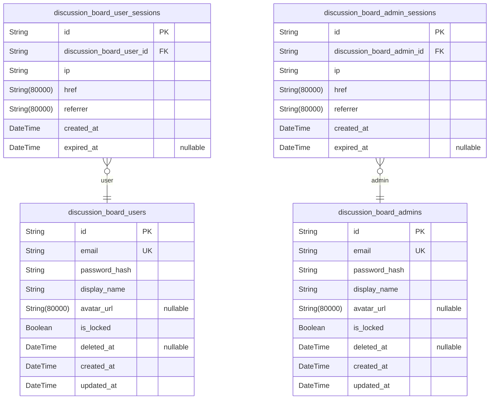
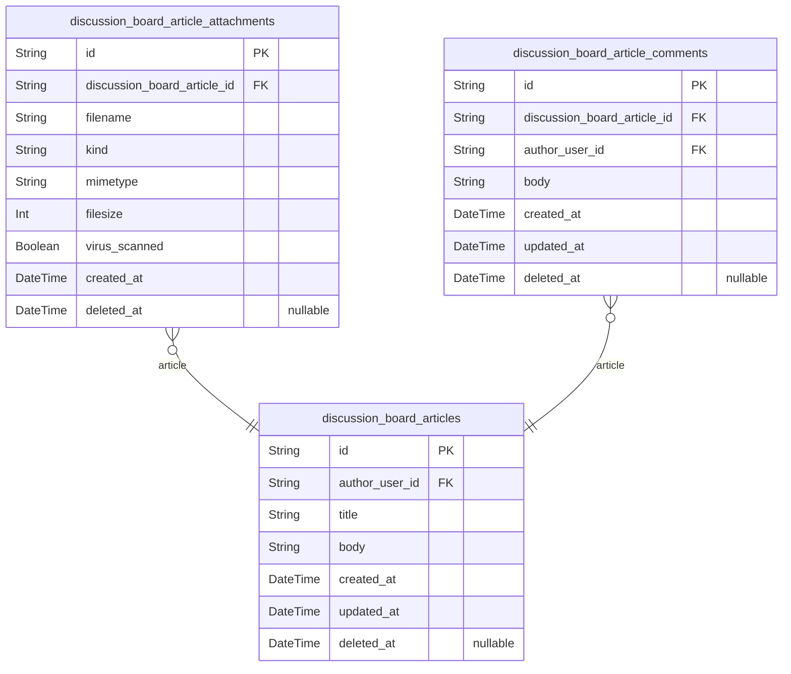
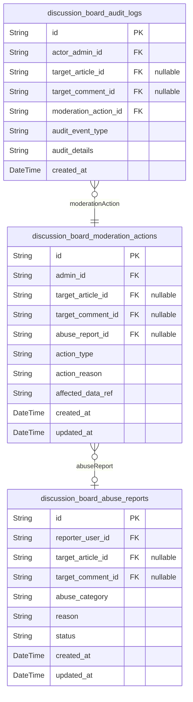

# Prisma Markdown

> Generated by [`prisma-markdown`](https://github.com/samchon/prisma-markdown)

- [Actors](#actors)
- [Content](#content)
- [Moderation](#moderation)

## Actors

```mermaid
erDiagram
"discussion_board_users" {
  String id PK
  String email UK
  String password_hash
  String display_name
  String(80000) avatar_url "nullable"
  Boolean is_locked
  DateTime deleted_at "nullable"
  DateTime created_at
  DateTime updated_at
}
"discussion_board_user_sessions" {
  String id PK
  String discussion_board_user_id FK
  String ip
  String(80000) href
  String(80000) referrer
  DateTime created_at
  DateTime expired_at "nullable"
}
"discussion_board_admins" {
  String id PK
  String email UK
  String password_hash
  String display_name
  String(80000) avatar_url "nullable"
  Boolean is_locked
  DateTime deleted_at "nullable"
  DateTime created_at
  DateTime updated_at
}
"discussion_board_admin_sessions" {
  String id PK
  String discussion_board_admin_id FK
  String ip
  String(80000) href
  String(80000) referrer
  DateTime created_at
  DateTime expired_at "nullable"
}
"discussion_board_user_sessions" }o--|| "discussion_board_users" : user
"discussion_board_admin_sessions" }o--|| "discussion_board_admins" : admin
```

### `discussion_board_users`

Registered end user identities for the discussion board system. Stores
essential login credentials, profile settings, and personally
identifiable information for authentication, display, and privacy
compliance. All content authorship in articles and comments references
this table for ownership and audit. Soft delete and lock states support
GDPR, account recovery, and moderation. Distinct from admins – not
polymorphic. Main entry point for all user/external actor flows.

Properties as follows:

- `id`: Primary Key.
- `email`: User's unique email address for login, notifications, and password resets.
- `password_hash`: Hashed password for authentication. Never stores raw plaintext passwords.
- `display_name`
  > Display name shown in user profile and for attribution to articles and
  > comments.
- `avatar_url`
  > Optional profile image/avatar for the user account, shown on
  > article/comment listings. Nullable for accounts without avatar.
- `is_locked`
  > Whether the user account is currently locked or suspended; used for
  > moderation, bans, security, or PII retention logic.
- `deleted_at`
  > Timestamp for soft deletion. Used to support GDPR-compliant
  > removal/anonymization, and to hide former accounts without destroying
  > content.
- `created_at`: User account creation timestamp.
- `updated_at`: Last profile update timestamp.

### `discussion_board_user_sessions`

Login session records for end users. Tracks stateless authentication
events for account security, multi-device login, privacy audit, and
session expiry support. Used in all authentication flows, account
tracing, or action recovery. Each session references the corresponding
user by foreign key. Follows strict session table field requirements.

Properties as follows:

- `id`: Primary Key.
- `discussion_board_user_id`: Associated user session's [discussion_board_users.id](#discussion_board_users).
- `ip`: IP address for the session. Used for audit and security review.
- `href`
  > URL/location of connection at session start. Useful for suspicious
  > activity auditing.
- `referrer`
  > Referrer of connection or page prior to session creation. Used for basic
  > session tracing.
- `created_at`
  > Session creation timestamp, used for session reuse, timeouts, and
  > analytics.
- `expired_at`: Session expiration time, or null if session still valid.

### `discussion_board_admins`

Administrative identities for the discussion board platform. Stores
credentials, email, profile, and lock state for privileged actors
empowered to moderate, audit, and control system operations. Admins are
separate from users to keep permissions and audit trails clear. All
moderator actions reference this table. Soft deletion, lock, and audit
state fields for platform compliance. Not polymorphic.

Properties as follows:

- `id`: Primary Key.
- `email`
  > Admin's unique email address for privileged login, escalation notices,
  > and audit traceability.
- `password_hash`: Hashed password for administrator login. No stored plaintext passwords.
- `display_name`
  > Admin's display name for moderator tools, platform audit logs, and
  > transparency.
- `avatar_url`
  > Optional admin avatar/profile picture, for team identification in logs
  > and UIs. Nullable for accounts without avatar.
- `is_locked`
  > Indicates locked, banned, or suspended admin account status. Used to
  > prevent privileged access abuse or investigation.
- `deleted_at`: Timestamp of soft deletion for GDPR or key rotation purposes.
- `created_at`: Administrator account creation timestamp.
- `updated_at`: Last time the admin profile was modified.

### `discussion_board_admin_sessions`

Session registry for all administrator logins, tracking server-side
authentication for security, audit, and incident review. Each session
references an admin actor and contains connection, time, and referrer
context as required for proper GDPR and internal compliance. Composite
index for session queries per admin actor, field set per session table
pattern.

Properties as follows:

- `id`: Primary Key.
- `discussion_board_admin_id`: Associated admin session's [discussion_board_admins.id](#discussion_board_admins).
- `ip`: Session's originating IP for incident review and admin login traceability.
- `href`: Connection URL for where the admin session was initiated.
- `referrer`: Referrer URL or entry point for admin login.
- `created_at`: Session timestamp for tracking session lifecycle and risk windows.
- `expired_at`: Session expiration timestamp, or null if active.

## Content

```mermaid
erDiagram
"discussion_board_articles" {
  String id PK
  String author_user_id FK
  String title
  String body
  DateTime created_at
  DateTime updated_at
  DateTime deleted_at "nullable"
}
"discussion_board_article_attachments" {
  String id PK
  String discussion_board_article_id FK
  String filename
  String kind
  String mimetype
  Int filesize
  Boolean virus_scanned
  DateTime created_at
  DateTime deleted_at "nullable"
}
"discussion_board_article_comments" {
  String id PK
  String discussion_board_article_id FK
  String author_user_id FK
  String body
  DateTime created_at
  DateTime updated_at
  DateTime deleted_at "nullable"
}
"discussion_board_article_attachments" }o--|| "discussion_board_articles" : article
"discussion_board_article_comments" }o--|| "discussion_board_articles" : article
```

### `discussion_board_articles`

Discussion board article (post) entity. Represents a user-authored
article allowing text, optional attachments, and subsequent comments.
Soft deletes are supported via deleted_at. Each article references a
[discussion_board_users.id](#discussion_board_users) as the author. Attachments are
associated via [discussion_board_article_attachments](#discussion_board_article_attachments). Comments are
stored separately for normalization and permission logic.

Properties as follows:

- `id`: Primary Key.
- `author_user_id`: User who authored the article. [discussion_board_users.id](#discussion_board_users)
- `title`: Article title. Required, 1-100 characters per business rule.
- `body`: Main article text body. Required, 1-10000 characters per business rule.
- `created_at`: Datetime this article was created.
- `updated_at`: Datetime this article was most recently updated.
- `deleted_at`
  > Datetime for soft delete (if present, article is deleted and hidden from
  > normal user views).

### `discussion_board_article_attachments`

Attachment (image or file) associated with a discussion board article.
Each record is an uploaded file or image with metadata describing its
character. Only articles (not comments) may have attachments. Enforces
many-to-one relationship to [discussion_board_articles](#discussion_board_articles).

Properties as follows:

- `id`: Primary Key.
- `discussion_board_article_id`
  > Parent article this attachment belongs to. {@link
  > discussion_board_articles.id}
- `filename`: Original uploaded filename, including extension.
- `kind`
  > Logical kind of attachment for business-level filtering. Expected values:
  > 'image', 'document', 'archive', or similar. Enforced by business logic
  > layer.
- `mimetype`
  > MIME type of uploaded file, e.g. 'image/jpeg', 'application/pdf'. Used
  > for download response and file type validation.
- `filesize`
  > Size in bytes of the uploaded file. Must not exceed per-article and
  > per-file limits (enforced in business logic).
- `virus_scanned`
  > Whether this attachment passed virus/malware scan at upload time. True if
  > safe, false or null otherwise.
- `created_at`: Attachment creation datetime (upload time).
- `deleted_at`
  > Attachment was deleted/removed from article (file is set for deletion).
  > Nullable for current/active attachment.

### `discussion_board_article_comments`

Discussion board article comment entity. Each record is a single comment
authored by a user on an article. Represents independent user input.
Comments are designed for independent moderation and permission checks.
Deleted_at is soft delete (hidden from standard views, remains for
audit/moderation). Each comment references its article and author.

Properties as follows:

- `id`: Primary Key.
- `discussion_board_article_id`
  > Parent article this comment belongs to. {@link
  > discussion_board_articles.id}
- `author_user_id`: Comment author. References [discussion_board_users.id](#discussion_board_users).
- `body`
  > Comment content/body. Required, limited to 1-1000 characters per business
  > rule.
- `created_at`: Datetime this comment was created.
- `updated_at`: Datetime this comment was most recently updated.
- `deleted_at`
  > Datetime for soft delete (if present, comment is deleted and hidden from
  > common views).

## Moderation

```mermaid
erDiagram
"discussion_board_abuse_reports" {
  String id PK
  String reporter_user_id FK
  String target_article_id FK "nullable"
  String target_comment_id FK "nullable"
  String abuse_category
  String reason
  String status
  DateTime created_at
  DateTime updated_at
}
"discussion_board_moderation_actions" {
  String id PK
  String admin_id FK
  String target_article_id FK "nullable"
  String target_comment_id FK "nullable"
  String abuse_report_id FK "nullable"
  String action_type
  String action_reason
  String affected_data_ref
  DateTime created_at
  DateTime updated_at
}
"discussion_board_audit_logs" {
  String id PK
  String actor_admin_id FK
  String target_article_id FK "nullable"
  String target_comment_id FK "nullable"
  String moderation_action_id FK
  String audit_event_type
  String audit_details
  DateTime created_at
}
"discussion_board_moderation_actions" }o--o| "discussion_board_abuse_reports" : abuseReport
"discussion_board_audit_logs" }o--|| "discussion_board_moderation_actions" : moderationAction
```

### `discussion_board_abuse_reports`

User-submitted abuse or inappropriate content report records. Each record
logs the reporting user, targeted content (article or comment), category
of abuse, detailed reason/explanation, current status (e.g., pending,
closed, rejected), and all required timestamps. Provides the basis for
administrative moderation workflow and compliance audits. Links only by
reference to users and content IDs—no content duplication.

Properties as follows:

- `id`: Primary Key.
- `reporter_user_id`
  > Reporter user's [discussion_board_users.id](#discussion_board_users). Identifies the user
  > who submitted the abuse report.
- `target_article_id`
  > Targeted article's [discussion_board_articles.id](#discussion_board_articles). The article
  > alleged for abuse, or null if the report concerns a comment only.
- `target_comment_id`
  > Targeted comment's [discussion_board_article_comments.id](#discussion_board_article_comments). The
  > comment alleged for abuse, or null if the report concerns an article
  > only.
- `abuse_category`
  > Type/category of alleged abuse. Examples: 'spam', 'offensive',
  > 'harassment', 'illegal', etc. Used for admin triage and reporting.
- `reason`
  > Detailed explanation/reason for the report as written by the reporter.
  > Used for admin context and audit. Full-text search enabled for this
  > field.
- `status`
  > Current report status. Examples: 'pending', 'in_review', 'closed',
  > 'rejected'. Workflow state for moderation lifecycle.
- `created_at`: Timestamp of report submission. Used for triage order and audit trace.
- `updated_at`: Timestamp of last status update. Used for tracking processing progress.

### `discussion_board_moderation_actions`

Administrative moderation actions including edits, hides, and deletions.
Each record logs the moderated object (article or comment), the
responsible admin, the action performed, the reason/justification (full
text), affected content, timestamps, and references to original report if
applicable. Used for compliance and regulatory trace. Immutable after
creation except for audit notes.

Properties as follows:

- `id`: Primary Key.
- `admin_id`
  > Admin's [discussion_board_admins.id](#discussion_board_admins). Identifies the administrator
  > performing the moderation action.
- `target_article_id`
  > Targeted article's [discussion_board_articles.id](#discussion_board_articles). The article
  > being moderated, or null if moderation concerns a comment only.
- `target_comment_id`
  > Targeted comment's [discussion_board_article_comments.id](#discussion_board_article_comments). The
  > comment being moderated, or null if moderation concerns an article only.
- `abuse_report_id`
  > Reference to abuse report [discussion_board_abuse_reports.id](#discussion_board_abuse_reports) if
  > this action is in response to a prior user report. Null if direct
  > moderation by admin.
- `action_type`
  > Type of moderation action: 'edit', 'delete', 'hide', 'warn', etc.
  > Business workflow enumeration.
- `action_reason`: Full text of reason or justification for action (sysadmin/audit context).
- `affected_data_ref`
  > Reference/summary of what data was affected by this action. May include a
  > content hash, file reference, or summary string for audit trace.
- `created_at`
  > Timestamp of moderation action creation. Used for compliance trace and
  > historical ordering.
- `updated_at`: Timestamp of last update or audit annotation.

### `discussion_board_audit_logs`

Append-only compliance/audit trail for all critical moderation actions.
Immutable snapshot of moderation events for regulatory and incident
review. Stores actor/admin, referenced object, action type, event
details, and audit metadata. Not directly modifiable except by compliance
staff in regulatory recovery. Retains complete historical record for all
audits.

Properties as follows:

- `id`: Primary Key.
- `actor_admin_id`
  > Admin's [discussion_board_admins.id](#discussion_board_admins). Admin responsible for the
  > action/event being audited.
- `target_article_id`
  > Target article [discussion_board_articles.id](#discussion_board_articles) if the audit event
  > references an article, else null.
- `target_comment_id`
  > Target comment [discussion_board_article_comments.id](#discussion_board_article_comments) if the audit
  > event references a comment, else null.
- `moderation_action_id`
  > Moderation action [discussion_board_moderation_actions.id](#discussion_board_moderation_actions) that
  > this audit event corresponds to. Used for cross-traceability and
  > integrity.
- `audit_event_type`
  > Type of audit event (e.g., 'moderation_performed', 'compliance_override',
  > 'manual_restore', etc.).
- `audit_details`
  > Free-text audit log detail or justification. May include policy
  > references or case numbers.
- `created_at`: Timestamp of audit event creation.
