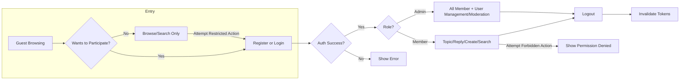

# User Roles and Permissions Requirements

## Authentication Requirements

WHEN a new user wishes to participate in discussions, THE system SHALL allow registration using a valid email and password.
WHEN a user registers, THE system SHALL verify the email address via confirmation link before enabling participation.
WHEN a user attempts to log in, THE system SHALL authenticate credentials and start a user session on success.
WHEN a user wishes to log out, THE system SHALL end the session and invalidate session tokens.
WHEN a user forgets their password, THE system SHALL allow password reset via verified email.
WHEN a user completes logout, THE system SHALL ensure all session tokens are invalidated on all devices.
WHEN a user is inactive for 30 days, THE system SHALL automatically log the user out and invalidate session tokens.
WHEN a guest browses the service, THE system SHALL not require authentication for viewing public discussions.

## User Role Structure

| Role   | Description                                                                                                 |
|--------|-------------------------------------------------------------------------------------------------------------|
| Guest  | A visitor who can browse and search public topics and replies, but cannot post, edit, or interact. No authentication required.         |
| Member | An authenticated user who can create new topics, post replies, and search/browse all public discussion content.                        |
| Admin  | An administrator who can manage users and moderate content. (Moderation is optional; only included for scalability/future-use readiness.) |

### Role Definition in Business Context
- Guest: Read-only access to topics and replies, no account needed. Cannot vote, reply, or post.
- Member: Can create topics relevant to economics and politics, reply to any public topic, and search discussions.
- Admin: Can do all member actions, PLUS manage user accounts and optionally moderate topics or replies.

## Role Permissions Matrix

| Action                            | Guest | Member | Admin |
|------------------------------------|:-----:|:------:|:-----:|
| Browse topics and replies          |   ✅   |   ✅    |  ✅   |
| Search discussions                 |   ✅   |   ✅    |  ✅   |
| Register an account                |   ✅   |    ❌   |  ❌   |
| Create new topics                  |   ❌   |   ✅    |  ✅   |
| Post replies/comments              |   ❌   |   ✅    |  ✅   |
| Edit own posts                     |   ❌   |   ✅    |  ✅   |
| Delete own posts                   |   ❌   |   ✅    |  ✅   |
| Manage user accounts               |   ❌   |   ❌    |  ✅   |
| Moderate topics and replies        |   ❌   |   ❌    |  ✅   |
| View analytics (future/restricted) |   ❌   |   ❌    |  ✅   |

## EARS-Format Requirements by Role

### Guest
WHEN a guest navigates the site, THE system SHALL allow viewing and searching of topics and replies only.
IF a guest attempts to post, reply, or edit, THEN THE system SHALL deny the action and prompt them to register or log in.

### Member
WHEN a member is logged in, THE system SHALL allow topic and reply creation, editing of their own posts, and search functionality.
IF a member tries to manage users or moderate others' content, THEN THE system SHALL deny the action with a clear error message.
IF a member attempts to edit or delete posts not authored by them, THEN THE system SHALL deny the action.

### Admin
WHEN an admin is logged in, THE system SHALL allow creation/editing/deleting of any topic or reply, management of user accounts, and (if enabled) moderation of discussions.
WHEN an admin performs a moderation action, THE system SHALL log the action for traceability.
WHEN an admin accesses analytics (if implemented), THE system SHALL restrict access to admins only.

## Session/Token Management (Business Terms)

WHEN a user logs in, THE system SHALL issue a JWT-based session token valid for 30 minutes of activity.
WHILE the session is active, THE system SHALL refresh the access token on each action, up to a maximum of 30 days inactivity.
WHERE a refresh token is present, THE system SHALL allow issuing new access tokens without re-authentication up to a maximum of 30 days since last use.
IF a session exceeds 30 minutes without action, THEN THE system SHALL require re-authentication.
IF a refresh token exceeds 30 days since last use, THEN THE system SHALL require a new login and invalidate the token.
WHEN a user logs out from any device, THE system SHALL invalidate all tokens for that user across devices.

### JWT Payload (for business context)
- userId: Unique identifier of the member or admin
- role: Role (guest, member, admin)
- permissions: Permissions granted to current session (as per matrix)

## Error Handling and Recovery

IF a user provides invalid login credentials, THEN THE system SHALL show a clear authentication failure message and deny access.
IF a registration is attempted with a duplicate email, THEN THE system SHALL show an error and deny registration.
IF a user tries to reset a password for an unregistered email, THEN THE system SHALL show a generic recovery message to avoid information leakage.
WHEN any authentication or session action fails, THE system SHALL instruct the user on recovery steps (e.g., password reset, retry, contact admin).

## User Experience and Performance Expectations

WHEN a user completes login, THE system SHALL confirm success, issue a session token, and redirect to the main discussion area within 2 seconds.
WHEN a permission is denied, THE system SHALL show a message within 1 second describing why the action is not allowed.
WHEN registration, login, or password recovery actions are completed, THE system SHALL inform the user of success/failure immediately.

## Mermaid Flow Diagram: User Authentication and Permissions

## Linking to Other Documents

- [Service Overview](./01-service-overview.md) – Provides business vision and justification
- [Primary User Scenarios](./06-primary-user-scenarios.md) – Shows main actor journeys
- [Business Rules and Constraints](./10-business-rules-and-constraints.md) – Specifies policy details
- [Performance Expectations](./08-performance-expectations.md) – Details timing/user experience requirements

