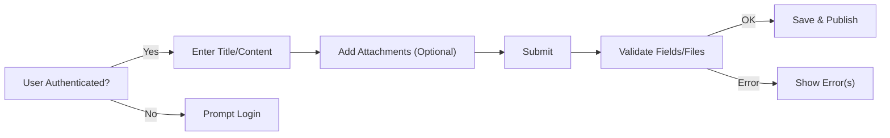

# Economic/Political Discussion Board: Requirements Analysis

## Introduction & Service Purpose
The economic/political discussion board is a web-based platform dedicated to thoughtful and civil discourse around economic, political, and related subjects. The aim is to provide a simple, minimal, but effective environment where users can exchange ideas, post articles with attached evidence, and discuss important issues without the noise or complexity of major social platforms. The platform strictly limits features to those essential for productive debate and healthy community engagement.

## Problem Statement & User Needs
- Online discussion of economics and politics is often diluted by trolling, spam, or unfocused threads on general-purpose platforms.
- Users interested in substantive, evidence-supported conversation lack a suitable forum that is both open and curated for civility.
- Users require the ability to share complex information via images or supporting files when making arguments or explaining data.
- A predictable, transparent moderation model is needed to maintain safety and fairness, contrary to arbitrary practices seen elsewhere.
- There is a need for intuitive self-management (users controlling their own content/attachments) without technical knowledge or complex onboarding.

## Business Model & Community Value
- THE system SHALL be free and open to anyone interested in economic/political debate, with no paywall or advanced registration process.
- THE platform MAY accept voluntary donations to support hosting and moderation cost, and may display unobtrusive banners (only for relevant community or education initiatives).
- THE platform SHALL avoid commercializing user data, advertisements, or features that detract from the core value of open, respectful exchange.
- THE system SHALL encourage engagement by recognizing constructive contributions (such as visible activity level or participation badges, subject to simplicity and privacy).

## User/Actor Definitions & Permissions
- **User**: Authenticated individual able to create, view, edit, and delete their own discussion articles and comments. Users MAY attach supported files/images to their articles. They are responsible for following community rules and can report abuse.
- **Admin**: A user with full moderation rights. Admins can view, edit, or delete any user's articles, comments, or attachments, as well as manage user accounts (ban, suspend, or restore).

### Permissions Matrix
| Feature                      | User | Admin |
|------------------------------|------|-------|
| Register/Login               | ✅   | ✅    |
| Create/Edit/Delete own posts | ✅   | ✅    |
| Attach files/images          | ✅   | ✅    |
| Comment on articles          | ✅   | ✅    |
| Moderate/Remove all content  | ❌   | ✅    |
| Manage user accounts         | ❌   | ✅    |

## Core Business Requirements

### Article and Comment Management
- THE system SHALL allow registered users to create, edit, and delete their own articles and comments.
- WHEN creating an article, THE system SHALL require a title (5-150 characters) and body (20-5000 characters).
- WHEN an article is deleted, THE system SHALL cascade removal to all attached comments and files.
- THE system SHALL enable users and authenticated guests to browse and read all non-restricted articles and comments.

### Attachment Handling
- WHEN creating or editing an article, THE user SHALL be able to upload up to 5 attachments (file types: JPEG, PNG, PDF, DOCX, XLSX, TXT, max 10 MB each).
- THE system SHALL prevent submission if any attachment fails file type or size validation.
- WHEN attachments are deleted or article is removed, THE system SHALL promptly erase linked files.
- ONLY authenticated users SHALL be permitted to download attachments; guest/unauthenticated access is denied.

### Moderation and Reporting
- WHEN content (article, comment, or attachment) is reported as inappropriate, THE system SHALL notify admins for review.
- THE admin SHALL have rights to delete, edit, or restore any article, comment, or attachment, and all such actions SHALL be logged.
- IF abuse or repeated violations are detected, THEN THE admin SHALL be able to suspend or ban user accounts. Suspended or banned users SHALL lose posting, commenting, and download privileges.
- THE admin SHALL communicate moderation actions and reasons to the affected user, and users SHALL be provided an appeal mechanism.

## Business Validation Rules & Scenarios
- Article titles and content SHALL meet strict length requirements; empty or invalid submissions are rejected with clear user feedback.
- Attachments MUST be among the allowed types and sizes; invalid uploads are blocked and explained.
- Users SHALL not create more than 3 articles an hour or 5 comments a minute (anti-spam).
- Abusive, illegal, or off-topic discussions are promptly removed, and admins SHALL maintain a moderation log for transparency.

## User Journey & Key Workflows

### Article Submission (EARS)
- WHEN a user accesses article submission, THE system SHALL require authentication.
- WHEN all fields and validations pass, THE system SHALL save the article, attachments, and author association.
- IF any error is found, THEN THE system SHALL instantly display all issues for user correction.

### Attachment Flow
- WHEN uploading, THE system SHALL immediately scan file type/size and reject if invalid, with feedback.
- IF parent article is deleted, THEN all attachments SHALL be erased with no trace.

### Moderation Flow
- WHEN a user flags content, THE system SHALL queue it for admin review.
- WHEN admin acts, THE system SHALL log the outcome and notify involved users.

### Mermaid: Article Submission Workflow

```mermaid
graph LR
  A["User Authenticated?"] -->|"Yes"| B["Enter Title/Content"]
  B --> C["Add Attachments (Optional)"]
  C --> D["Submit"]
  D --> E["Validate Fields/Files"]
  E -->|"OK"| F["Save & Publish"]
  E -->|"Error"| G["Show Error(s)"]
  A -->|"No"| X["Prompt Login"]
```

## Business Logic for Error Handling
- IF a user submits invalid data, THEN THE system SHALL group and display all relevant errors at once.
- WHEN authentication/session expires, THE system SHALL prompt login and preserve draft data where possible.
- IF uploads fail, THEN THE system SHALL request new, valid files and explain the reasons immediately.

## Authentication and Access (Business Perspective)
- Users MUST register with a valid email and password, agree to policies, and confirm their email to activate posting privileges.
- WHEN a user logs in, THE system SHALL issue a time-bound authentication token. IF that token expires, login is again required.
- ONLY authenticated users SHALL post articles/comments or download attachments; reading is public unless content is flagged or restricted by moderation rules.
- Admin status is assigned by platform operators, and all sensitive operations (account suspension, mass deletions) require admin authentication.

## Summary of Core Principles & Minimalism Commitment
- THE platform SHALL maintain simplicity and minimalism in interface and features, avoiding complexity in both user experience and requirements.
- All features, validations, and flows are designed for clarity, safety, and ease of use, with requirements written only in plain business terms to facilitate rapid, reliable backend implementation.
