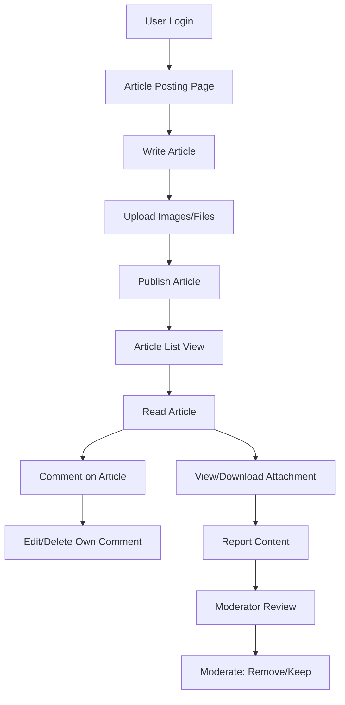

# Simple Economic/Political Discussion Board – Requirements Analysis

## 1. Service Overview and Vision
The discussion board enables open conversation on economic and political topics for registered users. It delivers a straightforward platform for article sharing, comment-based discussion, and freely uploading images/files. Its vision is to encourage civic discourse, open knowledge sharing, and easy participation in topical debates, with minimal barriers to entry while ensuring basic moderation, privacy, and content security.

## 2. Business Needs and Requirements
The system SHALL provide registered users the ability to post, read, and comment on articles related to economic and political affairs. WHEN a user creates an article, THE system SHALL allow attachments in the form of images or files. WHEN content is posted, THE system SHALL permit comment threads for ongoing discussion. All features SHALL prioritize simplicity and speed of use. The board SHALL operate under a minimal moderation model focused on basic decorum and legality. Attachments SHALL be stored securely. Anonymous usage is NOT supported; authentication is required for all posting and commenting activities.

### Functional Requirements (EARS Format)
- WHEN a user wants to register, THE system SHALL provide a simple sign-up process with email/password authentication.
- WHEN a user is authenticated, THE system SHALL allow creating a new article with a title, body content, and one or more image/file attachments (common formats only, e.g., .jpg/.png/.pdf with appropriate size limits).
- WHEN a user submits an article, THE system SHALL enforce validation for required fields, reject unsupported attachment types, and return clear error feedback for problems.
- WHEN an article is published, THE system SHALL make it viewable to all authenticated users in chronological or relevant order.
- WHEN viewing an article, THE system SHALL permit any authenticated user to post, edit, or delete their own comments below the article.
- WHEN a user views any article, THE system SHALL display attached images inline and provide download links for other supported file types.
- WHEN inappropriate content, spam, or prohibited files are detected, THE system SHALL allow moderators to remove posts or files in accordance with defined moderation rules.
- WHEN incidents of abuse or content violations occur, THE system SHALL enable users to report problematic content for moderation review.
- WHEN a file or image is uploaded, THE system SHALL scan for viruses and block malicious uploads.
- THE system SHALL permit users to download attached files if access is valid.
- WHEN a user attempts to perform any restricted action without sufficient permission, THE system SHALL display a clear, actionable error message.
- THE system SHALL log all posting and deletion actions for audit purposes.

### Non-Functional Requirements
- System responsiveness to all user actions SHALL be under 2 seconds in 95% of cases.
- Attachments SHALL be limited in size (e.g., 10MB per file, 30MB total per post) and number (e.g., max 5 attachments per article).
- All user data, posts, and file attachments SHALL be encrypted at rest and in-transit.

## 3. User Actors and Permissions
- **Registered User**: Can create articles, comment, edit/delete their own posts, upload attachments, and report inappropriate content.
- **Moderator**: Can remove posts/files that violate rules, manage abuse reports, and oversee community decorum.
- **Guest/Anonymous**: Cannot post, comment, or upload; can view articles if explicitly permitted by configuration.

### Permission Matrix
| Action                       | Registered User | Moderator |
|------------------------------|:--------------:|:---------:|
| Create Article               | Yes            | Yes       |
| Edit/Delete Own Article      | Yes            | Yes       |
| Comment on Article           | Yes            | Yes       |
| Edit/Delete Own Comment      | Yes            | Yes       |
| Upload Attachments           | Yes            | Yes       |
| Remove Others' Posts/Files   | No             | Yes       |
| Moderate Reports             | No             | Yes       |

## 4. User Journeys and Flows
- User registration, authentication, and session persistence during interaction.
- Creating a post (including file/image upload steps).
- Browsing articles, reading discussions, and downloading/viewing attached files.
- Adding, editing, and deleting comments.
- Reporting abuse or problematic content, followed by moderator review.
- Moderator workflow for post/file removal.

```mermaid
flowchart TD
    A["User Login"] --> B["Article Posting Page"]
    B --> C["Write Article"]
    C --> D["Upload Images/Files"]
    D --> E["Publish Article"]
    E --> F["Article List View"]
    F --> G["Read Article"]
    G --> H["Comment on Article"]
    H --> I["Edit/Delete Own Comment"]
    G --> J["View/Download Attachment"]
    J --> K["Report Content"]
    K --> L["Moderator Review"]
    L --> M["Moderate: Remove/Keep"]
```

## 5. Business Rules and Validation
- Article title and body are required for every post.
- File uploads are limited to designated formats (e.g., .jpg, .png, .pdf, .docx); system SHALL validate extension and MIME type.
- Attachments exceeding allowed size or unapproved format SHALL trigger error and rejection.
- When inappropriate content, spam, malicious code, or violations are identified, the system SHALL enable instant removal and user notification.
- Comments SHALL not be empty and are limited to a reasonable length per message.
- System SHALL enforce unique registration (email address).
- Duplicate file uploads in a single article are not allowed.

## 6. Performance and Error Handling
- The system SHALL respond to all user actions within 2 seconds or provide a progress indicator.
- System SHALL handle file upload errors, unsupported types, and large files with clear error messages.
- WHEN system resources are constrained (e.g., storage full), THE system SHALL notify users appropriately and avoid loss of existing content.
- Failed operations SHALL not result in data corruption or partial object creation.

## 7. Privacy and Compliance Requirements
- All user information, content, and file uploads SHALL be protected per industry-standard privacy practices.
- Only authenticated users may post or comment; user data is never shared with third parties.
- Uploaded attachments are scanned for malware.
- Content moderation complies with applicable legal standards.

## 8. Data Flow and Lifecycle
- Article and comment records are created, updated, or deleted in-system by the user or by moderators per permission rules.
- Attachments are stored and associated with their parent post throughout their lifecycle. Removed files SHALL be permanently deleted.
- Abuse and moderation reports are logged and tracked until resolved.

## 9. External Integration Points
- File storage (local or external, e.g., S3) for attachment persistence.
- Email service for registration verification, password recovery, and optional activity notifications.

## 10. Business Constraints and Summary
- Minimal feature set; avoid complexity: focus on straightforward posting, discussion, and file sharing.
- No advertising, analytics tracking, or commercial upsell features.
- All actions follow strict role-based access.
- Project is scoped for maintainability and straightforward implementation within minimal time/resources.
