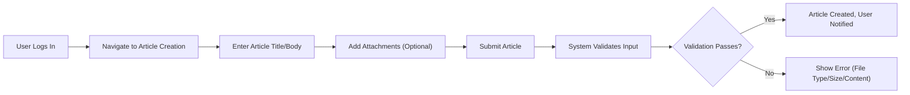

# Requirements Analysis Report for Discussion Board Service

## Functional Requirements

### Article Management
- WHEN a registered user submits a new article, THE system SHALL allow the user to write text content, attach zero or more images, and attach zero or more files (subject to file restrictions listed under Non-Functional Requirements).
- WHEN an article is created, THE system SHALL record the author, date/time of creation, and all attachments to the article.
- WHEN a user edits their own article, THE system SHALL permit editing of title, body, and attachments, provided the article is not deleted.
- IF a user attempts to edit or delete another user's article, THEN THE system SHALL deny access and return an appropriate error message.
- WHEN a user deletes their own article, THE system SHALL mark the article as deleted and hide it from standard user views while preserving it for administrative review and audit.
- WHEN an admin deletes any article, THE system SHALL permanently remove the article and all associated comments and attachments, ensuring this action is audited for traceability.

### Commenting and Discussions
- WHEN a registered user views an article, THE system SHALL allow them to post comments beneath the article, including plain text (no images or files required in comments).
- WHEN a user comments, THE system SHALL record the commenter, date/time, and comment content.
- WHEN a user deletes their own comment, THE system SHALL mark the comment as deleted and hide it from normal user views.
- IF a user attempts to edit or delete another user's comments, THEN THE system SHALL deny access and notify the user accordingly.
- WHEN an admin deletes a comment, THE system SHALL permanently remove the comment, logging the action for records.

### Attachment Support (Articles)
- WHEN a user creates or edits an article, THE system SHALL permit attaching image files (such as JPEG, PNG) and non-image files (such as PDF, DOCX, XLSX) per rules below.
- WHEN an article attachment is uploaded, THE system SHALL associate it only with that specific article and display download/view options with the article.
- WHEN an admin or author removes an attachment while editing or moderating an article, THE system SHALL remove the file from the article and mark it for backend processing for deletion.
- IF an attachment upload fails (e.g., unsupported file type, over size limit), THEN THE system SHALL provide a clear error message specifying the failure reason.

### Profile and Settings
- WHEN a user registers or updates their profile, THE system SHALL allow the member to specify a display name, email, password, and optionally an avatar image.
- WHEN a user changes their email or password, THE system SHALL require secure validation (such as input of current password for change confirmation).
- WHEN an admin accesses user management functions, THE system SHALL permit viewing, locking, or deleting any user profile except their own account.

### Moderation and Administration
- WHEN an admin views any article or comment, THE system SHALL permit editing or deleting the content, with all changes thoroughly logged for audit.
- WHEN an admin finds abusive or illegal content, THE system SHALL provide a simple workflow to hide, edit, or remove the article/comment and optionally suspend or remove the offending user.
- WHEN a critical moderation event occurs (such as mass deletion or emergency ban), THE system SHALL provide confirmation and a summary activity log for traceability.

## Non-Functional Requirements

### Simplicity and Minimalism
- THE system SHALL prioritize easy, fast article posting and discussion with minimal user friction (no unnecessary required fields, no complex navigation, minimal steps per action).
- WHILE operating, THE system SHALL maintain a clean, streamlined user experience and avoid excessive features that distract from the core posting/commenting flows.

### Performance and Reliability
- WHEN a user loads pages with fewer than 50 articles or comments, THE system SHALL return content within 2 seconds in 95% or more of cases.
- WHEN uploading images or files up to 10MB each, THE system SHALL complete uploads or return an error within 10 seconds in 98% or more of cases.
- WHEN deleting or hiding content, THE system SHALL reflect the change in user-visible lists immediately upon action completion.

### Availability and Access
- THE system SHALL provide 99.5% or higher service uptime, excluding scheduled maintenance, measured over the previous 30 days.
- WHERE system maintenance is scheduled, THE system SHALL notify users in advance and provide estimated downtime.

### File Attachment Restrictions
- THE system SHALL limit each attachment to a maximum size of 10MB.
- THE system SHALL permit up to 10 attachments per article (combined images and files).
- THE system SHALL only accept image files in JPEG or PNG format and document/file attachments in PDF, DOCX, or XLSX format.
- IF a user attempts to upload unsupported file types or files over the allowed size/quantity, THEN THE system SHALL provide a clear error message and block the upload.

### Usability
- THE system SHALL ensure all error and confirmation messages are clear and helpful to guide end-users.
- THE system SHALL support user operations (posting, commenting, uploading, editing, deleting) in a maximum of three steps for any action, ensuring no excessive navigation or workflow overhead.

### Privacy & Compliance
- THE system SHALL store user information and attachments securely and only for registered/logged-in users.
- WHEN a user deletes their account, THE system SHALL remove personally identifiable information but retain article and comment records with anonymized author attributions for audit/history.
- THE system SHALL comply with applicable privacy regulations (such as GDPR/KR-PIPA) for data storage, retention, and user consent.

## Acceptance Criteria

| Requirement                         | Acceptance Criteria                                                    |
|-------------------------------------|-----------------------------------------------------------------------|
| Article Creation, Editing, Deletion | Users can reliably create, edit, delete their own articles; no cross-user edits permitted; admins have full control, all actions are logged. |
| Commenting                          | Users can add/delete their own comments; no cross-user modifications; edits/deletes are handled immediately, actions visible to actors.      |
| Attachments                         | Only allowed file types/sizes accepted; errors shown for invalid attempts; each article supports up to 10 attachments, each up to 10MB.      |
| Profile & Settings                  | Users manage their own profiles and avatar images, secure updates; admins cannot modify their own admin accounts via user management.         |
| Moderation/Admin Actions            | Admins can review, edit, or remove any post/comment/user; actions are logged for traceability; workflow includes clear confirmations.         |
| Performance                         | All content, uploads, and actions process within specified time limits according to rules above, in 95-98% of realistic cases.                |
| Simplicity/Workflow                 | All actions (post, comment, upload, moderate) possible in 3 steps or fewer, without confusion or unnecessary steps.                           |
| Privacy/Compliance                  | PII is only visible to the owner/admin, anonymized after user deletion; data handling complies with legal requirements.                        |

## Process Flow: Article Creation and Attachment (Mermaid)

---

All requirements above SHALL be interpreted in natural language and business terms only. API, database, or UX implementation specifics are strictly excluded from this document.