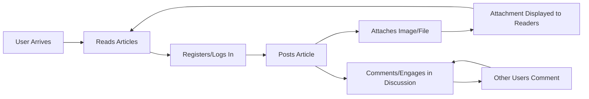

# Requirements Specification: Minimal Economic/Political Discussion Board

## 1. Introduction & Scope

The mission of the economic/political discussion board is to provide a bare-minimum, accessible online forum designed for substantive, civil debate on economic and political themes. The platform prioritizes simplicity and usability for users of all backgrounds. The board enables article posting, discussion via comments, and basic attachment handling (images/files), while minimizing technical, navigation, or moderation complexity.

## 2. Key User Needs

- Laypersons, students, and professionals require an easy-to-use, low-friction forum to share and debate ideas about economic and political matters.
- Users must be able to read content without registration, encouraging spontaneous exploration and participation.
- Authenticity and civil discourse are encouraged, where each poster is accountable for their content.
- Minimal disruption—no feature bloat, unnecessary notifications, or pressure to engage in non-core activities.
- Simple visual attachment handling enhances context and clarity for discussions.

## 3. Business Objectives & Success Metrics

- WHEN the board is in operation, THE system SHALL aim for high user retention (monthly/quarterly periods) and month-over-month growth in active users.
- WHEN articles are posted, THE system SHALL maximize engagement through discussion and attachment interaction, measured by the number of comments and the percentage of articles containing at least one attachment.
- THE system SHALL ensure community health by minimizing content requiring moderator intervention relative to total contributions.
- Success measured by ease-of-use, quality of civil discourse, and traction in the target audience.

## 4. Functional Requirements

### Article Posting
- WHEN a registered user submits a new article, THE system SHALL save the article with a timestamp and display it on the main board in reverse chronological order.
- THE system SHALL allow users to view all public articles without authentication.
- THE system SHALL allow authenticated users to edit and delete only their own articles.
- THE system SHALL ensure titles and content are required fields for article creation.

### Image/File Attachments
- WHEN creating or editing an article, THE system SHALL allow a user to attach one or more images/files.
- THE system SHALL support common image formats (jpg, png, gif) and common document formats (pdf, docx, txt).
- IF a user uploads an unsupported file type or a file exceeding size limits (e.g., 10MB per file), THEN THE system SHALL reject the upload and provide an error message within 2 seconds.
- WHEN a user views an article, THE system SHALL display thumbnails/previews for image attachments and download links for files.
- THE system SHALL relate all attachments to the authoring user's article and only permit removal or replacement by the article's author or an administrator.

### Comments & Discussions
- WHEN viewing an article, THE system SHALL display a list of all associated comments in chronological order.
- THE system SHALL allow registered and authenticated users to post, edit, or delete their own comments on any article.
- THE system SHALL allow administrators to edit or remove any comment in accordance with community guidelines.
- WHEN a comment is deleted, THE system SHALL remove it immediately from the visible comment list for all users.

### User Registration & Authentication
- THE system SHALL allow any new user to register an account with an email and password.
- WHEN a user attempts to post an article, comment, or attachment without being logged in, THE system SHALL redirect to the login/registration page.
- WHEN a user is not logged in, THE system SHALL allow full read-only access to all publicly posted content, attachments, and discussions.
- THE system SHALL provide password recovery by email.

### Moderation & Administration
- THE system SHALL assign administrator roles capable of:
    - Removing or editing any article, comment, or attachment
    - Managing user accounts (suspending, reactivating, or deleting users)
    - Monitoring and resolving flagged or reported content
- THE system SHALL provide clear audit logs for all administrative actions for traceability.
- WHEN content is removed by administrators, THE system SHALL notify the original author by email (if configured).

## 5. Non-Functional Requirements

### Usability
- THE system SHALL be fully usable with keyboard navigation and screen readers.
- THE interface SHALL be intuitive, requiring minimal steps for all core actions.
- WHEN users encounter errors, THE system SHALL provide clear, actionable messages within 2 seconds.

### Performance
- THE system SHALL return all article lists, comment threads, and attachment previews in under 1.5 seconds for 95% of requests under normal server load (fewer than 100 concurrent users).
- WHEN serving large attachments, THE system SHALL use background upload/download with progress indication for files over 5MB.

### Security
- THE system SHALL use secure, hashed password storage conforming to current industry standards.
- THE system SHALL prevent XSS, CSRF, and basic injection attacks on all form and file inputs.
- Attachments SHALL be virus-scanned before acceptance, and rejected with notification if malware is detected.

### Privacy & Compliance
- THE system SHALL NOT expose user email addresses publicly.
- All data SHALL be encrypted at rest and in transit (HTTPS only).
- WHEN users delete their account, THE system SHALL purge their personal data and all articles/comments authored by them within 48 hours, unless retention is required by legal authorities.

### Simplicity/Minimalism Principles
- THE interface SHALL avoid unnecessary features, modules, or complexity not central to article posting, discussion, and attachments.
- Error messages and confirmations SHALL be concise and free of jargon.

## 6. Business Model & Constraints

- THE platform SHALL remain freely accessible for its initial phase, relying on donations or grant funding as needed. No paywalls, premium tiers, or distracting advertising SHALL be applied.
- IF minimal, tasteful advertising is ever introduced for sustainability, THEN it SHALL not disrupt reading or posting experiences.
- The product scope SHALL remain tightly focused on the fundamental needs described; scope creep SHALL be actively resisted.
- The platform SHALL avoid integrations or features not essential to core use cases, such as external logins or social sharing in the initial deployment.
- All processes and policies SHALL comply with applicable privacy laws (e.g., GDPR, CCPA).

## 7. Mermaid Diagram: Core User Journey

## 8. Summary & Implementation Readiness

The guiding philosophy for this discussion board is restraint, transparency, and directness. All requirements are phrased using EARS for clarity and are closely derived from user/business needs. Requirements are minimal yet sufficient for a well-governed platform. All workflows, permission models, error handlings, and business constraints are explicitly defined to remove ambiguity for development teams. Further expansion and complexity are considered out-of-scope unless strictly mapped to measurable user value or regulatory requirement.