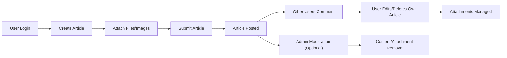

# Business Requirements for Economic/Political Discussion Board

## Key User Needs
- Users require an online space dedicated to economic and political topics that is simple, focused, and absent of unnecessary distractions.
- THE system SHALL minimize obstacles to registration and participation so that non-technical users can easily engage.
- Users need to share opinions and upload supporting evidence (images, files) to encourage respectful, fact-based discussion.
- THE system SHALL empower users to manage (create, edit, delete) their own articles, comments, and any associated attachments.
- THE system SHALL facilitate effortless exploration of ongoing or past discussions so users can join at their comfort level.

## Business Objectives
- THE platform SHALL provide a minimal, purpose-built discussion board centered around economic and political debate, aggressively avoiding feature creep.
- THE system SHALL make the mechanics of posting, discussing, and attaching files/images as immediate and reliable as possible.
- THE system SHALL define straightforward permission levels: regular users manage their own contributions; admins provide only essential moderation and user management, not intrusive oversight.
- THE platform SHALL uphold open debate but ensure safety by limiting attachment types and providing for content management.
- THE board SHALL not evolve into a complex social platform: no personal profiles, likes, or private messaging.

## Functional Requirements
_All requirements specified using EARS format, grouped by functional area._

### Article Management
- THE system SHALL allow any registered user to create new articles.
- THE system SHALL allow all users (registered or guest) to read articles and attached comment threads.
- WHEN a user creates an article, THE system SHALL allow upload and attachment of up to 5 images or document files. Supported formats are JPEG, PNG, GIF, PDF, DOCX, XLSX.
- WHEN a user edits their own article, THE system SHALL allow them to add, remove, or replace article attachments.
- WHEN a user deletes their own article, THE system SHALL remove all related comments and attachments.
- WHEN a user edits their article, THE system SHALL update the body and attachments, maintaining a visible history of changes with author and timestamp.
- IF an article has attachments, THEN THE system SHALL show download/preview links for all readers.

### Commenting and Discussion
- THE system SHALL allow registered users to post comments on any article.
- THE system SHALL allow users to edit or delete their own comments.
- WHEN posting a comment, THE system SHALL provide the option to attach up to 5 images or document files in the same formats as for articles.
- IF a comment contains attachments, THEN THE system SHALL provide download/preview links for all readers.
- WHEN a user deletes their own comment, THE system SHALL remove its attachments.

### Attachment Handling
- WHEN a user uploads an attachment, THE system SHALL validate type (JPEG, PNG, GIF, PDF, DOCX, XLSX), file size ≤ 10MB, and, for images, reasonable dimensions.
- IF an attachment fails validation, THEN THE system SHALL reject it and show an error with the specific reason (type, size, or dimension).
- WHILE an attachment is uploading, THE system SHALL display a progress/status indicator to the user.
- THE system SHALL bind each upload to either its parent article or comment.
- THE system SHALL scan uploads to block known malicious files or executable code.

### User Authentication and Permissions
- THE system SHALL require user registration (email and password) to create, edit, or delete content (including articles, comments, attachments).
- WHEN the user is not logged in, THE system SHALL limit their abilities to reading articles/comments and downloading attachments. Creation, editing, or deletion is not permitted.
- THE system SHALL ensure that only the author or an admin may edit or remove articles, comments, or attachments.
- WHERE a user is an admin, THE system SHALL provide tools to moderate (remove or edit) any article, comment, or attachment, and manage users for enforcement.
- THE system SHALL log all moderation actions (who, action, when) for transparency.
- THE system SHALL strictly enforce permission boundaries for user privacy and content control.

### Browsing & Discovery
- THE system SHALL display the list of articles in most-recent-first order with lazy loading or pagination.
- THE system SHALL allow users to filter and search articles by keyword in title/body.
- THE system SHALL show each article’s author, timestamp, comment count, and attachment count for context.

### Notifications and Feedback
- WHEN the user submits an article or comment, THE system SHALL present immediate visual feedback (success/failure message).
- IF any error happens during submission or upload, THEN THE system SHALL return a descriptive error to the user explaining the cause.
- Optional for later: THE system MAY notify users of replies to their contributions. This is not part of the initial minimal viable product (MVP).

## Non-Functional Requirements
- THE system SHALL enable login, registration, and session management using secure, modern authentication principles. Emails and passwords are never shown or shared.
- THE system SHALL respond to posting, commenting, and uploading actions within 2 seconds under normal conditions.
- THE system SHALL restrict attachments to 10MB each and a maximum of 5 per article/comment for usability and server safety.
- THE system SHALL scan and validate all uploads to ensure compliance with security standards and prevent malicious file distribution.
- THE system SHALL ensure that content (except private author/admin info) is readable by all site visitors, but only registered users can post.
- THE system SHALL preserve user privacy: emails/passwords are never shown; data is handled according to privacy best practices.
- THE system SHALL minimize time spent on non-essential features or visual customizations beyond minimal usability and accessibility.
- THE system SHALL avoid monetization features (ads, analytics requiring consent, payment) unless future requirement planning is explicitly added.

## Constraints
- The discussion board MUST remain minimal; features not integral to economic/political discourse or core discussion (e.g., likes, profiles, private messages) SHALL NOT be added.
- Only registered users may post, edit, or delete content; non-registered visitors are strictly read-only.
- Attachments are restricted in format and size; failed validations SHALL provide descriptive errors.
- Administrative tools are for moderation and user management only; platform control and content remain user-driven.
- Content moderation is available, but the expectation is that users self-manage their contributions; admins act only as needed.
- NO advertising, promotions, or analytics requiring explicit user consent SHALL be present unless formally planned for expansion.

## Mermaid: Article Lifecycle Flow

## Conclusion

This requirements analysis defines the use cases, user flows, and critical constraints for a straightforward discussion board supporting economic and political debate. All business requirements are detailed in EARS format, attachment and moderation workflows are fully covered, and scope boundaries are clear to prevent unnecessary complexity. This serves as the final requirements specification for backend implementation, ensuring developers have an actionable blueprint for system design and delivery.